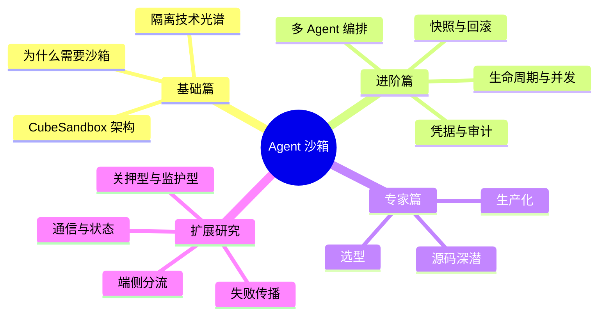

# 从 0 到 1 学 Agent 沙箱

> 以腾讯 CubeSandbox 为主案例，系统讲清 Agent 沙箱的隔离、供给、治理、并发、编排与源码机制。

本仓库只提交本 README 与 `文章内容/`。主线章节负责逐步建立完整知识体系；扩展研究放在主线之后，用来回看、深化和推演前文问题。

## 怎么读这套内容

主线不是简单的 1～35 连号：当前完整主线是第一至第二十九章；第三十、三十一、三十二、三十五章是后续研究扩写，其中第三十五章保留原编号，表示它是从前文问题继续长出来的研究章。

## 主线章节

### 基础篇：看懂（第一～八章）

- [01｜第一章　让 Agent 跑完一次任务，再把它安全收回来](文章内容/01-基础篇/第一章-当AI开始替你动手-Agent为什么必须住进沙箱.md)
- [02｜第二章　隔离的技术光谱：Docker、gVisor、传统 VM、MicroVM 与 WASM](文章内容/01-基础篇/第二章-隔离的技术光谱-Docker-gVisor-VM-MicroVM与WASM.md)
- [03｜第三章　沙箱有什么用：Agent 沙箱的用法原型与企业需求全景](文章内容/01-基础篇/第三章-沙箱有什么用-Agent沙箱的用法原型与企业需求全景.md)
- [04｜第四章　一篇文章看懂 CubeSandbox：60 毫秒背后的架构全景](文章内容/01-基础篇/第四章-一篇文章看懂CubeSandbox-60毫秒背后的架构全景.md)
- [05｜第五章　控制面与数据面：一次沙箱创建的十步旅程](文章内容/01-基础篇/第五章-控制面与数据面-一次沙箱创建的十步旅程.md)
- [06｜第六章　虚拟化底座：KVM、RustVMM 与 containerd Shim v2 的三角关系](文章内容/01-基础篇/第六章-虚拟化底座-KVM-RustVMM与containerd-Shim-v2的三角关系.md)
- [07｜第七章　网络治理：eBPF 虚拟交换机与 L7 出口网关](文章内容/01-基础篇/第七章-网络治理-eBPF虚拟交换机与L7出口网关.md)
- [08｜第八章　基础篇综合推演：给一个企业场景做架构设计](文章内容/01-基础篇/第八章-基础篇综合推演-给一个企业场景做架构设计.md)

### 进阶篇：吃透原理（第九～二十章）

- [09｜第九章　CubeCoW：快照、克隆与任意状态回滚的实现](文章内容/02-进阶篇/第九章-CubeCoW-快照克隆与任意状态回滚的实现.md)
- [10｜第十章　Agent 时代的凭据安全：当模型成为新的泄露通道](文章内容/02-进阶篇/第十章-Agent时代的凭据安全-当模型成为新的泄露通道.md)
- [11｜第十一章　内存账本：5MB 增量与并发供给的物理基础](文章内容/02-进阶篇/第十一章-内存账本-5MB增量与并发供给的物理基础.md)
- [12｜第十二章　AutoPause 与运营账：闲置沙箱的成本治理](文章内容/02-进阶篇/第十二章-AutoPause与运营账-闲置沙箱的成本治理.md)
- [13｜第十三章　可观测性与执行审计：Agent 的行车记录仪](文章内容/02-进阶篇/第十三章-可观测性与执行审计-Agent的行车记录仪.md)
- [14｜第十四章　沙箱的一生：生命周期语义与状态管理](文章内容/02-进阶篇/第十四章-沙箱的一生-生命周期语义与状态管理.md)
- [15｜第十五章　沙箱与 Agent 的接口：执行循环的供给策略](文章内容/02-进阶篇/第十五章-沙箱与Agent的接口-执行循环的供给策略.md)
- [16｜第十六章　协议兼容与生态位：E2B 接口为何成为事实标准](文章内容/02-进阶篇/第十六章-协议兼容与生态位-E2B接口为何成为事实标准.md)
- [17｜第十七章　环境供给的极端负载：批量评测](文章内容/02-进阶篇/第十七章-环境供给的极端负载-批量评测.md)
- [18｜第十八章　企业级并发架构（上）：供给链路——从一次请求到万级沙箱](文章内容/02-进阶篇/第十八章-企业级并发架构上-供给链路从一次请求到万级沙箱.md)
- [19｜第十九章　企业级并发架构（下）：多租户、弹性与故障域](文章内容/02-进阶篇/第十九章-企业级并发架构下-多租户弹性与故障域.md)
- [20｜第二十章　多 Agent 拓扑：多沙箱协作与编排](文章内容/02-进阶篇/第二十章-多Agent拓扑-多沙箱协作与编排.md)

### 专家篇：做决策、下源码（第二十一～二十九章）

- [21｜第二十一章　生产化：Terraform 集群部署、ARM64 与运维清单](文章内容/03-专家篇/第二十一章-生产化-Terraform集群部署-ARM64与运维清单.md)
- [22｜第二十二章　企业落地案例与场景矩阵（决策篇上）](文章内容/03-专家篇/第二十二章-企业落地案例与场景矩阵.md)
- [23｜第二十三章　横评与选型：CubeSandbox vs E2B vs Kata vs gVisor vs 自建（决策篇中）](文章内容/03-专家篇/第二十三章-横评与选型-CubeSandbox-E2B-Kata-gVisor与自建.md)
- [24｜第二十四章　边界与未来：MicroVM 与 WASM 融合、沙箱会成为 Agent 操作系统吗](文章内容/03-专家篇/第二十四章-边界与未来-MicroVM与WASM融合-沙箱会成为Agent操作系统吗.md)
- [25｜第二十五章　源码深潜：从 KVM_CREATE_VM 到 seccomp-BPF，CubeSandbox 的隔离链条](文章内容/03-专家篇/第二十五章-源码深潜-隔离篇-从KVM_CREATE_VM到seccomp-BPF.md)
- [26｜第二十六章　源码深潜：资源管控篇，Host cgroup 与 KVM memslot 不是一张账](文章内容/03-专家篇/第二十六章-源码深潜-资源管控篇-Host-cgroup与KVM-memslot.md)
- [27｜第二十七章　源码深潜：系统调用拦截篇，两套 seccomp 如何协作又为何不能互相替代](文章内容/03-专家篇/第二十七章-源码深潜-系统调用拦截篇-两套seccomp如何协作.md)
- [28｜第二十八章　源码深潜：性能开销篇，60 毫秒与 5 MB 应该怎样被拆解](文章内容/03-专家篇/第二十八章-源码深潜-性能开销篇-60ms与5MB如何测量.md)
- [29｜第二十九章　源码深潜：快照与状态机篇，CubeShim 如何让沙箱可暂停、可恢复、可回滚](文章内容/03-专家篇/第二十九章-源码深潜-快照与状态机篇-CubeShim生命周期.md)

## 扩展研究

这些文章不是主线的“第三十三、三十四章”替代品，而是从已完成章节中继续追问出来的专题。每篇正文顶部都标出了关联主线。

| 扩展内容 | 接回主线的位置 | 阅读作用 |
|---|---|---|
| 第三十章：多 Agent 的通信与状态 | 第二十章；回看第七、九、十章 | 把多 Agent 的通信通道、共享状态和记忆语义展开 |
| 第三十一章：端侧分流与云端护城河 | 第二、十、二十三、二十四章 | 把隔离光谱放到端侧 Agent 与云端平台的现实选择中 |
| 第三十二章：失败传播 | 第二十章；回看第九、十八、二十一、二十九章 | 把单个沙箱的失败处理提升到任务树和工作流层 |
| 第三十五章：关押型与监护型 | 第二十三章；回看第五～七、十、三十一章 | 对前面的隔离、治理和端侧问题做理论收束 |
| 四层平面专题 | 第四、六、七、九、二十八章 | 用一张总图回看继承、供给、治理和控制四层 |

- [30｜第三十章　学习笔记：多 Agent 的通信与状态——快而隐式，慢而明确](文章内容/扩展研究/第三十章-学习笔记-多Agent的通信与状态-快而隐式慢而明确.md)
- [31｜第三十一章　学习笔记：当操作系统免费送出沙箱——端侧分流与云端的护城河](文章内容/扩展研究/第三十一章-学习笔记-当操作系统免费送出沙箱-端侧分流与云端护城河.md)
- [32｜第三十二章　学习笔记：失败传播——从杀进程到停一棵树](文章内容/扩展研究/第三十二章-学习笔记-失败传播-从杀进程到停一棵树.md)
- [35｜第三十五章　研究笔记：关押型与监护型——沙箱的两种存在理由](文章内容/扩展研究/第三十五章-研究笔记-关押型与监护型-沙箱的两种存在理由.md)
- [专题｜CubeSandbox 四层平面全解：继承的虚拟机如何被削成沙箱（图文版）](文章内容/扩展研究/专题-四层平面全解-图文版.md)

## 附录

- [附录 A：术语与指标口径](文章内容/附录/附录A-术语与指标口径.md)：统一沙箱、启动、内存、并发和证据等级的含义。
- [附录 B：章节路线与证据索引](文章内容/附录/附录B-章节路线与证据索引.md)：解释主线接缝、扩展分支和暂不补写第三十三、三十四章的原因。

## 目录约定

- `文章内容/01-基础篇/`：建立问题、路线和 CubeSandbox 全景。
- `文章内容/02-进阶篇/`：深入快照、凭据、内存、生命周期、Agent 接口、并发和编排。
- `文章内容/03-专家篇/`：生产落地、选型和源码深潜。
- `文章内容/扩展研究/`：对主线章节的二次学习、专题扩写和理论推演。
