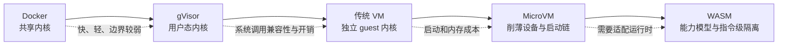

# 第二章　隔离的技术光谱：Docker、gVisor、传统 VM、MicroVM 与 WASM

<!-- chapter-nav -->

[← 上一章](第一章-当AI开始替你动手-Agent为什么必须住进沙箱.md) · [章节目录](../../README.md) · [下一章 →](第三章-沙箱有什么用-Agent沙箱的用法原型与企业需求全景.md)
<!-- /chapter-nav -->


> 《从 0 到 1 学 Agent 沙箱》系列 ｜ 基础篇 · 第二章
> 主案例：腾讯 CubeSandbox（github.com/TencentCloud/CubeSandbox，Apache 2.0）
> 前置：第一章（四大新问题：不可信、联网、状态、规模）。本章起不再铺垫基础概念。

---

## 引子：一道真实的面试题

"你们团队的 Coding Agent 跑在 Docker 里，够安全吗？"

这道题近两年出现在越来越多基础设施团队的面试和架构评审里。有趣的是答案的分布：说"够"的人引用 Docker 的市场份额——"全球几十亿容器每天都在跑，能不安全吗"；说"不够"的人引用同一组数据——"正因为共享内核，一次内核漏洞就是全灭"。

两边都对，但都没答到点上。**"够不够"是个错误的问题；正确的问题是"你的威胁模型是什么、你要隔离的执行者是谁、你能接受什么代价"。** 隔离从来不是一个是/否的开关，而是一条光谱——每一种技术都占据光谱上的一个位置，用不同的机制、挡不同的攻击者、付不同的代价。

本章的任务：把这条光谱画清楚。五种主流方案——Docker（namespace/cgroup）、gVisor（用户态内核）、传统 VM（Hypervisor）、MicroVM、WebAssembly——逐一定位。你会看到，每一种方案的兴起，都是因为上一代的隔离边界被新一代执行者击穿；而你也将获得回答那道面试题的完整框架。

## 一、先立尺子：隔离的三角权衡

比较隔离技术，先要有尺子。业界评估沙箱方案（从 AWS 选型 Firecracker 到 Google 设计 gVisor）实际使用的三把尺子：

**隔离强度**：攻击者被挡在几道墙外？墙是软件约定（"请进程不要越界"）还是硬件强制（"越界即 fault"）？这个问题的工程表述是**攻击面**——暴露给不可信代码的接口有多少行内核代码、多少个系统调用入口。

**启动速度**：从"要一个新环境"到"环境可用"要多久。这决定了供给的粒度——秒级启动只能支撑"粗粒度复用"，毫秒级才能支撑"细粒度即焚"（第一章的第一笔账）。

**资源开销**：一个实例吃掉多少内存与 CPU？这决定了密度——单机能养多少个实例（第一章的第二笔账与数量经济学）。

这三者构成一个三角，而**历史规律是：任何方案最多同时优化两个角**。Docker 快且轻，但隔离弱；传统 VM 强，但慢且重；MicroVM 的全部故事，就是在"强隔离"的前提下把另外两个角逼近容器的水位。这个"不可能三角"不是定理，而是工程经验的总结——理解它，你就掌握了本章的阅读地图：

```
              隔离强度（攻击面大小）
                    ▲
        传统 VM ●   │   ● gVisor
                ●   │  ● MicroVM
                      │
   Docker ●──────────┼──────────● WASM
                    │
     （快+轻，弱隔离） │
                    ▼
          启动速度 × 资源开销
```

（图中的位置是定性的；精确的数字对比见第三节总表。）



这条箭头不是“越往右越好”，而是从共享内核逐步把控制权收回到更窄的执行模型。读者后面遇到一个新方案时，可以先问它位于哪一段：它新增了哪道边界，又把哪部分兼容性、启动速度或编程自由度交出去。

## 二、五种方案，五次边界击穿

### 2.1 Docker：共享内核的契约

Docker 的隔离机制是 Linux namespace（pid/net/mnt/uts/ipc/user）加 cgroup——**在同一个内核上，给每个进程组一个"专属"的假象**。它快（~200ms）、轻（实例开销近零）、生态无敌（任何能在 Linux 上跑的东西都能容器化）。

但它的隔离边界是一份**契约，不是墙**。所有容器共享宿主机内核：容器里的代码虽然被 namespace 挡住了视野，它的每一个系统调用仍然直接进入宿主内核执行。这意味着：

- **内核漏洞 = 全体容器的漏洞。** 2019 年的 runC CVE-2019-5736 是标志性案例：容器内代码可覆写宿主机上的 runC 二进制，逃逸获得宿主机 root。历史上 Dirty COW（CVE-2016-5195）等内核提权漏洞，对容器化的不可信代码同样致命。
- **攻击面 ≈ 整个内核系统调用面**：数百万行 C 代码、300+ 个系统调用入口，全部暴露给不可信代码。内核社区自己也承认这是问题——Linux 内核的"attack surface reduction"工作常年进行，但永远做不完。

所以业界共识（也是 Docker 官方文档的立场）从来不是"容器不安全"，而是：**容器适用于"基本可信代码的工程隔离"——隔离故障、隔离资源、隔离环境差异；不适用于"敌意代码的安全隔离"。** 你的微服务、你的 CI、你团队 Agent 跑的内部脚本，容器是正确的工具。但把一个执行模型生成代码、可被提示词注入劫持的 Agent 放进去——第一章的"不可信"条件已经不满足契约的前提了。

### 2.2 gVisor：把内核搬到用户态

Google 2018 年开源的 gVisor（论文发表于 USENIX ATC 2018，Young et al.）给出了第三条路：既然共享内核的攻击面是问题，那就不共享——**用用户态进程（称为 Sentry）拦截并重新实现系统调用**。容器里的代码以为自己在调 Linux 内核，实际面对的是 gVisor 用 Go 重写的约 200 个系统调用。

- **收益**：攻击面从数百万行内核代码缩到 Sentry 的实现面；且**不需要改代码**——对现有 Linux 程序透明，"runsc" 换个 runtime 就能跑。
- **代价**：每次系统调用都要经过 Sentry 中转，**高频系统调用（文件 IO、网络）性能衰减可达 2～20 倍**——对一个跑编译、数据分析的 Agent 沙箱来说，这可能直接不可接受；同时 Sentry 自身的内存开销（数百 MB 级）限制了密度。

gVisor 在 Google 内部（App Engine、Cloud Functions、GKE Sandbox）承载了海量 Serverless 负载，证明了这条路的生产可行性。它击穿的是"容器不能跑敌意代码"的边界，但代价把"快与轻"让渡了出去。

### 2.3 传统 VM：硬件墙，重甲慢行

Hypervisor（KVM/Xen/VMware）用硬件虚拟化（Intel VT-x/AMD-V 的 root/non-root 模式）画出真正的硬件边界：Guest 以为自己在独占一台机器，它的任何越界访问都会触发 vmexit、被强制交回 Hypervisor 处理。攻击者要逃逸，必须击破的不再是"内核的契约"，而是硬件强制 + 一个小得多的虚拟化层攻击面。

但传统 VM 的重量众所周知：完整固件（BIOS/UEFI）启动、完整设备模拟（QEMU 的 PC 机型模拟了几十个设备）、完整操作系统——三者叠加，秒级启动、数百 MB 至数 GB 内存起步、单机十几个实例就是常态。**强隔离它拿了，但快与轻全丢了**——对需要成千上万沙箱的 Agent 平台，这是一条死路。

### 2.4 MicroVM：为不可信代码重新发明的 VM

2018 年，AWS 为 Lambda/Fargate 的多租户 Serverless 需求开源了 Firecracker（USENIX ATC 2020，Agarwal et al.）——论文标题说得直白：*Lightweight Virtualization for Serverless Applications*。它对传统 VM 做了三场"减重手术"，每一场都同时优化攻击面与启动开销：

1. **砍设备**：只保留 virtio 最小集（块设备、网络、vsock 等），QEMU PC 机型的几十个设备全部不要——每砍一个设备，就少一块攻击面、少一段启动时间。
2. **砍固件**：用 PVH 直接启动 Linux 内核，跳过 BIOS/UEFI——无固件，就无固件漏洞，也无需固件初始化的数百毫秒。
3. **砍框架**：基于 RustVMM 系列库从零组装 VMM（Rust 内存安全），不继承 QEMU 的历史包袱。

结果：**~125ms 启动、每 VM 低于传统 VM 一个数量级的内存开销、保留 KVM 硬件隔离**。AWS 用它支撑了"每年数万亿次的 Lambda 调用"背后的隔离。而 CubeSandbox 沿同一条路线（Cloud Hypervisor 的定制 fork）再进一步，走到了 60ms / <5MB / 单节点数千实例——路线的细节与代价，第四～六章与深潜章会完整拆开。

MicroVM 击穿的是"强隔离与快轻不可兼得"的定局。**它不是妥协的中间点，而是用工程手段把三角里的三件事同时逼近极限。**

### 2.5 WebAssembly：指令级的乌托邦，与它的天花板

WASM 用完全不同的机制实现隔离：代码先验证后执行（validation-before-execution），**只在 32/64 位线性内存上运算，碰不到外面任何东西**——不依赖内核，不依赖 Hypervisor，攻击面是验证器 + 运行时本身（wasmtime/WASMEdge 的实现面，远小于 Linux 内核）。

它快（毫秒级冷启动）、轻（MB 级内存）、可以嵌进任何宿主。WASI（WebAssembly System Interface）正在给这个纯函数世界开窗：文件、网络、时钟，都以"能力授予"的方式显式注入。

但天花板也很硬：**WASM 只能跑"编译成 WASM 的代码"**。Python 数据分析栈（NumPy/Pandas 依赖大量 C 扩展与原生二进制）、任意 shell 命令、系统工具链——今天主流 Agent 需要的整个 Linux 用户态生态，WASM 覆盖度仍然有限。性能模型也不同：跨语言边界与线性内存的约束，让计算密集型负载并非零成本。

所以 WASM 的正确定位是：**轻量任务的分级隔离选项**——纯计算、表单处理、不受信任的小函数，WASM 是最干净的答案；但"给 Agent 一个完整的 Linux"这个需求，它今天给不了。这个"按任务分级"的思想会在第二十四章（未来篇）回归——届时你将看到"轻任务 WASM、重任务 MicroVM"的混合形态可能是终局。

## 三、光谱总表：把五种方案放进一张图

| 方案 | 隔离机制 | 攻击面 | 启动 | 单实例开销 | 典型密度 | 对 Agent 的适用性 |
|---|---|---|---|---|---|---|
| **Docker** | namespace + cgroup（共享内核） | 整个宿主内核（300+ syscall） | ~200ms | ≈0 | 极高 | 可信内部代码 ✅；模型生成代码 ⚠️ 契约前提不满足 |
| **gVisor** | 用户态内核（Sentry 拦截） | Sentry 实现（~200 syscall 重实现） | 亚秒 | 数百 MB 级 | 中 | 敌意代码可跑，但 IO 衰减伤 Agent 吞吐 |
| **传统 VM** | Hypervisor + 硬件辅助 | 小（虚拟化层） | 秒级 | 数百 MB～GB | 十几个/节点 | 隔离达标，密度与启动双双出局 |
| **MicroVM** | KVM + 精简设备模型 + PVH | 极小（virtio 最小集 + Rust VMM） | 60～125ms | <5～50MB | 数千/节点 | **Agent 主战场**：强隔离 × 快 × 密度 |
| **WASM** | 验证后执行（线性内存） | 验证器 + 运行时 | 毫秒级 | MB 级 | 极高 | 纯计算小函数 ✅；完整 Linux 生态 ✖️ |

读这张表的正确方式不是从上往下打分，而是**按威胁模型对号入座**：

- 代码基本可信、要的是工程隔离 → Docker（绝大多数场景的正解，别过度设计）
- 敌意代码、不能改代码、能接受 IO 衰减 → gVisor
- 敌意代码、要硬件墙、量少预算足 → 传统 VM（或托管 VM 服务）
- **模型生成代码、要硬件墙、要毫秒级启动、要高密度** → MicroVM——这正是 Agent 沙箱的交集
- 纯函数、轻量、可重编译 → WASM

回到引子的面试题，现在你能给出的完整答案：**"跑内部脚本的 Coding Agent，Docker 是合理起点；跑用户/模型生成代码的 Agent，Docker 的契约前提已被击穿——需要沿光谱向右上移动，而移动的目标位（强隔离 + 快 + 密度）就是 MicroVM。"**

## 三点五、光谱上的产品版图：谁站在哪个位置

光谱是技术地图，最后把它翻译成产品地图——Agent 沙箱赛道的主要玩家，各自站在光谱的哪个位置、赌了什么：

| 产品 | 底座（光谱位置） | 形态 | 生态赌注 |
|---|---|---|---|
| **E2B** | Firecracker MicroVM | 闭源全托管 | **接口标准**：SDK 成为事实标准，"SQL of Agent Sandbox" |
| **CubeSandbox** | Cloud Hypervisor 定制 fork（MicroVM） | 开源自建 | **兼容 + 私有化**：兼容 E2B 协议 + 数据不出门 |
| **Kata Containers** | 轻量 VM + QEMU | 开源、K8s 原生 | **生态融入**：让存量 K8s 直接获得 VM 级隔离 |
| **gVisor（runsc）** | 用户态内核 | 开源、OCI runtime | **零改造**：换 runtime 即可，不要求重写应用 |
| **OpenSandbox 等新锐** | MicroVM / 混合 | 开源或托管 | 差异化场景（评测、数据科学等） |
| **自建 Firecracker** | Firecracker 直用 | 完全自研 | **极致控制**：平台层全部自己造，成本自担 |

三个值得记住的观察：

**观察一：底座趋同，产品分化。** 排除 gVisor 这条独立路线，MicroVM 阵营的产品（E2B、CubeSandbox、Firecracker 自建者）底层几乎是同一套东西（RustVMM 系 + KVM）——**竞争的分化点已经从"隔离技术"上移到"平台层与生态位"**：模板管理、调度、兼容协议、托管与否。这印证了光谱一节的判断：隔离技术本身正在变成大宗商品（commodity），护城河在往上移。

**观察二：E2B 的"SQL 效应"。** E2B 赢在接口而非技术——正如 Oracle 从未赢得每一笔数据库生意、但 SQL 赢了所有人，E2B SDK 正在成为 Agent 沙箱的"方言标准"，以至于后来者（包括 CubeSandbox）的第一张名片往往是"E2B 兼容"。接口标准的归属权与实现标准的归属权分离，是云基础设施史上反复上演的剧本（S3 兼容同理）。

**观察三：开源自建 vs 全托管的分界线。** 版图里真正的分野不是技术而是**运营责任**：数据合规要求高、已有运维团队的选 CubeSandbox/自建；要速度、不想养 infra 的选 E2B。这条线没有对错，只有匹配——第二十三章的选型决策树会把它画成流程。

## 四、被击穿的边界史：一部浓缩的教训史

把五种方案按时间轴排开，会发现一个循环了几十年的模式：

```
chroot(1979) ──▶ Jail/Zones(1999-2004) ──▶ cgroups/namespace(2007-2013)
     │                                        │
     ▼                                        ▼
  被击穿：进程可逃出 chroot          Docker 时代："内核契约"在多租户下被击穿
                                                │
              ┌─────────────────────────────────┤
              ▼                                 ▼
        gVisor(2018)                      Firecracker(2018)
     "把内核搬到用户态"               "给 VM 做减重手术"
              │                                 │
              ▼                                 ▼
     被代价卡住：IO 衰减                成为 Agent 沙箱的主流底座
                                              │
                                              ▼
                                    WASM：下一个候选边界？
```

每次循环都是同一个剧本：**执行者的不可信程度升级 → 现有边界被击穿 → 新方案在新位置立起更硬的边界 → 但通常要付出性能或生态的代价**。Docker 不是被"容器逃逸 CVE"打败的——它只是在多租户、敌意代码这个新场景下，契约的前提不再成立。Firecracker 也不是终点——Agent 只是最新一代的执行者。

记住这个模式，当你未来评估任何"新沙箱技术"（无论它叫什么名字），先问三个问题：它的墙是什么材质（软件契约还是硬件强制）？它把攻击面缩小到了哪里？它要求你付出什么代价？——这三个问题就是本章送给你的、超越具体技术的判断框架。

## 本章小结

一张表带走本章：

| 关键认知 | 一句话 |
|---|---|
| 隔离是光谱 | 没有绝对安全的方案，只有"威胁模型 × 代价"的匹配 |
| 三角权衡 | 隔离强度 × 启动速度 × 资源开销，历史规律是最多同时优化两个角 |
| Docker 的契约 | 共享内核 = 攻击面是整个内核；适用可信代码的工程隔离，不适用敌意代码 |
| MicroVM 的答案 | 砍设备 + 砍固件 + 砍框架，把 VM 的强隔离推到容器级的快与轻——Agent 场景的交集 |
| WASM 的定位 | 指令级沙箱，纯函数最干净；完整 Linux 生态是天花板；分级隔离的思想种子 |
| 边界击穿史 | 每一代执行者的不可信升级都会击穿上一代边界；评估新技术的三问：墙的材质、攻击面、代价 |

## 思考题（能算账的那种）

1. 你的团队现在用哪种方案跑 Agent 代码？对照第三节总表，它在你业务的威胁模型下是否"错位"——隔离过剩（浪费性能）还是隔离不足（暴露风险）？错位的代价折算成钱是多少？
2. 一个数据分析 Agent 的负载画像：频繁文件 IO（读写数百 MB 数据集）+ 中等网络调用。分别评估 Docker、gVisor、MicroVM 三种方案在这个画像下的综合成本（性能衰减 × 密度 × 单价）——gVisor 的 IO 衰减会不会反而比 MicroVM 更贵？
3. 用"三问框架"评估一个你听说过的其他沙箱技术（如 Kata Containers、Firecracker 直用、或某个国产沙箱）：墙的材质？攻击面缩到了哪里？代价是什么？——欢迎把答案发在评论区，我们逐一对照。

## 下章预告

"光谱画完了，那 Agent 到底拿沙箱来做什么生意？"

第三章《沙箱有什么用：Agent 沙箱的用法原型与企业需求全景》。前两章一直在讲"怎么隔离"，但企业真正关心的是"能拿来干什么"。下一章我们先立一个四问判别标准（代码谁写的？怎么执行？环境什么角色？速度意味着什么？），把"在线判题、CI、Replit"这类通用沙箱场景从 Agent 沙箱里剔除出去，然后展开六种 Agent 用法原型——从 Code Interpreter 到多 Agent 协作系统——每一种都对应一类真实的企业业务形态。并发沙箱能干什么、天花板在哪里，那一章给出全景答案。

---

> **参考与延伸**
> - Young et al., *gVisor: A User-Space Kernel for Containers*, USENIX ATC 2018
> - Agarwal et al., *Firecracker: Lightweight Virtualization for Serverless Applications*, USENIX ATC 2020
> - runC 逃逸漏洞 CVE-2019-5736 披露记录；Dirty COW CVE-2016-5195
> - Docker 官方文档中关于容器安全边界的立场声明（docs.docker.com → Security）
> - WebAssembly System Interface（WASI）标准与 wasmtime/WASMEdge 实现
> - CubeSandbox 仓库：github.com/TencentCloud/CubeSandbox
