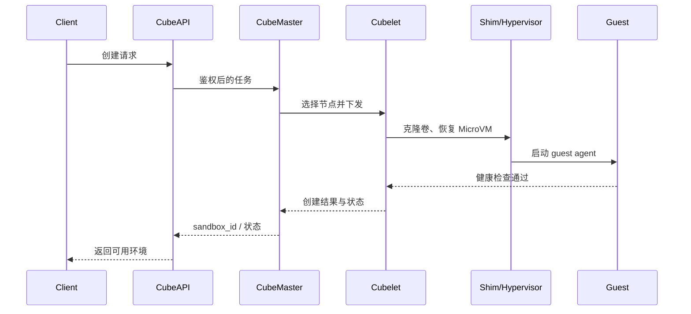

# 第五章　控制面与数据面：一次沙箱创建的十步旅程

<!-- chapter-nav -->

[← 上一章](第四章-一篇文章看懂CubeSandbox-60毫秒背后的架构全景.md) · [章节目录](../../README.md) · [下一章 →](第六章-虚拟化底座-KVM-RustVMM与containerd-Shim-v2的三角关系.md)
<!-- /chapter-nav -->


> 《从 0 到 1 学 Agent 沙箱》系列 ｜ 基础篇 · 第五章
> 主案例：腾讯 CubeSandbox（github.com/TencentCloud/CubeSandbox，Apache 2.0）
> 前置：第四章（架构全景图与七组件）。本章把那张地图变成动画——一次创建请求的十步旅程，每一步都有名字、有责任归属、有失败剧本。
> 口径说明：基于 v0.5.x；十步划分与失败推演为架构逻辑的合理重构，个别组件内部行为以源码为准。

---

## 引子：一个反直觉的设计问卷

假设你从零设计一个沙箱平台，第一个架构决策往往是这个：

> "创建沙箱的请求，应该由谁来处理？"

直觉的答案是一个"大服务"：它接收请求、查节点、起虚拟机、配网络、返回结果——一条龙。直觉还会补充：这样最简单，没有分布式通信，没有两个平面，一个团队就能维护。

这个直觉答案是错的，而且错得很贵。业界所有活下来的同类系统——Kubernetes、SDN 控制器、数据库的解析层与存储引擎、CubeSandbox——都不约而同地把"决定"与"执行"切成了两个平面。**它们不是没想过偷懒，是都在偷懒的路上撞了墙。**

第四章已经给了结论：控制面管调度与状态，数据面管虚拟机与流量。本章回答三个被上一章悬置的问题：**一次创建的十步旅程里，每一步到底发生什么、失败了谁负责？控制面为什么必须集中那九件事？把两个平面合并，会撞上哪五堵墙？**

读完本章，你不仅看得懂 CubeSandbox 的日志，也拿到了评估任何"调度 + 执行"系统的通用检查表。

## 一、十步旅程：每一步都有责任归属



这条时序图只画成功路径，实际系统还要为每条箭头定义失败归属：调度失败回到控制面重试，节点执行失败由 Cubelet 上报，guest 健康检查失败要销毁半成品，状态回写失败则必须靠幂等键和对账任务避免重复创建。

先把第四章的骨架图请回来，这次装上血肉——每一步给四样东西：**动作、平面归属、失败时谁负责、用户看到什么**。这张表是本章的核心装置，也是运维排障时的对照手册：

| 步 | 动作 | 平面 | 失败时谁负责 | 用户看到什么 |
|---|---|---|---|---|
| ① | SDK 发起创建请求 | —（客户端） | 客户端重试 | 超时/连接错误 |
| ② | CubeAPI 接收、鉴权、协议翻译 | **控制面** | CubeAPI 返回明确错误码 | "鉴权失败 / 参数非法"，毫秒级失败 |
| ③ | CubeMaster 查水位与模板命中率，选定节点 | **控制面** | CubeMaster：无节点可调度 → 立即拒绝或入队 | "资源不足 / 排队中" |
| ④ | 指令下发目标节点的 Cubelet，状态预写 Redis | **控制面** | CubeMaster 超时重试或换节点 | 感知不到（内部重试） |
| ⑤ | Cubelet 调 CubeCoW 克隆模板磁盘卷 | **数据面** | Cubelet 上报失败，Master 标记沙箱为 Failed | 创建失败，可重试 |
| ⑥ | CubeShim 驱动 CubeHypervisor，从内存快照恢复 MicroVM | **数据面** | 同上；节点级失败则该节点被摘除调度 | 创建失败；同节点其他沙箱不受影响 |
| ⑦ | CubeVS 配 TAP 网卡，挂 eBPF 策略 | **数据面** | Cubelet 回滚已创建的资源（磁盘/VM），再上报 | 创建失败，无资源残留 |
| ⑧ | 沙箱内 guest agent 就绪，健康检查通过 | **数据面** | Cubelet 判定超时，走清理路径 | 创建失败（慢失败，秒级） |
| ⑨ | Cubelet 上报"创建成功" | 数据面→控制 | 状态丢失则由心跳兜底对账 | 感知不到 |
| ⑩ | CubeMaster 确认状态，返回 sandbox_id | **控制面** | Master 状态机回滚 | 成功响应，或明确的失败码 |

十步里藏着几个值得单独拧出来看的细节。

**细节一：②③ 的失败是"快失败"，⑤～⑧ 的失败是"慢失败"。** 控制面的三段（鉴权、调度、下发）全部是内存操作与短查询，失败在毫秒级返回——用户的重试成本几乎为零。数据面的四段（克隆、恢复、配网、健康检查）涉及真实的磁盘、KVM、网卡操作，失败可能要等秒级超时才知道。**这就是为什么 ③ 的调度必须精准**：一次错误的调度决策，代价不是 3ms 的决策时间，而是后面 40ms 的白做加一次完整的回滚。调度器宁可多花几毫秒选对节点，也不能把请求派给一个"看起来有空位"的坏节点。

**细节二：第⑦步失败时的"回滚"不是免费的。** 想象⑥已经成功（MicroVM 已恢复、内存已映射），⑦配网失败——此时必须把 VM 停掉、把 reflink 克隆的磁盘卷删掉、把预写的状态清理掉。**创建路径的每一步都必须为"前面所有步骤的反悔"做好准备**，这是数据面代码复杂度的隐形来源。没有事务，就要靠精心设计的补偿顺序。

**细节三：第⑩步是两个平面的缝合点。** ⑤～⑨ 全程，"沙箱存在吗"这个问题在控制面看来始终处于模糊状态——Redis 里写着 Creating，节点上跑着真实的创建流程，两边只靠⑨这条上报消息对齐。**如果⑨丢了（网络抖动、Cubelet 重启）呢？** 兜底机制是 Cubelet 的周期性心跳对账：节点如实上报自己有哪些沙箱，Master 用它校准自己的账本。分布式系统的经典问题"两边各有一份真相"，靠的就是这个对账回路——这也是为什么状态必须只存在 Redis 一处（下一节的主题）。

**细节四：整条链路没有一步是"等别人"。** ②③④ 是串行的短查询；⑤⑥⑦ 在节点内流水线化。60ms 的预算纪律贯穿每一步：任何一步如果引入了"同步扫描全集群""等一个慢节点应答"之类的行为，预算立刻爆掉。快，是设计纪律的副产品。

## 二、控制面的九件事：为什么必须集中

控制面要干的活，可以列成九项。逐条过，每条问同一个问题：**这件事为什么不能下放到节点自己做？**

1. **接收请求**——统一入口才能统一限流、鉴权、计费。
2. **校验身份与参数**——权限是全局策略，节点各自校验必然出现口径漂移。
3. **选择计算节点**——需要全局视野（所有节点的水位），单个节点不知道别人多忙。
4. **判定使用哪个模板**——模板是全局资产，其分发与命中率是集群级优化。
5. **判定节点资源是否足够**——同 3，"够不够"是相对全局负载而言的。
6. **通知目标节点创建**——调度的执行动作，必须由做决定的人下发（否则谁对决定负责？）。
7. **保存沙箱 ID、状态、节点位置**——**全系统只能有一份真相**。如果每个节点都自己记账，一次网络分区后两边账本必然分叉，"这个沙箱到底活着吗"将永远吵不清。
8. **对外返回结果**——响应的一致性由入口的统一性保证。
9. **处理生命周期（暂停/恢复/销毁/迁移）**——生命周期往往跨节点（迁移）、跨请求（长任务），只有持有全局状态的平面能编排。

九件事的共同答案收敛成一句话：**凡是需要"全局视野"或"唯一真相"的事，必须集中；这是信息论决定的，不是组织架构决定的。** 分散的节点永远看不到彼此的水位，也永远无法对"谁是权威"达成免协商的一致——把它们硬捏在一起，你得到的不是分布式，是分布式错觉。

当然，集中不等于单点。控制面自身的可用性靠副本解决（多实例 CubeAPI/CubeMaster + Redis 主从），调度器实例之间靠"抢占式选主或分片"避免脑裂——CubeMaster 的具体选主机制以源码与部署文档为准，此处不展开。**关键是：控制面的"高可用"是水平复制一份相同的真相，而不是让数据面各自持有一份不同的真相。**

## 三、数据面的三件事：为什么必须下沉

反过来，数据面的活——**启动 MicroVM、创建 TAP 网卡、执行用户代码**——为什么不能收上来，让控制面遥控执行？

**因为延迟与吞吐不能过网络调度。** 拆开看：

- **延迟**：创建链路预算 60ms，其中数据面占约 45ms。如果克隆磁盘、恢复内存这些操作要"请示"控制面逐段执行，每次网络往返加上调度排队，预算立刻翻几倍。数据面操作必须"拿到指令后一口气做完"，中间不再回头。
- **吞吐**：一个节点每秒要创建/销毁上百个沙箱，这些操作的指令流量是海量的短命令。让它们全部穿过中央调度器，调度器会先于计算资源饱和——**控制面成为吞吐瓶颈的那一刻，加多少计算节点都没用**。
- **故障隔离**：用户代码执行是整个系统里最容易出事的部分（资源超限、内核 panic、恶意行为）。把它锁在节点内部，任何执行层故障的爆炸半径就天然是"单节点"，而不是"全平台"。

所以数据面拿到的不是"任务描述"，而是**一份自包含的工单**：模板 ID、资源规格、网络策略、沙箱 ID——拿着它，节点可以在不回头的情况下完成⑤～⑨的全部工作。控制面与数据面之间的接口越"胖"（一次下发、信息完备），系统越快；越"瘦"（频繁往返确认），系统越脆。

## 四、反面试算：合并两个平面的五堵墙

现在正面回答引子的问题：直觉里的"一条龙大服务"，会撞上哪五堵墙？每一堵都配一个具体的故障剧本——

**墙一：一个进程挂掉，拖垮所有虚拟机。**
剧本：大服务进程内存泄漏 OOM——它既是 API 又是虚拟机管理器，内核杀掉它的瞬间，全平台数千个正在运行的沙箱全部失去管理者，变成孤儿。控制面/数据面分离后，同样的 OOM 只影响"新请求进不来"，存量沙箱继续跑，数据面等控制面重启即可。

**墙二：调度逻辑与虚拟化强耦合。**
剧本：你想把调度算法从"水位优先"改成"模板命中率优先"——在大服务里，这意味着重新编译/发布整个虚拟机管理进程，发布窗口里所有创建请求中断。分离后，调度器独立升级，滚动重启，计算节点无感。

**墙三：扩容变成不可能任务。**
剧本：流量涨了 10 倍。分离架构里这是两道简单的算术题：控制面加副本（API 是无状态的，调度器有选主协议），数据面加节点（新节点装上 Cubelet 注册进集群即可）。合并架构里，"扩容"意味着那个大进程的内部所有状态（哪个沙箱在哪、哪个节点忙）都要重新分片——等于重写一遍系统。

**墙四：故障边界不清。**
剧本：用户报"创建失败"。分离架构里第一问就是"控制面还是数据面"——②③失败去查调度日志，⑤～⑧失败去查目标节点的 Cubelet 日志，责任域天然切开。合并架构里，一次失败要在同一份混杂的日志里翻找，平均修复时间（MTTR）直接翻倍。第一章六件套里"可观测"的价值，一半要靠清晰的边界才能兑现。

**墙五：运维与升级复杂度叠加。**
剧本：升级虚拟化层（Kernel/KVM 有安全补丁）。分离架构里，数据面节点逐台排水（drain）、升级、回池，控制面全程在线调度其余节点。合并架构里，升级任何一部分都要动整个大服务——于是团队学会了两件事：能不升就不升，要升就挑深夜。安全补丁的延迟，就是攻击者的窗口。

五堵墙的共同根源：**合并架构把"变化频率完全不同的两部分"焊死了。** 控制面的逻辑天天在改（调度策略、API 迭代），数据面的状态以小时计存在（跑着的沙箱）——前者的任何一次变更，都在拿后者当人质。

## 五、两个平面的两种活法：扩容与节点解剖

分离不是目的，**让两个平面各自用适合自己的方式长大**才是。

**控制面的扩容单位是"副本"。** CubeAPI 是无状态的，直接水平复制；CubeMaster 的调度决策依赖共享状态（Redis），多实例靠选主或分片协调。控制面扩容的触发指标：API P99 延迟、调度排队长度。

**数据面的扩容单位是"节点"。** 加一台机器、装上 Cubelet、注册进集群——容量就增加了。数据面扩容的触发指标：节点水位、供给排队（第十八章展开成完整的容量规划方法论）。

**一个计算节点里面长什么样？** 值得停下来解剖一次——它就是一台普通 Linux 服务器，但叠了一整层"沙箱基础设施栈"：

```
        ┌─────────────────────────────────────────┐
        │  计算节点（一台 Linux 服务器）             │
        │                                         │
        │   MicroVM #1   MicroVM #2   ... #N      │  ← 每个沙箱一个独立内核
        │   (Python)     (Node)                   │     guest agent 在内
        │      │            │                     │
        │   CubeHypervisor（KVM 虚拟化层）          │  ← 造机器、管 vCPU/内存
        │      │                                   │
        │   CubeShim（containerd Shim v2 桥）       │  ← 对上装容器，对下驱 VM
        │      │                                   │
        │   Cubelet（节点代理）                     │  ← 接工单、组织创建、上报
        │                                         │
        │   CubeVS（eBPF：TAP 网卡 + 策略 + NAT）   │  ← 每沙箱一张虚拟网卡
        │   KVM / Linux 内核（宿主机）               │
        └─────────────────────────────────────────┘
```

值得注意的三点：其一，**宿主机内核同时是"沙箱的敌人与朋友"**——沙箱要被它挡住（KVM 边界），又靠它提供网络 datapath（eBPF）；其二，**所有组件都是用户态进程**，除了 KVM 模块本身，升级不需要动内核；其三，节点上没有一份"全局状态"——它只是工单的执行者，重启节点损失的是正在创建的任务，而不是集群的记忆。

## 六、K8s 映射表：一份你已有的心智模型

如果读过 Kubernetes，本章的一切都可以用一张映射表直接消化——CubeSandbox 与 K8s 的控制面/数据面是同构的：

| 关注点 | Kubernetes | CubeSandbox | 同构点 |
|---|---|---|---|
| 系统入口 | kube-apiserver | CubeAPI | 唯一入口、鉴权、限流 |
| 调度决策 | kube-scheduler | CubeMaster | 全局视野选节点 |
| 唯一真相 | etcd | Redis | 状态只有一份 |
| 节点代理 | kubelet | Cubelet | 接收工单、自治执行、心跳对账 |
| 执行单元 | Pod（容器进程组） | MicroVM（独立内核客户机） | **关键差异所在** |
| 网络模型 | CNI（iptables/eBPF） | CubeVS（eBPF） | 每单元一个网络端点 |
| 生命周期语义 | Pod：重建便宜、尽量不迁移 | 沙箱：即焚常态、快照可回滚 | 语义起点不同 |

六行同构，一行根本差异：**执行单元的性质**。K8s 的 Pod 是"共享内核的进程组"——所以 K8s 的调度优化围绕"装箱"（bin-packing，资源利用率优先），Pod 重建的成本模型是"秒级、可接受"。CubeSandbox 的执行单元是"独立内核的客户机"——调度除了装箱还要考虑模板命中率（缓存哪个模板）与启动路径（快照恢复的 IO 局部性），而"即焚"语义把创建吞吐推成了第一指标。**同构的是骨架，不同的是肌肉记忆**——这就是为什么"直接拿 K8s 调 MicroVM"（比如每沙箱一个 Pod）看起来可行、实则处处别扭的深层原因：调度粒度、启动延迟、生命周期语义三者全部错位。这个判断将在第十八章（供给链路）与第二十三章（选型）反复回归。

## 本章小结

| 关键认知 | 一句话 |
|---|---|
| 十步旅程 | ①～④与⑩是控制面（快失败、毫秒级），⑤～⑨是数据面（慢失败、自包含工单）；⑨⑩的缝合靠心跳对账兜底 |
| 控制面九件事 | 凡需要"全局视野"或"唯一真相"的事必须集中——信息论决定，不是架构偏好 |
| 数据面三件事 | 延迟与吞吐不能过网络调度；执行层故障的爆炸半径天然锁在单节点 |
| 合并的五堵墙 | 一个进程挂全灭、调度与虚拟化耦合、扩容不可能、故障边界不清、升级拿存量当人质——根源是变化频率被焊死 |
| 两种活法 | 控制面加副本、数据面加节点；计算节点 = 普通服务器 + 一层沙箱基础设施栈 |
| K8s 映射 | 六行同构、一行差异：执行单元是进程组还是独立内核——决定了装箱之外还要考虑模板与即焚吞吐 |

## 思考题（能算账的那种）

1. 用第一节的十步表做一次桌面推演：50 并发创建请求中，一个节点在⑥步批量失败（KVM 资源耗尽）。按"控制面重试换节点"的策略，这批请求的最终延迟分布会怎样？如果重试策略是"立即原节点重试"呢？——算出两种策略下的最坏情况延迟差。
2. 墙三的量化：你的平台要从 10 节点扩到 100 节点。分离架构下，控制面需要几个副本（假设单调度器吞吐 500 创建/秒、峰值需求 4000/秒）？合并架构下，列出你至少要重新设计的三件事。
3. K8s 映射表的逆向题：如果你的公司已有 K8s，参照第六节，你复用了哪些"同构件"（apiserver 思路、etcd 思路）？哪些必须自建（模板命中率调度、即焚生命周期）？用这张表给你的技术负责人写三句话的结论。

## 下章预告

"工单下发到了节点，现在钻进工厂车间。"

第六章《虚拟化底座：KVM、RustVMM 与 containerd Shim v2 的三角关系》。十步旅程里最重的⑥⑦两步——CubeShim 与 CubeHypervisor——终于轮到主角登场：KVM 的硬件虚拟化到底怎么画出那道"硬件墙"？RustVMM 生态（Firecracker → Cloud Hypervisor → CubeHypervisor）的血脉传承意味着什么？Shim v2 这座桥为什么能让 K8s 生态直接管理虚拟机？三个名字的三角关系，是下一章的全部内容。

---

> **参考与延伸**
> - CubeSandbox 仓库与 `docs/architecture/`（v0.5.x）：github.com/TencentCloud/CubeSandbox
> - Kubernetes 组件架构文档：kubernetes.io/docs/concepts/architecture/
> - Kleppmann, *Designing Data-Intensive Applications*（第 5、8 章：单主复制与一致性——"唯一真相"的分布式系统论证）
> - containerd Runtime v2 (Shim) 设计文档
> - Brewer 的 CAP 定理与分布式协调的经典论述（控制面选主的背景）
