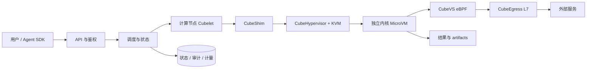
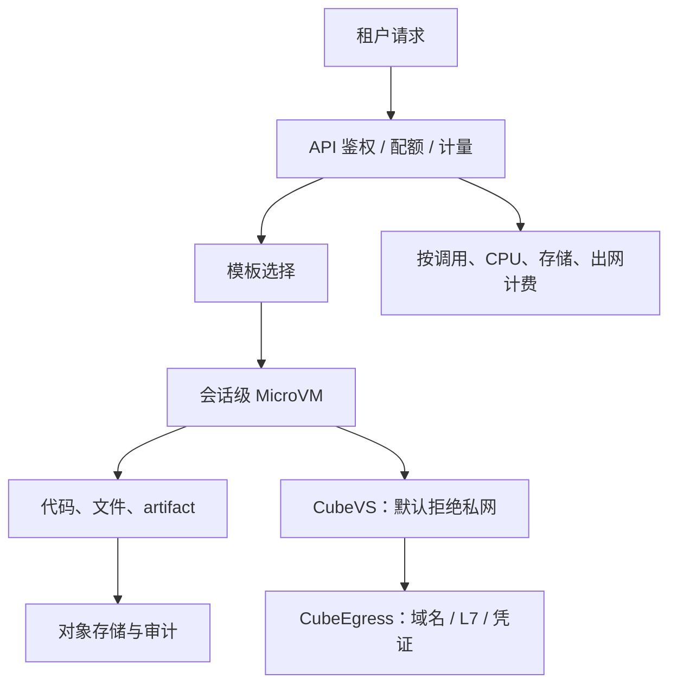
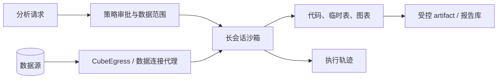
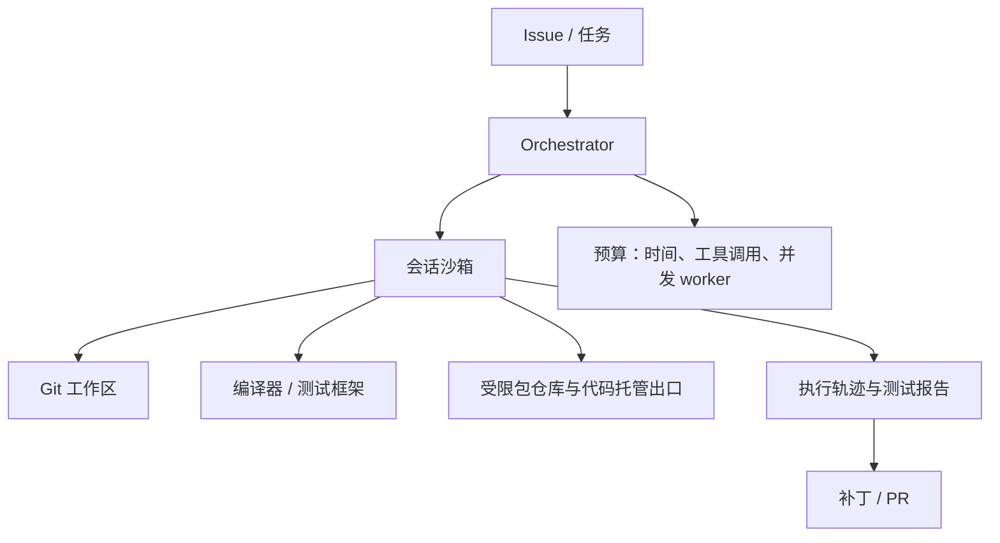

# 第八章　基础篇综合推演：给一个企业场景做架构设计

<!-- chapter-nav -->

[← 上一章](第七章-网络治理-eBPF虚拟交换机与L7出口网关.md) · [章节目录](../../README.md) · [下一章 →](../02-进阶篇/第九章-CubeCoW-快照克隆与任意状态回滚的实现.md)
<!-- /chapter-nav -->


> 《从 0 到 1 学 Agent 沙箱》系列 ｜ 基础篇·综合推演  
> 主案例：腾讯 CubeSandbox  
> 前置：第一至第七章。本文只使用前七章已经出现的概念，不把某一组容量数字伪装成生产基准。文中的容量结果都是假设演算，用于展示决策过程。  
> 目标：读完后，能够从需求、威胁模型、隔离路线、网络、凭据、生命周期和容量七个角度画出一页纸架构草图。

## 引子：同一套沙箱，为什么答案不同

一家企业同时有三个团队来申请“Agent 沙箱”：平台团队想做多租户代码执行 SaaS；数据团队想让 Agent 读取经营数据并生成报告；研发团队想让 Coding Agent 自动改仓库、跑测试和提交补丁。

三个人都说需要“一个能执行代码、能联网、能保存状态的沙箱”。如果只按这句话采购，最后很可能得到一个看似通用、实际处处不合适的平台：SaaS 团队担心租户互相影响，数据团队担心凭据和数据落地，研发团队则发现环境不够完整、启动策略和 Git 流程接不上。

架构设计不是从组件清单开始，而是从约束开始。我们沿着七个问题走：

1. 谁写代码，代码有多不可信？
2. 一个任务需要多少步、多久、多少状态？
3. 网络是默认允许还是默认拒绝？哪些访问需要 L7 检查？
4. 凭据是否进入 guest？谁负责注入和轮换？
5. 沙箱是一次性、会话级，还是需要快照和暂停？
6. 峰值并发、创建吞吐和工作负载内存各是多少？
7. 需要托管平台、Kubernetes 编排，还是自建 MicroVM？

## 一、先画共同骨架

无论三个场景如何不同，都可以先画出一张共同的骨架：



这张图只说明层次，不说明每个场景的配置。控制面负责身份、模板、调度、状态和计量；节点数据面负责 VM、rootfs、TAP 和策略执行；guest 内运行 Agent 所需的工具；网络出口和凭据代理在沙箱外；结果回传和审计要能关联同一个 `task_id` 与 `sandbox_id`。

接下来每个场景都要对这张骨架做三种修改：选择隔离路线，选择生命周期，选择容量和运营边界。

## 二、场景一：多租户代码执行 SaaS

### 2.1 需求卡片

假设平台为不同企业客户提供“提交问题，Agent 生成代码并返回表格、图表或文件”的 API。约束如下：

| 项目 | 假设 |
|---|---|
| 峰值同时存活沙箱 | 2,000 个 |
| 单任务平均工具调用 | 10 次；会话级复用 |
| 工作负载画像 | 70% 轻量 Python，30% 较重数据处理 |
| 轻量工作集 | 150MB/沙箱，假设值 |
| 较重工作集 | 500MB/沙箱，假设值 |
| 安全要求 | 租户隔离、默认拒绝内网、出站审计 |
| 结果 | 文件和 artifact 必须回传，沙箱可销毁 |

代码是模型现场生成的，可能被用户输入和外部数据诱导。这里的威胁模型比内部脚本更强，Docker 共享内核不应作为唯一的租户边界。MicroVM 是合理的主路线；如果业务只运行可重编译的小函数，WASM 可以作为低风险分支，但不能覆盖完整 Python 生态。

### 2.2 一页纸架构



**租户边界**至少有三层：每个沙箱独立 guest 内核；每个租户拥有独立的策略、配额和审计视图；控制面 API 只允许租户访问自己的 sandbox_id、模板和 artifact。不要把“每个租户一个 namespace”当成硬件隔离的替代品。

**网络策略**采用默认拒绝内网、按域名放行依赖仓库和允许的业务 API。依赖下载可以走普通 L3/L4 出站；需要注入客户 API Key 的请求必须进入 CubeEgress，并限制 Host、scheme、method 和 path。用户上传的文件与 Agent 生成的文件进入 artifact 通道，不能通过任意内网地址回传。

**生命周期**采用会话级沙箱：任务的十次工具调用复用同一个状态，减少反复安装依赖和环境漂移。任务完成后设置短 TTL；长时间等待用户确认时可以 AutoPause，但要把唤醒延迟写进产品 SLO。

### 2.3 容量粗算：不要把 5MB 当成全部内存

用第十一章会展开的公式先做一版粗算：

```text
总内存 = 宿主机基础 + 控制面常驻 + N × 沙箱增量 + 所有工作集
```

按上面的假设：

- 轻量工作集：2,000 × 70% × 150MB = 210GB；
- 较重工作集：2,000 × 30% × 500MB = 300GB；
- 工作负载合计约 510GB；
- 如果把 CubeSandbox 公开的 5MB 作为“额外开销的量级假设”，2,000 个沙箱约增加 10GB，但这不是完整 guest 内存，也不是所有配置的保证；
- 再加控制面、节点代理、文件缓存、系统余量和故障冗余，规划量不能只写 520GB。

若使用 128GB 节点，按最多 70% 可分配内存计算，每节点约 89.6GB 可用。仅按上述工作负载和 20GB 其他开销粗算，至少需要 `530 / 89.6 ≈ 6` 个节点；考虑滚动升级、单节点故障和峰值抖动，生产池应再留冗余，例如规划 8～9 个节点。这个结果不是 benchmark，而是告诉你：**工作集画像比“5MB”更决定容量。**

创建吞吐还要另算。2,000 个同时存活沙箱不等于每秒要创建 2,000 个；如果晚高峰 60 秒内需要创建 1,200 个，平均供给速率就是 20 创建/秒，短时峰值还要结合队列和模板预热。并发数、到达率和服务率不是同一个指标。

### 2.4 计费钩子放在哪里

计费不应只按“创建过一个沙箱”收取。比较可解释的维度包括：

- 沙箱存活时长和暂停时长；
- CPU 配额与实际 CPU 时间；
- guest 工作集峰值；
- 持久化卷和 artifact 大小；
- 出站字节数与代理请求数；
- 高级凭证、审计和快照能力。

API 层负责记录租户与任务，节点侧上报资源使用，CubeEgress 提供出站计量，存储层提供卷和 artifact 计量。最终账单需要把这些事件汇总到一个不可重复计费的任务 ID 上。

## 三、场景二：企业内部数据分析 Agent

### 3.1 约束完全变了

数据分析 Agent 的危险点不只是“代码逃逸”，还有数据被复制、凭据被打印和结果不可复现。一个典型任务是：“读取近三个月客户流失数据，生成分群图表和解释报告。”它可能执行几十步，访问多个数据源，产生大量中间文件，并在等待审批时停留数小时。

此时优先级是：数据不落地、凭据不进 guest、过程可审计、结果可复现。单纯追求冷启动数字反而可能排在后面。

### 3.2 架构选择



数据访问尽量采用代理或短期身份，而不是把数据库密码写入环境变量。代理按租户、数据集、SQL/API 路径和时间窗口授权；沙箱只拿到必要的数据结果。出站策略要同时保护公网、内网和云元数据地址。

生命周期采用长会话加 AutoPause。暂停前要确认任务没有正在写入关键文件或事务；恢复后要重新做健康检查和凭据有效性检查。若数据合规要求“任务结束即销毁”，则把中间文件和快照的保留期限写进数据分类规则，不要让 AutoPause 默认把敏感数据留在磁盘上。

### 3.3 容量与成本

数据分析的内存和 IO 方差大，不能用平均值掩盖长尾。容量规划至少分为轻量查询、聚合分析和大文件处理三档；每档分别估计 CPU、内存、临时磁盘、网络和生命周期。一个 100 个并发的分析平台，可能比 1,000 个轻量 Code Interpreter 更早被磁盘 IO 或数据库连接数卡住。

企业需要做两张账：

- **计算账**：沙箱和工作集占多少内存、CPU 和节点；
- **数据账**：数据读取、临时文件、结果保留、审计和备份产生多少存储与网络成本。

“数据不落地”也要定义边界：guest 临时文件、内存快照、代理缓存、日志和 artifact 是否都算数据副本？没有这份定义，合规审计很难判断销毁是否完成。

## 四、场景三：团队 Coding Agent 平台

### 4.1 Coding Agent 需要“完整工作台”

研发团队的 Agent 要读取 Git 仓库、修改文件、安装依赖、跑测试、修失败，再提交补丁。它对沙箱的要求比 Code Interpreter 高：状态持续几十步，工具链完整，网络要能拉包但不能扫内网，结果要能关联到 commit、测试报告和 PR。

这里不一定需要每个工具调用一个全新沙箱。会话级环境通常更合适；任务分支、失败重试和并行方案则适合从干净模板或中间快照派生。

### 4.2 架构草图



Git 凭据不要直接放进 guest。可以用短期 token、只读镜像、受限代理或由控制面代提交。网络规则区分“拉依赖”“读仓库”“创建 PR”三个动作。测试报告和补丁是 artifact，不能只依赖沙箱退出码。

### 4.3 并发和失败

Coding Agent 常见的并发不是只有用户数，还有一个任务内并行的编译、测试和子 Agent。假设 500 个会话同时在线，每个会话平均运行 2 个并行 worker，底层可能需要约 1,000 个沙箱；如果评测或批量迁移叠加进来，交互式会话和批处理会争抢节点、模板和出站带宽。

平台需要为交互式任务设置更高优先级，为批量评测设置并发配额；创建失败要能区分调度不足、模板缺失、网络失败和 guest 测试失败。重试不能简单地把同一工作区复制三遍，否则会把一个错误放大成资源洪峰。

## 五、三种场景的选择矩阵

| 维度 | 多租户代码执行 | 数据分析 Agent | Coding Agent |
|---|---|---|---|
| 主要风险 | 租户越界、恶意代码、出网滥用 | 数据泄露、凭据泄露、留存不合规 | 仓库污染、供应链、任务状态错误 |
| 生命周期 | 短到中等，会话复用 | 中到长，可能 AutoPause | 中到长，支持快照/分支 |
| 网络 | 域名放行、L7 凭证 | 数据连接代理、严格内网策略 | Git/包仓库/PR 分离授权 |
| 隔离选择 | MicroVM 主路线，WASM 作分支 | MicroVM + 代理和审计 | MicroVM 或 K8s+Kata，视企业平台而定 |
| 主要容量瓶颈 | 工作集内存、创建吞吐 | IO、数据连接、存储 | 并行 worker、模板和测试 CPU |
| 结果形态 | 文件、图表、artifact | 报告、数据摘要、审计链 | 补丁、测试报告、PR |

### E2B、K8s Agent Sandbox 与 CubeSandbox 的位置

E2B 是产品化的 Agent 沙箱平台，适合希望通过 SDK 快速获得隔离 Linux、模板和状态能力的团队。它把 Firecracker、快照、网络和观测封装起来，换来较低的自建门槛，但企业需要评估数据驻留、网络接入、成本和平台依赖。[E2B Runtime](https://github.com/e2b-dev/runtime)

Kubernetes Agent Sandbox 是 K8s 原生控制器和 CRD，提供 Sandbox、Template、Claim、WarmPool 等声明式对象，底层可以选择 gVisor、Kata 等运行时。它适合已有 K8s 运维、权限、调度和审计体系的组织，但它是编排层，不自动替你解决 MicroVM、凭据、出站和 Agent 状态问题。[官方文档](https://agent-sandbox.sigs.k8s.io/docs/)

CubeSandbox 处在二者之间：它拥有自己的 Agent 沙箱控制面和 MicroVM 数据面，同时兼容 E2B 接口、支持 K8s 部署，并把快照、网络和凭据作为产品能力的一部分。选择它的理由应该是状态化 Agent、私有化和底层可控性，而不是单个启动数字。

## 六、完整走一遍：多租户 SaaS 的创建到销毁

把场景一的请求展开，能检验前七章是否真的连起来：

1. **请求进入 API**：校验租户、模板、资源上限和网络策略，生成 `task_id`；
2. **控制面鉴权与计量**：记录调用方、预算和计费维度；
3. **调度节点**：根据可用内存、模板是否本地、故障域和租户配额选择节点；
4. **准备模板**：Cubelet 克隆 rootfs 和所需状态，CubeShim 准备内核、内存与 guest agent；
5. **创建 MicroVM**：KVM 建立 VM，VMM 配置 vCPU、内存、virtio 和 vsock；
6. **接入网络**：创建 TAP，加载 eBPF 过滤器、策略 map 和必要的端口映射；
7. **健康检查**：guest agent 报告文件、进程和网络能力可用；
8. **执行循环**：Agent 生成代码，沙箱执行，结果以 stdout/file/artifact 回流；
9. **审计和计量**：命令、策略命中、出站请求、资源使用与结果关联到任务；
10. **暂停或销毁**：完成后保存需要的 artifact，按 TTL 删除 VM、TAP、卷、临时凭据和会话状态。

每一步都要有失败责任：参数失败在控制面快速返回，节点资源不足进入排队或拒绝，VMM 启动失败由数据面清理，网络策略错误不能让沙箱带着默认开放策略继续运行，销毁失败必须进入可重试的回收队列。

## 七、企业评审清单

在评审任何“Agent 沙箱平台”时，可以使用下面这张清单：

- **隔离**：guest 是否独立内核？VMM、guest kernel、设备后端和 side channel 的边界是什么？
- **接口**：是否支持你已有的 SDK、OCI、containerd、K8s 或 Agent 框架？兼容的是接口名，还是完整行为语义？
- **网络**：默认策略是什么？能否按 CIDR、域名、SNI、Host、path 和 method 控制？是否支持 DNS/hosts/IPv6 等边界情况？
- **凭据**：密钥保存在哪里？是否进入 guest、日志、快照和模型上下文？轮换和撤销怎样证明？
- **状态**：能否快照、克隆、暂停、恢复、回滚？状态包括文件、内存、进程还是只包括镜像？
- **容量**：并发、创建到达率、创建服务率、工作集内存、IO 和端口分别是多少？最先饱和的资源是什么？
- **企业运营**：审计能否关联租户和任务？升级、灰度、故障域、备份和删除证据是否清楚？

## 本章小结

基础篇的“看懂”不等于记住组件名，而是能把需求翻译成架构约束：

| 结论 | 具体含义 |
|---|---|
| 隔离路线服从威胁模型 | 不可信、完整 Linux、规模化任务通常指向 MicroVM，但轻任务可以分级到 WASM |
| 生命周期决定成本 | 会话复用、调用即焚、AutoPause、快照分支分别适合不同工作流 |
| 网络和凭据是独立边界 | 有硬件隔离不等于可以默认上网、把密钥塞进环境变量 |
| 容量要按工作集算 | 5MB 等额外开销指标不能代替 guest 工作负载内存、IO 和连接数 |
| 平台层次要分清 | E2B 是产品平台，Agent Sandbox 是 K8s 编排层，CubeSandbox 是可私有化的 Agent 沙箱系统 |
| 设计要能解释失败 | 每个动作都有责任域、回滚路径、审计证据和用户可见结果 |

## 思考题

1. 从三个场景中选一个，画出控制面、数据面、guest、网络出口、凭据和审计的六层图，并在每条箭头旁写上失败责任。
2. 把你的峰值需求拆成三个数：稳态存活沙箱数、每秒创建到达率、每秒创建服务率。哪一个数变化会先触发扩容？
3. 如果平台同时服务交互式 Coding Agent 和批量评测，设计一个租户/业务优先级矩阵，说明排队、降级、拒绝和故障隔离策略。
4. 给一个“不该使用 CubeSandbox”的场景，并说明 Docker、gVisor、Kata、E2B 或 WASM 为什么更匹配。

## 下篇预告

基础篇到此结束。下一章进入进阶篇的第一道机制：CubeCoW 如何用写时复制、快照和增量脏页追踪，把“环境复现”和“毫秒级派生”同时做成基础能力。

---

> **参考与延伸**
> - CubeSandbox v0.7.2 架构总览：<https://github.com/TencentCloud/CubeSandbox/blob/v0.7.2/docs/architecture/overview.md>
> - CubeSandbox 性能与模板文档：<https://github.com/TencentCloud/CubeSandbox/tree/v0.7.2/docs/zh/guide>
> - E2B Runtime：<https://github.com/e2b-dev/runtime>
> - Kubernetes Agent Sandbox：<https://agent-sandbox.sigs.k8s.io/docs/>
> - Kubernetes NetworkPolicy：<https://kubernetes.io/docs/concepts/services-networking/network-policies/>
> - Kata Containers：<https://github.com/kata-containers/kata-containers>
