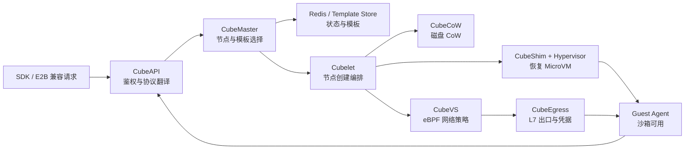

# 第四章　一篇文章看懂 CubeSandbox：60 毫秒背后的架构全景

<!-- chapter-nav -->

[← 上一章](第三章-沙箱有什么用-Agent沙箱的用法原型与企业需求全景.md) · [章节目录](../../README.md) · [下一章 →](第五章-控制面与数据面-一次沙箱创建的十步旅程.md)
<!-- /chapter-nav -->


> 《从 0 到 1 学 Agent 沙箱》系列 ｜ 基础篇 · 第四章
> 主案例：腾讯 CubeSandbox（github.com/TencentCloud/CubeSandbox，Apache 2.0）
> 前置：第一～三章（四大新问题、隔离光谱、六种用法原型）。本章是全系列的"总地图"——五～七章逐层拆解它，深潜章逐行下钻它。
> 口径说明：本章描述基于 CubeSandbox v0.5.x（2026-09 检出的代码基线与官方架构文档）；组件职责以官方仓库为准，个别细节处标注"以源码为准"。

---

## 引子：三张名片，一个系统

第一次打开 CubeSandbox 的 README，你会看到三行字：

> 冷启动 **< 60ms**；单实例内存开销 **< 5MB**；单节点 **数千** 实例。

前三章我们已经论证了这三个数字的分量：它们分别是"用完即焚架构成立"（第一章）、"密度与成本结构成立"（第二、三章）的前提。但数字不是魔法——**60ms 不是某个天才函数的执行时间，而是从你敲下 `Sandbox()` 到沙箱可用之间，整条链路上每一个环节都做了减法的结果**。

传统 VM 为什么秒级？因为它要过固件、过设备枚举、过完整 OS 启动——每一段都是串行的历史包袱。CubeSandbox 要做到 60ms，就必须让链路上没有任何一段"付得起懒"：模板要预克隆、内核要直接启动、内存要映射而非拷贝、网络策略要在内核态就位。**每一个 60ms 的组成部件，都对应一个"别的地方偷懒、这里就必须加倍偿还"的工程决策。**

所以本章不逐个拆数字（那是第九、十一章与深潜章的工作），而是先把整台机器的图纸铺开：**七大组件各管什么、控制面与数据面怎么分工、一次调用从头到尾经过哪些站点。** 读完本章，你应该能徒手画出 CubeSandbox 的架构图——这张图是后续所有章节的坐标系。

## 一、四大核心能力：架构要兑现的合同

架构图之前，先看架构要兑现的合同。CubeSandbox 对外承诺四件事，每件事都直接对应前三章立起的某根支柱：

| 核心能力 | 兑现的支柱 | 工程含义 |
|---|---|---|
| **即时启动**（60ms 级） | 第一章"用完即焚"成立的前提 | 快照恢复 + 模板预克隆，而非逐台安装 |
| **硬件级隔离**（独立内核） | 第二章 MicroVM 交集中的"强隔离"角 | KVM 虚拟化 + 精简设备模型，而非容器契约 |
| **E2B 兼容**（一行配置迁移） | 第三章企业选型的生态位 | 协议兼容层，而非自有 SDK 锁定 |
| **轻量高密度**（5MB/数千实例） | 第三章三笔账的成本前提 | 共享内核页 + 写时复制，而非每实例完整 OS |

注意这四条之间的张力：隔离要求"每个沙箱一个独立内核"，密度要求"开销趋近于零"——**如果每个沙箱真的要独占一个完整 OS 的内存，这两条就不可兼得**。CubeSandbox 的全部架构智慧，可以一句话概括为：**让每个沙箱"逻辑上独占、物理上共享"**——独立内核的边界 + 共享的物理页。这句话现在是悬念，第九章与深潜四会把它拆到代码行。

## 二、架构全景图：先看森林

直接上图。这是 CubeSandbox 的全貌——建议花一分钟盯住它，本章剩下的内容都是在放大它的局部：

```
                          你 的 应 用
        （Agent 编排 / SDK 调用 / OpenAI Agents SDK / E2B SDK）
                              │
                              ▼
   ┌──────────────────────── 控制面 ────────────────────────┐
   │                                                        │
   │   CubeAPI ──── CubeMaster ──── Redis（状态/元数据）      │
   │  （API 网关）   （编排调度）      （Template Store 模板中心）│
   │                     │                                  │
   └─────────────────────┼──────────────────────────────────┘
                         │ 下发创建指令（选中某个计算节点）
                         ▼
   ┌──────────────────────── 数据面（计算节点池）──────────────┐
   │                                                        │
   │  ┌─ Cubelet（节点代理）─────────────────────────────┐    │
   │  │   │                                              │    │
   │  │   ▼                                              │    │
   │  │  CubeShim ──► CubeHypervisor ──► MicroVM #1      │    │
   │  │ （Shim v2）    （KVM 虚拟化）      独立内核沙箱      │    │
   │  │                   │            MicroVM #2 … #N    │    │
   │  │                   ▼                              │    │
   │  │              CubeVS（eBPF 虚拟交换机）              │    │
   │  │                   │                              │    │
   │  └───────────────────┼──────────────────────────────┘    │
   │                      ▼                                   │
   │              CubeEgress（L7 出口网关）                     │
   └──────────────────────────┬───────────────────────────────┘
                              ▼
                        外部世界（API/仓库/网络）
```

两个平面，七种组件。图上最重要的一条分界线就是**控制面与数据面之间那条**——它不是画图习惯，而是这个系统最重要的设计决策（第五章整章讲它）。先给一句话版本：

> **控制面决定"在哪儿做、做什么"（调度、状态、模板、API）；数据面执行"真刀真枪"（起虚拟机、跑代码、转流量）。**

对照你熟悉的系统：这套分法与 Kubernetes（控制面 = apiserver + scheduler；数据面 = kubelet + 容器运行时）、与 SDN（控制平面下发流表、数据平面转发包）完全同构。这不是巧合——**任何"管理少量复杂调度 + 执行海量简单动作"的系统，最终都会长成这个形状**。第五章会论证为什么"不这样长"的五个后果。

## 三、组件巡礼：七个名字，七份职责

架构图上的每个框，各领一份职责。逐一过——每一节末尾标注"深挖去向"，那是这个组件在后续章节的专属领地。

### CubeAPI：系统的前台

Rust 编写的高并发 API 网关。所有 SDK 请求（创建、连接、暂停、销毁、执行代码）从这里进入。它做协议的"翻译官"：对外说 E2B 兼容协议与自有 REST，对内把请求转成控制面的调度指令。

**为什么用 Rust**：网关是整个系统的流量漏斗，P99 延迟与内存占用直接进入每个请求的预算——Rust 无 GC 抖动的特性在网关层收益最大（Firecracker 选 Rust 的论证同款，见第二章）。
**深挖去向**：第十八章供给链路的"请求层"。

### CubeMaster：调度大脑

集群的编排器。收到创建请求后，它要回答四个问题：哪个节点有空位（资源水位）、那个节点有没有缓存这个模板（模板命中率）、要不要亲和（同租户/同任务聚集或打散）、以及——把决定写进 Redis，让全集群对"哪个沙箱在哪个节点上"只有一份真相。

**设计要点**：调度是纯控制面行为——它读全局状态、做决策、下发指令，自己从不碰虚拟机。这让调度逻辑可以独立演进与扩容（加副本）而不动数据面。
**深挖去向**：第五章十步旅程的第③步；第十八章调度层。

### Redis 与 Template Store：记忆与弹药库

Redis 承载运行时状态（沙箱 ID → 节点、状态、元数据），是控制面的"事实库"；Template Store 是模板中心——**每个沙箱都不是从零安装的，而是从一个预制模板"派生"出来的**：模板里预装了 OS、运行时、常用依赖（Python + 常用库、Node 等），并预先做了一次"开机快照"。60ms 的第一块基石就在这里：**创建 = 从快照恢复，而不是从零启动**（第九章拆快照机制，深潜四拆 fast restore 的 mmap 实现）。

**深挖去向**：第九章（快照）、第十七章（评测的模板派生）。

### Cubelet：节点代理

数据面在每个计算节点上的"工头"。它接收 CubeMaster 的指令，在本节点上组织创建流程：调 CubeShim 起沙箱、配网络、上报状态与资源水位。K8s 的 kubelet 是它最近的亲戚——同样的"节点自治 + 接受调度"模式。

**深挖去向**：第五章第④～⑨步（数据面主战场）。

### CubeShim：两个世界的桥

实现 containerd Shim v2 协议的桥接层。这是"用起来像容器、隔离上是 VM"（第一章）的关键机关：**对上，它假装自己是一个容器运行时，让 containerd/K8s 生态用管理容器的方式管理沙箱；对下，它驱动 CubeHypervisor 起真正的虚拟机。** 你的 Docker 命令行习惯、你的 K8s 运维体系，都能原样复用——这是第二章"生态兼容"三角里 CubeSandbox 对 Kata 路线的继承。

**深挖去向**：第六章（Shim v2 三角关系）；第二十九章（状态机源码）。

### CubeHypervisor：虚拟机工厂

Cloud Hypervisor 的定制 fork（RustVMM 血脉，第二章的 MicroVM 路线）。每个沙箱 = 它创建的一个 KVM MicroVM：独立内核、virtio 最小设备集、PVH 直接启动（无固件）。它也是安全模型的地基——四层隔离同心圆的最外两层都由它实现。

**深挖去向**：第六章（虚拟化底座）；第二十五章（隔离源码深潜）。

### CubeVS：内核里的海关

eBPF 编写的虚拟交换机。每个沙箱一张 TAP 网卡，进出流量在内核态被三个 eBPF 程序处理：NAT 转换、连接跟踪、策略执行（allow_out/deny_out）。**不经过 Bridge、不经过 OVS、不经过 iptables**——因为规则数 × 沙箱数会让 iptables 直接爆炸（第七章的完整论证）。

**深挖去向**：第七章（eBPF 网络治理）；第二十八章（per-packet 成本）。

### CubeEgress：出口的安检门

L7 出口网关（OpenResty 底座）。沙箱所有出站流量在这里被代理：域名白名单过滤、凭据注入（第十章的主角——密钥在这里按请求注入，永不进沙箱）、访问审计。

**深挖去向**：第七章（L7 治理）、第十章（凭据保险库）。

### 组件速查表

| 组件 | 平面 | 一句话职责 | 最近亲戚 |
|---|---|---|---|
| CubeAPI | 控制 | API 网关与协议翻译 | 各家 API Gateway |
| CubeMaster | 控制 | 调度与集群状态 | kube-scheduler |
| Redis / Template Store | 控制 | 状态真相 + 模板弹药库 | etcd + 镜像仓库 |
| Cubelet | 数据（节点） | 节点工头，组织创建 | kubelet |
| CubeShim | 数据 | Shim v2 桥，容器体验 | Kata shim |
| CubeHypervisor | 数据 | KVM MicroVM 工厂 | Firecracker / CH |
| CubeVS | 数据 | eBPF 虚拟交换机 | Cilium datapath |
| CubeEgress | 数据 | L7 出口安检 | Envoy/NGINX 网关 |

（注：组件名为官方仓库口径；早期社区材料中出现的 `CubeOps`、`CubeTemplateCenter` 等命名以官方文档为准，本文不采用。）

## 四、完整调用链：一次创建的极速旅程

组件是名词，调用链是动词。现在把 `Sandbox()` 到"沙箱可用"的完整旅程串一遍——每一步标注平面归属与耗时量级（量级为估算，精确分解见深潜四）：

```
① SDK 发起创建请求（E2B 兼容协议）
      │
② CubeAPI 接收、鉴权、翻译                    【控制面｜~ms 级】
      │
③ CubeMaster 查水位/模板命中率 → 选定 NodeB    【控制面｜~ms 级】
      │
④ 指令下发 NodeB 上的 Cubelet，状态写入 Redis  【控制面｜~ms 级】
      │
⑤ Cubelet 调 CubeCoW：克隆模板磁盘卷           【数据面｜~10ms 级】
      │         （reflink 写时复制，见第九章）
⑥ CubeShim 启动 CubeHypervisor：从内存快照      【数据面｜~10ms 级】
      │         mmap 恢复 MicroVM（非从零启动）
⑦ CubeVS 为沙箱配 TAP 网卡 + 挂 eBPF 策略      【数据面｜~ms 级】
      │
⑧ 沙箱内 guest agent 就绪，健康检查通过        【数据面｜~ms 级】
      │
⑨ Cubelet 上报"创建成功"                       【数据面 → 控制】
      │
⑩ CubeMaster 更新状态，SDK 收到 sandbox_id     【控制面｜~ms 级】
```

十步，四个控制面段落（②③④⑩）、一个数据面主体（⑤～⑨）、总计 60ms 左右。**注意步骤⑤⑥是整条链路的耗时大头**——而它们快的原因高度一致：都不做"从零开始"的事。磁盘不是复制的、是 reflink 派生的；VM 不是启动的、是从内存快照映射恢复的。这两步的内部机制（CubeCoW 与 fast restore）分别在第九章与深潜四展开。

（这十步的完整版——每步失败时谁负责、用户看到什么——是第五章的主角，本章先给骨架。）



图里有一个容易被忽略的回路：沙箱可用后，状态还要回写控制面。没有这次回写，用户虽然可能已经拿到一个运行中的 VM，调度器却仍然认为创建失败或状态未知，后续重试就可能产生重复实例。第五章会把这个回路拆成十步，并分别讨论每一步失败时的补偿动作。

### 4.1 “60 毫秒”应该拆成四个时间点

讨论启动速度时，至少要区分四个时间点，否则不同文章里的数字无法比较：

1. **请求受理**：API 收到请求并返回任务或沙箱 ID；
2. **实例出生**：MicroVM、磁盘和网络资源已经创建；
3. **环境可用**：guest agent 健康检查通过，可以执行第一条命令；
4. **结果可见**：命令输出回到 SDK 或用户界面。

CubeSandbox 的公开指标更接近创建链路的体验目标，不能自动等同于“第一条命令输出”的端到端延迟。模板命中、节点排队、网络策略加载、guest 内服务启动和客户端传输都可能落在四个时间点之间。后续做压测时，应同时记录四个 timestamp，并报告平均值、P95、P99 与失败重试次数；只报一个平均 60ms，无法定位是控制面慢、数据面慢，还是客户端等待慢。

## 五、横向对照：同一道题的两种答案

把 CubeSandbox 的架构放进参照系里，它的设计选择会更清晰。

**vs E2B（闭源全托管）**：E2B 从公开文档与 SDK 行为可反推出同构的分层（API 层/调度层/计算层，底层 Firecracker）——**这印证了这条架构路线是"问题倒逼的收敛解"，而非 CubeSandbox 的私有发明**。差异在开放性：E2B 是托管服务（你交出运维权换取零运维），CubeSandbox 开源自建（你保留数据与控制权，付出运维成本）。这个差异如何映射到企业选型，第二十三章展开。

**vs Firecracker 直用**：Firecracker 只回答了"怎么造一台快速 MicroVM"（数据面的⑥），而 API/调度/模板/网络/审计/多租户——控制面全家桶——全都要自己造。CubeSandbox 相当于"Firecracker 级的底座 + 完整的平台层"。第二十三章会给"自建 Firecracker 的隐藏成本"开一张一个人月级的清单。

**vs K8s + Kata**：最接近的同构对照。Kata 用轻量 VM 跑 Pod（同样的 Shim 桥接思想，CubeSandbox 的 agent/rustjail 直接源自 Kata），但它的优化目标是"融入 K8s 生态跑普通负载"，而非"Agent 沙箱的极致供给"——调度粒度、启动延迟、生命周期语义（K8s 的 Pod 语义 vs 沙箱的即焚语义）都有差异。何时选谁，第二十三章的决策树回答。

## 本章小结

| 关键认知 | 一句话 |
|---|---|
| 60ms 是链路设计 | 不是单点优化——模板预克隆、快照恢复、内核态网络，每个环节都做了减法 |
| 两面分层 | 控制面（CubeAPI/CubeMaster/Redis/模板中心）管调度与状态；数据面（Cubelet/Shim/Hypervisor/VS/Egress）管执行——与 K8s/SDN 同构 |
| 逻辑独占、物理共享 | 隔离要求独立内核，密度要求零开销——矛盾的解法是共享物理页 + 独立边界（第九章/深潜四拆解） |
| 七组件各司其职 | API 网关、调度大脑、状态库、节点工头、Shim 桥、VM 工厂、eBPF 海关、L7 安检——速查表收口 |
| 十步调用链 | ②③④⑩控制面、⑤～⑨数据面；⑤⑥是耗时大头，快的关键都是"不从零开始" |

**自查练习**：合上文章，试着画出第二节的全景图——组件、平面分界线、流量方向。画得出来，本章的目标就达成了；画不出来，回去看第二节的图再看一遍。（这正是学习目标"徒手画出架构图"的验收方式。）

## 思考题（能算账的那种）

1. 十步链路里，控制面四段（②③④⑩）合计预算假设 15ms、数据面五段（⑤～⑨）合计 45ms。如果集群扩到 50 个节点、CubeMaster 调度延迟因状态量膨胀从 3ms 涨到 30ms，总延迟变成多少？这解释了为什么调度器必须"读快照、不扫全集群"？
2. 对照第三节速查表，你的团队现有体系里哪些组件已经有对应物（如已有 K8s = 已有调度）？把"自建 CubeSandbox"换算成"需要新造哪几个组件"——这是第二十三章自建成本清单的预演。
3. 假设模板 Store 有 20 个模板、每个模板预热内存 300MB。要让 500 节点集群的每个节点都能秒起任意模板，内存代价是多少？这个数字如何反过来论证"调度器必须考虑模板命中率"（第③步）？

## 下章预告

"地图有了，现在钻进第一条隧道。"

第五章《控制面与数据面：一次沙箱创建的十步旅程》。本章的十步只是骨架——下一章给每一步装上血肉：每步失败时谁负责、用户看到什么报错、状态如何回滚。更重要的是那个贯穿全章的问题：**为什么必须把控制与执行切成两刀？** 我们会推演"混在一起"的五个灾难后果，从"API 挂掉拖垮所有 VM"讲到"故障边界不清"——理解了反面，你才真正理解本章这张架构图为什么长这样。

---

> **参考与延伸**
> - CubeSandbox 仓库与 `docs/architecture/` 官方架构文档（v0.5.x）：github.com/TencentCloud/CubeSandbox
> - containerd Runtime v2 (Shim API) 设计文档：github.com/containerd/ttrpc、containerd/docs
> - Kata Containers 架构白皮书（Shim v2 与 hypervisor 桥接的同源设计）
> - Agarwal et al., *Firecracker: Lightweight Virtualization for Serverless Applications*, USENIX ATC 2020（MicroVM 底座论证）
> - Kubernetes 控制面/数据面分离的经典论述：kubernetes.io/docs/concepts/architecture/
