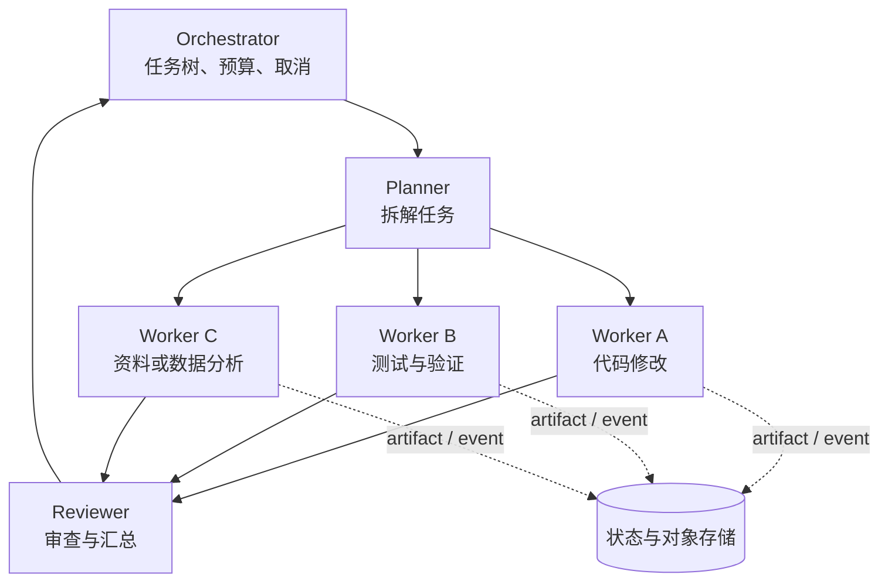

# 第二十章　多 Agent 拓扑：多沙箱协作与编排

<!-- chapter-nav -->

[← 上一章](第十九章-企业级并发架构下-多租户弹性与故障域.md) · [章节目录](../../README.md) · [下一章 →](../03-专家篇/第二十一章-生产化-Terraform集群部署-ARM64与运维清单.md)
<!-- /chapter-nav -->


> 《从 0 到 1 学 Agent 沙箱》系列｜进阶篇·第二十章  
> 基线说明：本文以 CubeSandbox `v0.7.2`（本地 commit `f1aaa737fb3862202b1731e0e0d844c28779f930`）的 MicroVM、网络、API 和生命周期组件作为基础设施参照。关于 E2B multi-agent 示例、LangGraph、MetaGPT、OpenAI Swarm 和 Kubernetes Agent Sandbox，只讨论公开的编排思想；不把示例拓扑或 SDK 名称当成底层网络实现。特别说明：vsock 通常是 host↔guest 的通道，不是跨 VM 之间天然可用的网络；跨沙箱通信仍需显式的网关、虚拟网络或消息系统。

## 引子：一个产品，一群 Agent

第三章留下的原型六是多 Agent 协作。现在把它具体化：规划 Agent 拆任务，worker Agent 修改代码或分析数据，审查 Agent 检查结果，汇总 Agent 生成交付物。每个 Agent 都可能需要自己的工具、凭据和工作目录。

这时“给每个 Agent 一个沙箱”只是起点。真正的问题是：谁创建和回收这些沙箱？worker 如何拿到任务？结果通过什么通道回来？多个 worker 是否看到同一份文件？一个 worker 超时，orchestrator 是否停止兄弟任务？如果每个沙箱都安全隔离，却没有预算和失败传播规则，多 Agent 系统仍会因资源爆炸而不可用。

## 一、拓扑谱系：从一间房到一栋楼



这张图把四种关系分开：父子关系由任务树表达，通信关系由消息或受控网络表达，结果关系由 artifact 引用表达，资源关系由预算和配额表达。若只记录“有三个 worker”，却没有记录它们依赖谁、共享什么状态、消耗谁的预算，失败时就无法判断该停哪一支，也无法解释为什么一个子任务可以继续而另一个必须取消。

### 1. 单 Agent、单沙箱

这是最简单的基线：一个 Agent 持有一个 sandbox ID，所有工具调用在其中执行。状态连续、调试容易，缺点是权限集中、故障影响整个任务，且无法并行拆解。

### 2. 主 Agent + 工具沙箱

主 Agent 留在编排服务或受控会话中，需要执行代码时临时调用工具沙箱。工具沙箱可以按调用创建或从池中领取，返回 stdout、文件或结构化结果。该拓扑适合少量高风险工具：主 Agent 不直接拥有宿主权限，工具能力被接口层约束。

### 3. Orchestrator + 并行 worker

编排器把任务拆成 N 个 worker，每个 worker 一个 sandbox 或一组执行环境。并行度应受预算和依赖约束：

```text
N_running ≤ min(N_token_budget, N_sandbox_quota, N_node_capacity)
```

并行不一定减少总时间。若所有 worker 访问同一存储或同一外部 API，瓶颈会从模型转移到共享资源；如果任务很短，创建和协调开销还可能超过执行收益。

### 4. 层级式拓扑

规划者、执行者和审查者各自拥有沙箱或受限工具。层级结构能把权限和职责拆开：规划者只能提交任务，执行者能改工作区，审查者能读 artifact 但不能写生产系统。代价是上下文传递、预算分配和故障传播更复杂。

## 二、通信通道的选择

### 1. vsock：通常是 host↔guest，不是 VM↔VM

virtio-vsock 提供 guest 与 host 之间的 socket 通道，适合 guest agent、控制面 sidecar 或宿主上的代理收发请求。它通常不是“两个独立 VM 自动互相可见”的跨 VM 网络；若要让 VM A 与 VM B 通信，需要在 host、虚拟交换机、网关或消息系统上显式转发，并重新设计身份与审计。

在 CubeSandbox 这类 MicroVM 架构中，vsock 可以承载 guest agent 与 host 控制组件之间的低层通道；应用层多沙箱协作仍应通过受控网络或消息总线。把 host↔guest 的通道直接暴露给租户，会扩大宿主攻击面。

### 2. 经出口网关的网络

每个 sandbox 通过虚拟网卡访问一个策略网关。网关按 sandbox、租户和任务身份做 ACL、DNS、速率限制和审计。优点是可观察、可撤销、可插入凭据代理；代价是额外延迟、单点压力和连接状态管理。

跨 worker 的请求应包含任务树、发送者、接收者、过期时间和幂等键。不要只用 IP 地址鉴权，因为 sandbox 重建后 IP 可能变化，且 IP 不是租户身份。

### 3. 共享文件系统

共享卷最容易让 worker 交换代码和中间文件。它也最容易制造隐式耦合：一个 worker 覆盖文件，另一个 worker 读到半写状态；恶意 worker 把脚本或符号链接放入共享目录，影响兄弟任务。使用共享卷时要规定目录所有权、原子写入、版本标记、锁和只读挂载。

### 4. 消息传递

消息队列把任务和结果显式化，适合异步 worker 和重试。消息应包含输入 artifact 引用，而不是把大文件塞进消息正文；队列要有 ack、可见性超时、死信和幂等键。消息传递不自动保证文件一致性，artifact 仍需版本化和哈希校验。

## 三、共享状态的三种模型

### 1. 共享卷：低延迟，高耦合

适合编译缓存、协同修改和需要 POSIX 语义的任务。要接受锁竞争、权限传播和单点存储压力。对于不可信 worker，优先提供只读挂载或按目录隔离，而不是把宿主路径直接暴露。

### 2. 快照派生：出生一致，写入私有

每个 worker 从同一模板或事件快照派生，任务完成后提交 patch、报告或 artifact。它适合并行评测和可复现任务。合并冲突必须在 orchestrator 层解决，不能假设多个私有 rootfs 会自动合并。

### 3. 消息与 artifact：最明确，搬运成本可控

worker 只通过消息接收输入、输出 artifact 引用和状态事件，最容易审计和重试。代价是序列化、对象存储和一致性延迟。大文件尽量使用内容哈希寻址，避免同一数据被每个 worker 重复上传。

可以用一个选择函数辅助决策：

```text
state_cost = latency_weight × L + coupling_weight × K + storage_weight × S
```

权重由业务决定；低延迟协同编辑可能接受高耦合，合规评测可能愿意牺牲延迟换取可追溯。

## 四、失败传播：停止一棵任务树，而不是只杀一个进程

### 1. 任务树和预算树

Orchestrator 应为每个任务建立树：父节点分配总 token、时间、沙箱和网络预算，子节点再细分。一个简单约束是：

```text
Σ child_time_budget ≤ parent_time_budget
Σ child_sandbox_quota ≤ parent_sandbox_quota
Σ child_egress_budget ≤ parent_egress_budget
```

预算不是硬件隔离，但能阻止“每个 worker 都按自己的上限运行”导致的乘法爆炸。若父任务剩余 30 秒，不能再给新 worker 60 秒的独立 TTL。

### 2. 超时与级联终止

worker 超时后，编排器要先标记任务状态，再发送取消，等待宽限期，最后销毁 sandbox。兄弟 worker 是否停止取决于依赖：独立搜索可以继续，依赖同一中间结果的审查 worker 应取消。终止事件必须幂等，因为控制面重试可能重复发送。

### 3. 部分成功和补偿

多 Agent 任务常出现部分成功：三个 worker 完成，第四个失败。系统应保存成功 artifact 和失败 reason，允许只重跑失败分支；不要为了“全局一致”把已完成的外部副作用自动回滚，除非业务具备补偿事务。汇总 Agent 要知道哪些结果来自重试、哪些来自原始执行。

## 五、容量账：N 个 Agent × M 个沙箱

多 Agent 系统的资源量可以先用上界估算：

```text
R_mem ≈ N_agent × M_sandbox_per_agent × m_sandbox
       + R_orchestrator + R_gateway + R_storage_cache
```

这只是内存下界。实际还要加入长尾持有时间、模板页缓存、网络连接、日志和评测 artifact。若每个父任务平均 8 个 worker、同时运行 200 个父任务，理论 worker 数就是 1,600；即使每个 worker 的 guest 开销很小，节点调度、出口连接和结果写入也可能先饱和。

创建并发和运行并发同样要分开：worker 可以排队等待 sandbox，但仍计入任务的时间预算；如果为降低等待而预热 1,600 个环境，低谷资源成本会迅速上升。应设置全局、租户、父任务和拓扑层四级上限。

## 六、横向参照

**LangGraph** 等图式编排框架强调节点、状态和重试；当节点需要执行不可信代码时，沙箱 ID、工具策略和 artifact 应作为显式状态，而不是隐藏在进程全局变量中。

**MetaGPT、OpenAI Swarm** 等多 Agent 示例展示角色分工和消息传递模式。示例通常假设本地进程或受控工具；企业部署需要补上租户、凭据、网络和资源预算。

**E2B multi-agent 示例**体现了“每个 Agent 可拥有执行环境”的产品体验。使用者仍应明确是一个会话复用一个 sandbox，还是每个 worker 新建；托管服务的配额与网络策略以当前文档和账户配置为准。

**Kubernetes Agent Sandbox** 可以提供会话资源、CRD、调度、配额和节点运维的编排基础。它不替代应用层的任务树、消息协议、跨沙箱身份和失败补偿。

## 七、企业视角：先画任务拓扑，再算基础设施

企业设计评审可以按四张图展开：

1. **任务图**：父子 Agent、依赖、并行分支和汇总点；
2. **权限图**：每个角色能读写哪些 artifact、访问哪些网络和凭据；
3. **状态图**：共享卷、快照、消息和外部数据库分别保存什么；
4. **故障图**：worker 超时、节点故障、网关不可用、消息重复和部分成功如何处理。

多租户 SaaS 往往需要租户级并发和网络配额；企业数据分析更关注数据不跨租户、凭据不进入共享卷；评测平台则需要从任务树反查每个 sandbox 和环境 manifest。拓扑越复杂，审计事件越不能只记录“父任务成功”，要保存子任务、通信和 artifact 的关联 ID。

## 本章小结

多 Agent 系统是一棵资源和状态树，而不是把一个 Agent 进程复制几份。拓扑从单沙箱到层级 worker 逐步增加并行和故障传播；vsock 通常只解决 host↔guest，不是跨 VM 的现成网络；跨沙箱通信应在受控网络、消息或共享卷之间做明确取舍。状态模型决定一致性与审计成本，预算树决定资源上界，取消和部分成功语义决定系统能否恢复。先画任务、权限、状态和故障四张图，再计算 sandbox、节点、网络和存储容量。

## 思考题（能算账的那种）

1. 一个父任务并行启动 8 个 worker，同时运行 200 个父任务。若每个 worker 的内存假设为 80 MB，编排器和网关固定占用 4 GB，计算内存下界，并讨论模板页缓存和长尾如何改变结果。
2. 设计三种通信方案：vsock 经 host 代理、出口网关、消息队列。分别列出通道方向、身份绑定、审计点、单点故障和跨 VM 事实，说明为什么不能把 vsock 直接当成 VM↔VM 网络。
3. worker A 已向外部系统提交订单后超时，worker B 仍在等待 A 的 artifact。设计任务树状态、幂等键和补偿策略，要求重试不会重复下单。

## 下章预告

多 Agent 拓扑把基础设施推到应用边界：权限、状态和预算都必须显式化。下一章进入生产化，把这些原则落到 Terraform 集群、ARM64、监控、审计和升级清单，回答“能不能长期运营”。

## 参考与延伸

- CubeSandbox v0.7.2：`CubeAPI`、`CubeMaster/pkg/service/sandbox`、`Cubelet` 与网络配置，commit `f1aaa737fb3862202b1731e0e0d844c28779f930`。
- virtio-vsock specification：<https://www.kernel.org/doc/html/latest/vm/vsock.html>。
- Kubernetes Agent Sandbox：<https://github.com/kubernetes-sigs/agent-sandbox>。
- E2B Documentation / examples：<https://e2b.dev/docs>。
- LangGraph documentation：<https://langchain-ai.github.io/langgraph/>。
