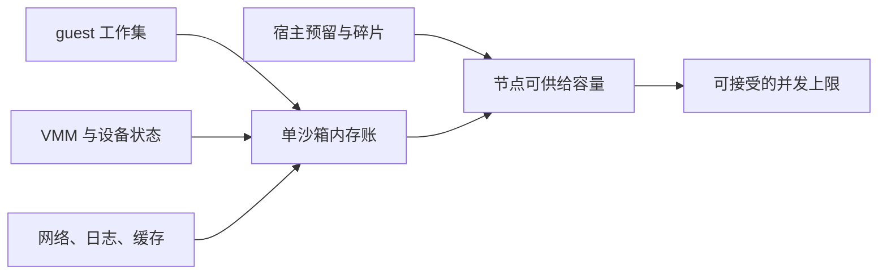

# 第十一章　内存账本：5MB 增量与并发供给的物理基础

<!-- chapter-nav -->

[← 上一章](第十章-Agent时代的凭据安全-当模型成为新的泄露通道.md) · [章节目录](../../README.md) · [下一章 →](第十二章-AutoPause与运营账-闲置沙箱的成本治理.md)
<!-- /chapter-nav -->


> 《从 0 到 1 学 Agent 沙箱》系列 · 进阶篇
>
> **源码基线**：腾讯 CubeSandbox `v0.7.2`，commit `f1aaa737fb3862202b1731e0e0d844c28779f930`。本文的 5MB 只作为“额外开销量级”的账本项，不当作所有负载的实测承诺。

## 开篇先算一笔账

一台 64 GiB 节点放 100 个沙箱，是否可行？只问“每个沙箱 5MB”没有意义。真正的总账是：

```text
总内存
= 宿主机基础开销
+ 控制面与节点常驻组件
+ 共享模板与共享页
+ N × 沙箱增量开销
+ Σ(每个沙箱的工作负载内存)
+ 安全余量
```

假设宿主机和系统服务占 8 GiB，CubeMaster/Cubelet/Redis/代理及模板缓存占 4 GiB，100 个沙箱的 VMM、页表、virtio 设备和网络状态每个新增 5 MiB；每个任务工作集是 512 MiB，安全余量取 15%，则：

```text
固定项 = 8 + 4 = 12 GiB
增量项 = 100 × 5 MiB ≈ 0.49 GiB
工作项 = 100 × 512 MiB = 50 GiB
原始合计 ≈ 62.49 GiB
含余量 ≈ 62.49 ÷ 0.85 = 73.5 GiB
```

结论不是“64 GiB 只能跑 87 个”，而是：在这组假设下，100 个工作集为 512 MiB 的沙箱不应承诺塞进 64 GiB。若工作集只有 256 MiB，结果会完全不同；若是编译任务，缓存和并发链接器又会把峰值推高。5MB 是边际成本的一项，不是产品报价里的“每沙箱总成本”。

## 一、三层内存模型

### 1. 平台固定成本

固定成本包括宿主 Linux、containerd、Cubelet、CubeMaster、Redis、CubeEgress、监控代理、镜像/模板缓存和文件系统元数据。它与沙箱数量弱相关，但并非恒定：Prometheus 时间序列、策略索引、并发创建队列会随 N 增长。

固定成本应先在空节点上测量，再放入容量模型。不能把一个开发环境的 2 GiB 直接套到生产节点；控制面是否与计算面同机，也会改变账本。CubeSandbox 的组件职责和节点拆分在前文架构章节讨论，本文只保留它们对内存的影响。

### 2. 沙箱增量成本

增量成本是创建一个空沙箱后，宿主机相对基线多出的内存：VMM 元数据、KVM 映射、页表、virtio 队列、TAP/代理缓冲、CubeShim 与监控状态、私有 COW 页。它通常是 MB 级，但会随内核版本、设备模型、线程数、网络缓冲和快照后写入量变化。

`host_sandbox` 指标把 CubeShim、VMM 等宿主机侧占用记入沙箱 cgroup；`guest_workload` 则观察沙箱内工作负载 cgroup。两个视角不能直接相加。官方文档明确指出，宿主机侧当前值可能低于 guest 工作集（共享快照页），也可能更高（VMM、CubeShim 与私有 COW 页）。参考：[沙箱资源指标](https://github.com/TencentCloud/CubeSandbox/blob/f1aaa737fb3862202b1731e0e0d844c28779f930/docs/zh/guide/resource-metrics.md)。

### 3. 工作负载成本

工作负载包括 Python/Node 运行时、编译器、语言服务器、依赖缓存、用户数据、数据库和 page cache。它是最容易被低估的一层，因为“进程 RSS”不等于“宿主机可回收内存”：文件缓存可共享，匿名页和 COW 页通常不可共享；同一模板启动 100 个进程，代码页可能共享，但每个任务生成的对象和缓存不会自动共享。

对 Agent 平台，至少要建立三种画像：

| 画像 | 典型峰值（假设） | 主要风险 |
|---|---:|---|
| 轻量 Python 查询 | 128–256 MiB | 并发峰值、解释器与缓存抖动 |
| Coding/编译 | 512 MiB–2 GiB | 编译器并发、临时文件、page cache |
| 数据分析 | 1–8 GiB | NumPy/Pandas、列式缓存、结果物化 |

这些是容量规划的示例假设，不是 CubeSandbox 实测。上线前应从真实任务采样 P50/P95/P99 峰值，并注明是否包含文件缓存。

## 二、从 1 到 100：逐项演算

设：

- `H`：宿主与基础服务保留内存；
- `C`：共享模板、文件缓存可摊薄部分；
- `d`：每沙箱额外开销；
- `w_i`：第 i 个沙箱工作集峰值；
- `r`：安全余量比例；
- `M`：节点物理内存。

可用容量约为 `A = (M − H − C) × (1 − r)`，可容纳的沙箱数满足：

```text
Σ(w_i + d) ≤ A
```

同质负载 `w_i = w` 时：

```text
N_max = floor(A / (w + d))
```

以 `M=64GiB、H=12GiB、C=2GiB、r=15%、d=5MiB` 为例，`A≈42.5GiB`：

- 128MiB 工作集：`N_max≈321`；
- 512MiB 工作集：`N_max≈82`；
- 2GiB 工作集：`N_max≈21`。

这三个数字说明，工作集从 128MiB 增加到 512MiB，理论密度下降近四倍；把增量从 5MiB 优化到 3MiB，只会使轻负载场景略有收益，对重编译任务几乎没有影响。优化方向必须和画像匹配。

混合负载要用分桶而不是平均值。假设 100 个沙箱中 70 个轻任务各 256MiB，25 个编译任务各 1GiB，5 个数据任务各 4GiB，额外开销均 5MiB：

```text
工作项 = 70×256 + 25×1024 + 5×4096 = 43,520 MiB
增量项 = 100×5 = 500 MiB
合计 ≈ 43.0 GiB
```

如果可用容量只有 42.5GiB，平均工作集看似 435MiB，实际已经超限。容量规划应按租户和任务类别设置配额，避免“大任务”把轻任务的密度账吞掉。

## 三、共享的真相：哪些页能摊薄

模板只读页、内核代码页和相同的动态库页可能通过 page cache 或 KSM 等机制共享；共享并非免费，也不应在没有测量时按 100% 扣除。只要沙箱写入同一页，COW 就会产生私有副本；Python 字典、Node heap、编译中间产物和日志都是典型私有内存。

快照恢复还会改变时间分布：恢复瞬间可能只映射快照页，随着任务运行，脏页逐步增加。于是“启动时占用”和“运行 5 分钟后的占用”是两笔不同的账。AutoPause 把匿名页写入快照后可以释放驻留内存，却会把成本转移到存储和唤醒 I/O，下一章会展开。

## 四、密度上限不只在内存

### CPU

如果每个沙箱保证 2 vCPU，64 核节点的硬保证上限是 32 个，与内存计算的 82 个取小值。若使用 CPU 超卖，密度提高但尾延迟和公平性恶化；编译任务在同一时间爆发时，CPU throttling 会成为隐藏成本。

### 文件描述符、进程和网络端口

每个沙箱至少消耗 TAP、vsock、日志文件、代理连接和控制面连接。Linux 的 `pid_max`、cgroup 进程数、宿主文件描述符和端口范围都会形成上限。端口映射或固定出站连接越多，端口耗尽越早发生。容量模型应使用：

```text
N_max = min(N_memory, N_cpu, N_pid, N_fd, N_port, N_network, N_scheduler)
```

### 调度与创建吞吐

内存有余量不等于能在高峰创建 1000 个沙箱。若每次创建平均 60ms、并发创建槽位为 64，理想完成率约为 `64/0.06≈1066 次/秒`；这只是数学上限，未包含磁盘抖动、网络配置、锁竞争和失败重试。容量与供给必须分别建模：驻留上限解决“能养多少”，创建吞吐解决“多久能供上”。

## 五、横向参照：传统 VM、Firecracker 与 K8s Agent Sandbox

传统 VM 通常包含完整固件、设备模型和客户机内核，基础驻留内存更高；它适合强隔离与稳定工作负载，但在每沙箱几百 MB 的场景，密度会被固定项主导。Firecracker 通过精简设备与 VMM，把增量压低到 MB～几十 MB 量级，但实际密度仍取决于 guest 工作集和宿主资源。Firecracker 的公开数据应作为路线参考，不应直接当作 CubeSandbox 的实测。

Kubernetes Agent Sandbox 等方案通常把“每个 Agent 一个可复用运行单元”的供给问题交给 Pod、Job 或自定义控制器。Pod 级资源请求/限制有利于调度与配额，但共享内核的隔离等级、快照恢复语义和 VMM 增量账不同。CubeSandbox 的 `host_sandbox`/`guest_workload` 双视角可以作为 K8s 方案设计监控时的参考：分别记账宿主运行时和 Agent 工作负载，避免把两者混成一个数字。

## 企业视角：按画像报价，不按“5MB”报价

容量规划表至少应包含：节点物理内存、固定组件、共享缓存折扣、每画像 P50/P95/P99 工作集、VMM 增量、CPU 保证、磁盘和网络上限、安全余量、创建吞吐和失败重试率。报价可以按“轻任务并发分钟”“编译任务并发分钟”“数据分析 GiB·分钟”分档，而不是给所有用户一个统一的沙箱单价。

建议每次版本升级做三组对照：空沙箱、启动后空闲、代表性负载运行 10 分钟；分别记录 host_sandbox 和 guest_workload，标明采集间隔、cgroup 上限、模板版本、节点规格。资源指标端点默认只在可信管理网络开放，文档明确它没有鉴权和 TLS，不能直接暴露公网。


## 本章扩展：把“5MB”拆成一笔可审计的账



5MB 只有在账本边界明确时才有意义。假设节点为 64GiB，宿主和系统服务预留 8GiB，单沙箱 guest 工作集 256MiB，额外开销 5MiB，节点还要留出 10% 的安全余量：

```text
可分配内存 = (64 - 8)GiB × 90% ≈ 50.4GiB
理论并发 ≈ floor(50.4GiB ÷ 261MiB) ≈ 197
```

这个数字仍不是承诺，因为页缓存、快照恢复时的瞬时峰值、日志缓冲和回收延迟都会制造水位尖峰。容量规划应同时记录 `reserved`、`committed`、`working_set` 和 `reclaimable` 四个字段；只看宿主机剩余内存，会把可回收缓存误当成可立即供给的空间。

第十二章会在这本账上继续回答：一个长时间等待模型回复的沙箱，应该继续占用完整工作集，还是进入暂停状态，把账上的驻留成本降下来？

## 本章小结

5MB 是增量开销的一个量级锚点，工作负载内存才是并发供给的主要变量。完整账本要把固定成本、可共享页、沙箱增量、工作集和安全余量分开；密度上限取内存、CPU、进程、文件描述符、端口、网络和调度吞吐的最小值。只优化 VMM 增量而不控制任务画像，不能把单节点密度从几十变成数千。

## 思考题

1. 64GiB 节点固定开销 14GiB、余量 15%、每沙箱增量 6MiB。分别计算 256MiB、768MiB、2GiB 三种工作集的理论密度，并找出 CPU 保证为 48 个 1-vCPU 沙箱时的最终上限。
2. 一个 500 沙箱评测批次中，10% 任务会把内存峰值推到正常值的 4 倍。用 P95 画像与平均值各算一次容量，说明为什么平均值会造成 OOM。
3. 设计一个指标面板，同时显示 host_sandbox 内存、guest_workload 内存、CPU throttling、cgroup failures 和创建等待时间。哪些指标用于扩容，哪些只用于定位单个异常任务？

## 下章预告

内存账本回答“运行着要花多少”，但 Agent 往往大部分时间在等模型、等用户确认或等上游服务。下一章把这段等待变成运营账：何时挂起、快照占多少盘、唤醒多长时间，AutoPause 什么时候真的省钱。

## 参考与源码

- [CubeSandbox 资源指标文档（v0.7.2）](https://github.com/TencentCloud/CubeSandbox/blob/f1aaa737fb3862202b1731e0e0d844c28779f930/docs/zh/guide/resource-metrics.md)
- [CubeSandbox 内存管理器（v0.7.2）](https://github.com/TencentCloud/CubeSandbox/blob/f1aaa737fb3862202b1731e0e0d844c28779f930/hypervisor/vmm/src/memory_manager.rs)
- [Firecracker 官方项目](https://github.com/firecracker-microvm/firecracker)
- [Kubernetes Agent Sandbox 项目](https://github.com/kubernetes-sigs/agent-sandbox)
