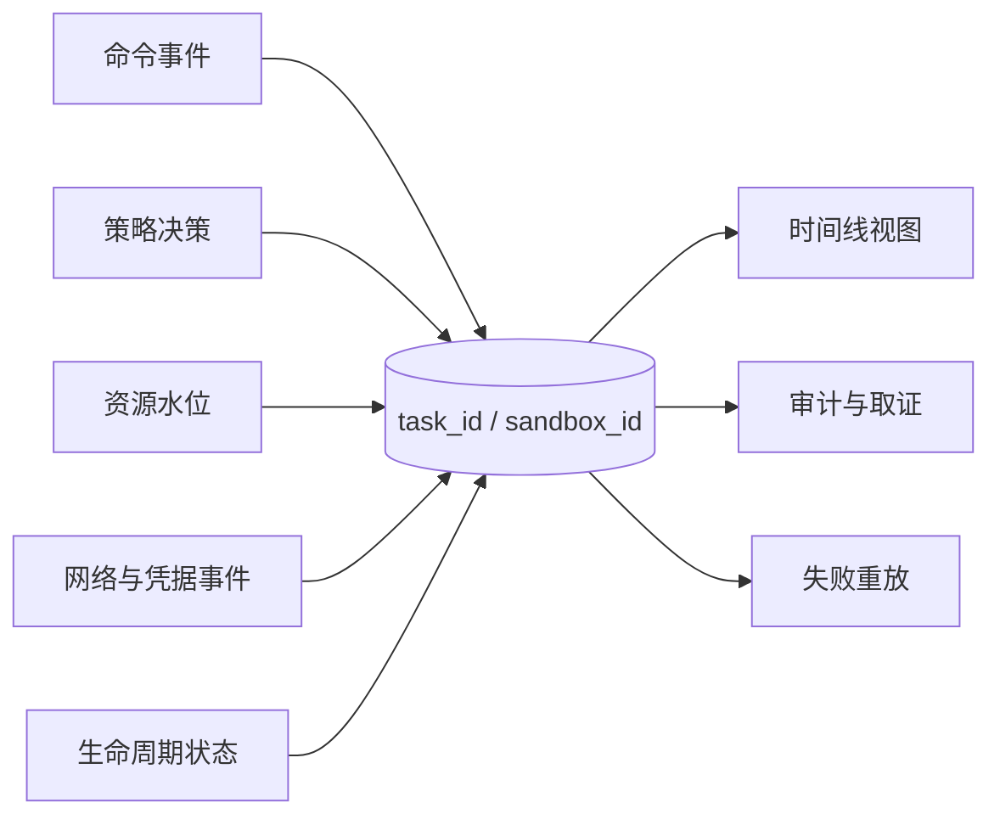

# 第十三章　可观测性与执行审计：Agent 的行车记录仪

<!-- chapter-nav -->

[← 上一章](第十二章-AutoPause与运营账-闲置沙箱的成本治理.md) · [章节目录](../../README.md) · [下一章 →](第十四章-沙箱的一生-生命周期语义与状态管理.md)
<!-- /chapter-nav -->


> 《从 0 到 1 学 Agent 沙箱》系列 · 进阶篇
>
> **源码基线**：腾讯 CubeSandbox `v0.7.2`，commit `f1aaa737fb3862202b1731e0e0d844c28779f930`。

## 引子：同一个 bug，人有断点，Agent 只有一串黑盒输出

人类开发者遇到测试失败，会打开断点、查看调用栈、重放请求和比较文件 diff。Agent 的“调试”通常是几十次工具调用：创建文件、安装依赖、运行测试、读取错误、修改代码、再次运行。最终只留下一个“任务失败”和一段模型总结，真正导致失败的那一步可能已经消失。

执行审计要记录的不只是日志，而是一次任务的因果链：哪个任务在什么沙箱里，由哪个模型/用户触发，执行了哪些命令和文件操作，访问了哪些网络目标，策略如何决策，最后产生了什么 artifact。它同时服务于开发者回放、安全取证和管理层报表，但三类消费者的粒度不同，不能用一份无限膨胀的文本日志解决全部问题。

本章先划清事实边界：CubeSandbox `v0.7.2` 已有沙箱级 stdout/stderr 日志、CubeEgress 结构化 HTTP 审计和资源指标；它并没有自动把 guest 内每一条 shell 命令、每一次文件读写都变成一条平台审计事件。完整 execution trace 是架构目标，需要 guest agent、vsock、出口网关和编排层协同建设。

## 一、三类事件与一个关联键

### 1. 命令执行事件

命令事件至少包含：`task_id`、`sandbox_id`、调用序号、命令摘要、退出码、开始/结束时间、stdout/stderr 引用、资源使用和超时状态。原始命令可能含密钥、个人数据或提示词注入内容，不应默认写入全量审计；可以保存规范化命令、哈希和按权限访问的加密原文。

### 2. 文件操作事件

文件事件记录创建、读取、写入、重命名、删除、权限修改和 artifact 导出。对 Agent 而言，文件是工作记忆，变化比 stdout 更能解释“为什么下一步行为不同”。但逐次 read 会产生海量数据，因此常见方案是：记录路径、操作类型、字节数、哈希和调用者，内容只在命中敏感策略或显式 artifact 时保存。

### 3. 网络访问事件

网络事件记录原始目标、解析后的 SNI/Host、端口、方法、路径、策略 ID、allow/deny、响应码、字节数、TLS 验证和凭据注入引用。CubeEgress 的 `audit.lua` 已实现这一层的大部分结构化字段，并把普通 `http_request` 与额外 `security_event` 写入 JSONL；源码见 [audit.lua](https://github.com/TencentCloud/CubeSandbox/blob/f1aaa737fb3862202b1731e0e0d844c28779f930/CubeEgress/lua/audit.lua#L1-L220)。

三类事件都要带稳定关联键：

```text
trace_id → task_id → sandbox_id → event_id
```

`request_id` 只标识一次 HTTP 请求，不能替代跨工具调用的 `trace_id`。任务重试或沙箱迁移时，`sandbox_id` 可能变化，`task_id` 仍应保持一致，另加 attempt 序号。

## 二、采集点架构：每一层能看见什么

```text
[Agent 编排器]
  ├─ tool_call / model_turn / result
  ├─ task_id、trace_id、租户、模型版本
  ↓
[guest agent / envd]
  ├─ 命令、退出码、子进程、文件摘要
  ├─ vsock 上报（不让 guest 直接改审计存储）
  ↓
[CubeShim / Cubelet]
  ├─ sandbox 生命周期、资源、stdout/stderr
  ├─ 将 guest 事件与 sandbox_id 绑定
  ↓
[CubeEgress]
  ├─ DNS/HTTP/SNI/Host、策略决策、注入引用
  ├─ 代理侧看到真实出网，不依赖模型自报
  ↓
[控制面/审计存储]
  └─ 规范化、脱敏、WORM/对象锁、索引与告警
```

### guest agent

它最接近命令和文件语义，能看到 PID、工作目录、退出码和操作前后的哈希；代价是 guest agent 本身属于沙箱内组件，可能被不可信代码终止或欺骗。它提供的是“应用层观测”，不能替代宿主机的强制证据。

### vsock 与 CubeShim

vsock 可以把事件送到宿主侧，而不开放一个可被沙箱直接访问的网络端口。CubeShim 能把连接与沙箱身份绑定，并在快照/恢复时处理代理关系。若 guest agent 被杀死，宿主仍可记录生命周期、资源和网络事件，但命令/文件轨迹会出现缺口，审计必须标注“采集器失联”，不能假装全量。

### CubeEgress

出口网关能观察最终代理请求、Host/SNI、策略决策和上游状态，适合做网络事实源。它看不见沙箱在请求前如何生成文件，也看不见被加密在请求体中的业务数据，因而需要和 guest 事件拼接。

### 编排器

只有编排器知道模型版本、提示词版本、tool call 顺序和用户身份。把这些信息留在业务日志里而不与 sandbox trace_id 关联，事后就无法回答“是哪一次模型决策导致这条命令”。

## 三、CubeSandbox 当前能提供什么

### 沙箱 stdout/stderr

官方日志文档说明，`cubecli logs` 读取的是容器 init 进程的 stdout/stderr；通过 `exec` 启动的子任务日志需要用 E2B SDK 的 `on_stdout/on_stderr` 回调获取。日志文件位于 Cubelet 挂载命名空间，删除沙箱后随之清除，当前版本也不支持实时 `--follow`。参考：[沙箱日志文档](https://github.com/TencentCloud/CubeSandbox/blob/f1aaa737fb3862202b1731e0e0d844c28779f930/docs/zh/guide/sandbox-logs.md)。

这意味着“日志存在”不等于“执行轨迹完整”：子进程输出可能在 SDK 层，短时日志峰值可能丢失，删除后默认不再可取。合规系统若需长期留存，应在任务结束前把日志和 artifact 转存到独立存储，并记录转存成功或失败。

### CubeEgress JSONL 审计

`audit.lua` 记录时间、request_id、sandbox 源地址、策略、原始目的地、TLS、HTTP 方法/路径、状态、字节数、用户代理、凭据注入头名和脱敏请求头。凭据原值不会写入 credentials 块；上游 502/504 且零字节响应会标记 `upstream_unreachable_or_unverified`。这适合网络取证，但不是命令与文件审计。

### 资源指标

`/v1/metrics/resource` 提供 `host_sandbox` 与 `guest_workload` 两种视角的 CPU、内存、throttling 和 memory failures。端点缓存最新样本，抓取请求不会同步 RPC 每个沙箱；暂停或删除后停止导出。资源指标文档还指出端点没有鉴权/TLS，只应开放在可信管理网络。参考：[resource-metrics.md](https://github.com/TencentCloud/CubeSandbox/blob/f1aaa737fb3862202b1731e0e0d844c28779f930/docs/zh/guide/resource-metrics.md)。

## 四、一次 30 步任务的存储账

假设任务有 30 个工具调用，每步产生：命令摘要 300B、结果摘要 1KB、网络事件 2 条各 700B、文件事件 10 条各 250B，事件封装和索引占 40%。则每步约：

```text
0.3 + 1.0 + 2×0.7 + 10×0.25 = 4.5 KB
加索引与封装 ≈ 4.5 × 1.4 = 6.3 KB
30 步 ≈ 189 KB/任务
```

若每天 100,000 个任务，原始量约 18.9GB/天；保留 30 天约 567GB，尚未计副本、WAL、索引和压缩。若 10% 任务保存完整请求体或文件 diff，体量可能放大一个数量级。这个推演只是假设，不是 CubeSandbox 的实测日志量。

存储策略可分三层：

- **热层**：最近 7 天的结构化事件，支持按 trace_id 秒级回放。
- **温层**：30–90 天的摘要、哈希和安全事件，保留必要索引。
- **冷层**：合规期限内的压缩归档与 artifact，采用对象锁、加密和分层检索。

安全事件、策略拒绝、凭据注入失败和审计缺口应全量保存；普通成功命令可以按租户和风险等级采样，但采样规则必须记录在元数据中。

## 五、三类消费者的不同视图

### 开发者回放

需要按时间轴看到模型调用、命令、stdout/stderr、文件 diff、网络结果和资源峰值。回放可以隐藏密钥和个人数据，但不能把“脱敏成功”当成“原始记录不存在”。

### 安全团队取证

更关心异常序列：策略拒绝后是否尝试换域名、是否读取 `/proc`、是否大量压缩文件、是否在允许域名上传异常体积。安全查询应保留原始时间顺序、策略版本和事件缺口，支持导出签名包。

### 管理层报表

只需租户用量、失败率、P95 延迟、凭据使用次数、合规留存率和审计缺口，不应接触命令原文和请求体。把三种视图混在同一张表，会导致权限扩大和存储成本失控。

## 六、OpenTelemetry 的位置与缺口

OpenTelemetry 能统一 trace/span、日志和指标的传输格式，适合把编排器的模型 turn、CubeMaster 的生命周期 RPC 和 CubeEgress 的 HTTP 请求挂到同一 trace 上。但它不会自动看见 guest 内部文件读写，也不能证明日志没有被不可信代码篡改。需要定义 Agent 语义约定：`agent.task`、`agent.tool_call`、`sandbox.exec`、`sandbox.egress`、`sandbox.artifact` 等 span 名，规定 `sandbox_id`、`tenant_id`、`policy_id` 和 `attempt` 标签，并严格禁止 secret、完整提示词和大请求体进入 span 属性。

## 企业视角：审计链的完整性证明

一次取证应能从用户请求走到：模型版本 → tool_call → sandbox 生命周期 → 命令/文件事件 → 出口策略 → 上游结果 → artifact。链路任何一段缺失都要显示“unknown”或“collector_lost”，不能用空数组掩盖。日志系统应提供：时间同步、追加写、哈希链或 WORM、访问审计、删除证明和保留策略版本。

安全演练可以故意终止 guest agent、注入一个恶意域名、制造代理 502、触发暂停/恢复和节点故障，然后检查是否能回答五个问题：谁触发、执行了什么、看见了什么、发往哪里、哪些证据缺失。能回答才算行车记录仪，而不是“收集了很多日志”。


## 本章扩展：从日志集合到一次可重放的执行轨迹



审计事件建议至少包含：单调时钟与墙上时钟、事件类型、调用方角色、输入摘要、策略版本、结果摘要、父事件 ID 和幂等键。原始命令输出可以进入受控日志存储，但索引中应保存哈希和大小，避免把敏感数据复制到每个查询系统。

排障时先按一条因果链查询，而不是先搜关键词：

```text
请求受理 → 策略判断 → 资源分配 → 命令执行 → 网络/凭据访问
→ 状态变化 → artifact 产出 → 回收结果
```

这条链能区分“模型命令错了”“策略拒绝了”“节点资源不足”和“任务成功但回收失败”。第十四章会把链上的状态变化收敛为明确的生命周期状态机。

## 本章小结

执行审计是因果链，不是日志堆。命令、文件、网络三类事件要用 task/trace/sandbox/request 关联；guest agent 提供语义，CubeEgress 提供网络事实，Cubelet/CubeMaster 提供生命周期和资源事实，编排器提供模型与用户上下文。CubeSandbox 当前实现覆盖日志、网络审计和资源指标，但没有宣称 guest 内每一次文件操作都被全量采集；完整 trace 需要额外的采集器、脱敏、不可篡改存储和缺口标记。

## 思考题

1. 设计一个 30 步任务的事件 schema，要求同一事件既能按 trace 回放，也能按 sandbox 和租户统计，不允许存储密钥和完整提示词。
2. guest agent 被模型生成的命令杀死后，哪些证据仍可由 CubeEgress、Cubelet 和宿主机 cgroup 提供？如何在报告中标记不完整性？
3. 100,000 个任务/天、30 天留存、10% 全量 body 的情况下，设计热/温/冷分层和预算，并给出采样规则。

## 下章预告

日志回答“发生了什么”，生命周期语义回答“现在处于什么状态、下一步是否合法”。下一章把创建、运行、挂起、恢复、迁移、超时和销毁串成一张状态机，并区分设计模型与 `v0.7.2` 的真实状态枚举。

## 参考与源码

- [CubeSandbox 沙箱日志文档（v0.7.2）](https://github.com/TencentCloud/CubeSandbox/blob/f1aaa737fb3862202b1731e0e0d844c28779f930/docs/zh/guide/sandbox-logs.md)
- [CubeEgress 审计实现](https://github.com/TencentCloud/CubeSandbox/blob/f1aaa737fb3862202b1731e0e0d844c28779f930/CubeEgress/lua/audit.lua)
- [CubeSandbox 资源指标文档](https://github.com/TencentCloud/CubeSandbox/blob/f1aaa737fb3862202b1731e0e0d844c28779f930/docs/zh/guide/resource-metrics.md)
- [OpenTelemetry 文档](https://opentelemetry.io/docs/)
- [E2B SDK 文档](https://e2b.dev/docs)
