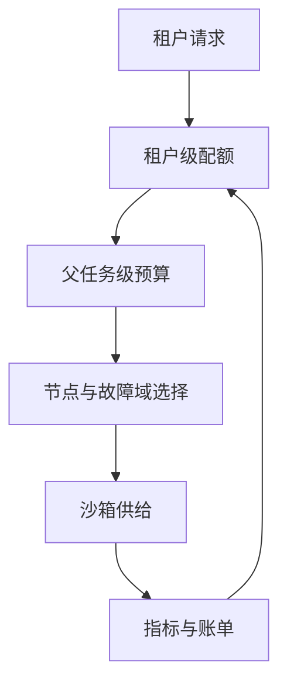

# 第十九章　企业级并发架构（下）：多租户、弹性与故障域

<!-- chapter-nav -->

[← 上一章](第十八章-企业级并发架构上-供给链路从一次请求到万级沙箱.md) · [章节目录](../../README.md) · [下一章 →](第二十章-多Agent拓扑-多沙箱协作与编排.md)
<!-- /chapter-nav -->


> 《从 0 到 1 学 Agent 沙箱》系列｜进阶篇·第十九章  
> 基线说明：本文引用 CubeSandbox 时，以本地 `v0.7.2` commit `f1aaa737fb3862202b1731e0e0d844c28779f930` 的控制面、Cubelet、存储和错误码实现为参照。容量数字均为教学假设；没有使用未经验证的实测排名，也不把某个版本的单节点指标外推为集群保证。

## 引子：三个事故同时发生

上午十点，租户 A 启动一千个评测任务；十点零五分，承载 800 个交互沙箱的节点 3 宕机；十点十分，平台要滚动升级控制面。三个事件分别考验公平性、故障域和排水能力，但它们会互相放大：评测洪峰占满弹性池，节点故障把重建请求推入同一个队列，控制面升级又触发客户端重试。

因此，企业级并发架构的目标不是“每个租户都有一台机器”，而是在有限资源中保持清晰的边界：谁可以使用多少资源、谁先获得供给、故障影响多大、系统何时拒绝、状态怎样恢复。

## 一、多租户的三道边界

### 1. 沙箱间：执行隔离

第一道边界是一个 sandbox 与另一个 sandbox 之间的 KVM/guest、存储、进程和网络隔离。它解决的是“代码不能直接看见邻居”。但硬件隔离不自动提供公平：一个沙箱仍可能在自己的额度内制造高磁盘写入、网络连接或日志洪峰。

### 2. 租户间：资源与网络策略

第二道边界把多个 sandbox 归入租户配额。配额对象应覆盖 CPU、内存、并发实例、创建速率、磁盘、artifact、出口带宽和凭据调用次数。网络策略应按租户/沙箱身份绑定出口白名单和审计规则，而不是只按节点 IP 过滤。

### 3. 平台与租户间：控制面权限

第三道边界保护 API、调度器、模板、快照和审计数据。一个租户不能列出另一租户的 sandbox ID、读取模板中的秘密、删除共享快照，或把控制面内部错误作为侧信道。CubeSandbox 仓库包含 sandbox 查询、错误码和多组件控制逻辑；生产部署仍需在 API 网关和数据库层验证租户过滤，不能只依赖前端传来的 `tenant_id`。

三道边界的失败模式不同：KVM 配置错误是沙箱间问题，配额绕过是租户间问题，越权查询是平台边界问题。威胁建模和测试应分别覆盖。

## 二、公平性：一个租户的洪峰不能饿死其他人

### 1. 配额与速率是两种限制

配额限制“同时占多少”，速率限制“单位时间新建多少”。只设并发配额，租户可以频繁销毁重建打满创建链路；只设速率，长任务仍会占满内存。可为每个租户维护：

```text
inflight_sandbox ≤ Q_concurrency
create_rate ≤ Q_rate
storage_bytes ≤ Q_storage
network_egress ≤ Q_egress
```

这些是平台策略变量，不是产品默认值。配额拒绝应返回可读 reason code，并记录审计。

### 2. 优先级与加权公平

交互式 Coding、批量评测和低优先级回放可以进入不同队列。简单的严格优先级会让低优先级永远得不到资源；加权公平队列按租户权重分配令牌，更适合长期运行。优先级只能影响“谁先获得新资源”，不能突破沙箱安全边界或抢走已运行进程的内存。

抢占是最后手段。若平台可以暂停或迁移低优先级 sandbox，应先保存状态并向 Agent 回传“暂挂”，再释放资源；若不能可靠恢复，宁可拒绝新任务，也不要强杀无重试语义的外部操作。Kubernetes 的 PriorityClass/Preemption 是参照，不是直接复制方案，因为 guest 状态和外部副作用让沙箱抢占更昂贵。

### 3. Noisy Neighbor 的识别

邻居噪声可能来自 CPU、内存回收、磁盘 I/O、网络连接、日志写入或控制面请求。监控要把节点级指标归因到租户、模板和 sandbox；只看节点平均 CPU 会掩盖某个租户的磁盘队列。必要时把高 I/O 评测任务放入专用节点池，牺牲一点利用率换取交互延迟稳定。

## 三、弹性伸缩：加节点只是链条中的一环

### 1. 常驻池与弹性池

常驻池承载稳定交互流量，弹性池承载评测洪峰和周期性任务。扩容链通常是：申请节点 → 安装内核和运行时 → 加入健康检查 → 预热模板 → 接受调度。节点分钟级加入，而模板预热可能秒级或更久；因此仅依据 API 队列扩容会有滞后。

### 2. 伸缩触发信号

可组合四种信号：创建队列长度、Ready P95、节点资源水位和未来任务预约。队列增长说明当前供给不足，内存水位接近上限说明不能继续超卖，预约信息则允许提前准备模板。触发阈值要带滞回，避免扩缩容抖动：扩容阈值和缩容阈值不能相同。

### 3. 缩容与排水

节点缩容前进入 `Draining`：停止接收新 sandbox，等待短任务结束，暂停/迁移可恢复任务，最后重建不可迁移任务。CubeSandbox 的生命周期和存储代码包含暂停、恢复、卷和快照相关路径；是否能跨节点无损迁移要按 v0.7.2 的具体配置验证，不可把“有快照”直接等同于“任意运行态可迁移”。

排水决策可比较三种成本：

```text
C_wait = 剩余运行时间 × 资源占用
C_move = 快照/网络传输 + 恢复失败风险
C_rebuild = 从模板重建 + 丢失未持久化状态的业务代价
```

交互会话通常偏向等待或暂停，短批任务偏向重建；涉及外部副作用的任务不能自动重放。

## 四、故障域：800 个 sandbox 宕机时发生什么

### 1. 影响半径

故障域可以是进程、节点、机架、可用区、控制面副本或存储后端。节点故障影响半径近似为该节点承载的 sandbox 数，但真实影响还包括共享模板、网络出口和日志服务。容量规划要限制单节点最大影响：

```text
max_loss_per_node ≤ 业务可接受的重建并发
```

如果一个节点放了 800 个会话，而全局重建服务率只有 50/s，恢复洪峰至少需要 16 秒理想下限，还未计入模板和网络；这只是算术假设，实际要看长尾和失败重试。

### 2. 重建、恢复、迁移

* **重建**：从模板或快照创建新 sandbox，最简单但会丢失未持久化状态。
* **恢复**：从内存/磁盘快照恢复，状态连续性更好，但依赖快照完整和兼容的节点硬件/版本。
* **迁移**：在两个节点间转移运行态，复杂度最高，涉及网络连接、设备状态和一致性。

故障处理应先确认外部副作用。一个任务在节点宕机前可能已经成功写入数据库，但平台没收到回执；自动重建并重试可能造成重复写入。为每个外部动作保存幂等键和提交状态，比单纯“自动重试”更重要。

### 3. 控制面高可用

控制面副本可以避免单进程故障，但共享数据库、队列或缓存仍可能成为单点。状态机操作要有版本号或条件更新，避免两个副本同时认为自己拥有同一 sandbox。CubeMaster/CubeAPI 的组件边界提供了拆分参照；部署时需明确哪些状态在数据库、Redis、节点本地和对象存储中，以便故障后重建索引。

## 五、雪崩防治：重试、惊群和级联失败

### 1. 重试风暴

节点故障后，800 个客户端同时重试创建；如果每个请求再重试 3 次，理论请求量可变成 3,200。指数退避、抖动、全局重试预算和服务端幂等键是最低限度。服务端应把“已接受但未知状态”与“明确失败”区分，客户端不能对未知状态盲目重建。

### 2. 惊群

多个控制面副本同时监听同一事件，可能对同一个节点发起重复清理或恢复。使用租约、分片队列或唯一 operation owner；owner 失联后再接管。接管必须检查版本和当前节点状态，而不是仅凭旧消息执行。

### 3. 级联失败

模板存储变慢会导致创建超时，客户端重试加重存储；日志系统拥塞会阻塞执行结果，控制面误判 sandbox 未就绪；网络出口故障会让 Agent 重试外部请求。每一层要有隔离舱和限流：日志上传不能阻塞控制面状态，模板拉取失败不能反复打爆对象存储。

## 六、容量规划：从峰值并发到节点数

设高峰运行 sandbox 数为 `C_peak`，每实例内存预留 `m`，节点可安全提供的内存为 `M_node`，保留系统和故障余量后，可用节点数下界为：

```text
N_mem ≥ ceil(C_peak × m / M_node)
```

还要分别计算 CPU、磁盘、网络地址和创建槽位的下界，最终取最大值：

```text
N ≥ max(N_mem, N_cpu, N_disk, N_net, N_create)
```

这只是资源下界。若需要容忍一个节点故障，再按故障域增加冗余；若有常驻池和弹性池，还要把两者的峰值错开。不要把“单节点数千实例”作为无条件容量，它依赖内存、工作负载、模板、网络和隔离策略。

## 七、横向参照

Kubernetes `ResourceQuota`、Priority、Node Drain 和 PodDisruptionBudget 提供了企业运维中的配额、公平和排水心智。沙箱平台可以复用控制面模式，但要新增 guest 状态、快照、外部副作用和网络出口的语义。

E2B 托管服务通常把节点故障、扩缩容和配额封装在服务边界，使用者应关心公开的限额、状态和错误，而不是猜测内部故障域。CubeSandbox 自建路线能把租户和数据放在自己的控制范围内，却需要自行建设监控、升级、备份和事故演练。

## 八、企业视角：三类业务的不同取舍

**多租户代码执行 SaaS**优先保证租户公平、网络审计和计费准确；可为大租户提供专用池，但需防止其占用控制面。

**企业内部数据分析 Agent**更看重数据驻留、凭据轮换和长会话恢复；弹性可以保守，审计与删除证明必须完整。

**评测集群**接受批量排队，重点是快照一致性、吞吐和失败重跑；应与交互池隔离，避免洪峰拖慢用户。


## 本章扩展：公平性不是平均分配



一个租户占用多少资源，不应只按请求数计算。至少要同时看创建速率、驻留沙箱数、CPU/内存峰值、出口带宽和失败重试次数。评测租户可能请求量不大，却在短时间内制造大量并行沙箱；交互式租户请求量较高，但每个沙箱大部分时间处于等待状态。公平调度需要给不同维度设置上限，并把超限原因返回给客户端。

故障域也要进入调度键：节点、机架、可用区、模板存储和出口网关都可能是独立故障域。重试时不能只换一台机器，还要避免把同一父任务的所有 worker 重新放进同一个故障域，否则“重试”只是把事故复制一遍。

到这里，主线已经从单个沙箱的生命周期扩展到一个平台的资源治理。第二十章再把租户和故障域放进多 Agent 任务树，讨论失败如何沿依赖关系传播。

## 本章小结

企业级并发的下半场围绕“公平和生存”：沙箱间、租户间、平台与租户间是三道不同边界；配额和速率分别限制占用与洪峰；常驻池、弹性池和排水决定伸缩成本；节点故障需要在重建、恢复、迁移之间选择，并用幂等和重试预算防止雪崩。容量规划应从峰值并发、资源预留和故障余量推导节点数，而不是复制单节点宣传数字。下一章把这些节点上的多个 Agent 组织起来，讨论多沙箱协作、通信和失败传播。

## 思考题（能算账的那种）

1. 租户 A 有 1,000 个评测任务，租户 B 有 100 个交互会话。设每节点安全容量 200 个实例、每租户最大并发分别为 600 和 150，设计队列与专用池，并计算至少需要多少节点才能容忍一个节点故障。
2. 节点承载 800 个 sandbox，故障后重建服务率假设为 50/s，失败重试额外增加 20% 请求。估算理想恢复时间，并说明长尾、模板冷缓存和外部副作用会如何改变结果。
3. 为“节点进入 Draining”设计状态机，列出新建、短任务、可暂停会话、不可迁移长任务四类请求的处理路径。

## 下章预告

单 Agent 单沙箱只是基线。真实系统会出现规划者、执行者、审查者和并行 worker：它们如何通信、共享状态，某个 worker 失控时如何停止整棵任务树？下一章进入多 Agent 拓扑与多沙箱编排。

## 参考与延伸

- CubeSandbox v0.7.2：`CubeMaster/pkg/errorcode`、`CubeMaster/pkg/service/sandbox`、`Cubelet/storage`，本地 commit `f1aaa737fb3862202b1731e0e0d844c28779f930`。
- Kubernetes ResourceQuota：<https://kubernetes.io/docs/concepts/policy/resource-quotas/>。
- Kubernetes Pod Priority and Preemption：<https://kubernetes.io/docs/concepts/scheduling-eviction/pod-priority-preemption/>。
- Kubernetes Pod Lifecycle / termination：<https://kubernetes.io/docs/concepts/workloads/pods/pod-lifecycle/>。
- E2B Documentation：<https://e2b.dev/docs>。
