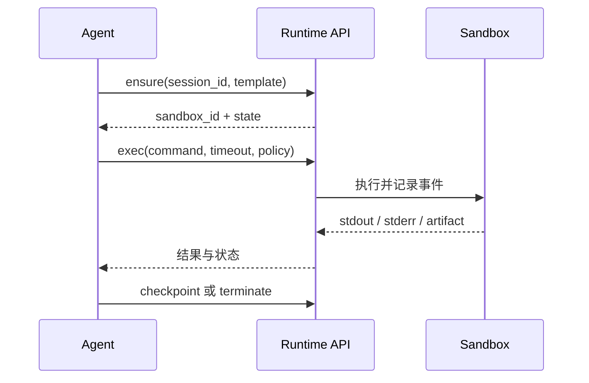

# 第十五章　沙箱与 Agent 的接口：执行循环的供给策略

<!-- chapter-nav -->

[← 上一章](第十四章-沙箱的一生-生命周期语义与状态管理.md) · [章节目录](../../README.md) · [下一章 →](第十六章-协议兼容与生态位-E2B接口为何成为事实标准.md)
<!-- /chapter-nav -->


> 《从 0 到 1 学 Agent 沙箱》系列｜进阶篇·第十五章  
> 基线说明：本文描述的是 Agent 与沙箱之间的接口设计方法。涉及 CubeSandbox 的事实，以本地仓库 `G:\Projects\agent-sandbox-series-research\CubeSandbox` 的 `v0.7.2` 基线（commit `f1aaa737fb3862202b1731e0e0d844c28779f930`）为准；涉及 E2B、OpenAI Code Interpreter、SWE-agent/OpenHands 的产品行为，只引用其公开文档，不把托管服务的内部实现推断成事实。文中的数字若带“示例”“假设”，仅用于推演，不能当作实测排名。

## 引子：三十步任务，沙箱到底该建几次

设想一个 Coding Agent 接到任务：“修复测试失败，提交补丁。”它可能经历三十轮循环：读取仓库、运行测试、查看错误、修改文件、再次运行。每一轮都可以写成同一个闭环：

```text
LLM 生成下一步计划
        │ tool call（命令、代码、文件操作）
        ▼
接口层校验预算、权限和目标沙箱
        ▼
沙箱执行 ── stdout/stderr/退出码/文件产物/审计事件
        │
        └──────── 结果压缩后回到模型，开始下一轮
```

问题不在于“能不能执行命令”，而在于**沙箱何时出生、状态留在哪里、结果怎样回来、失败如何重试**。一个会话一个沙箱，状态自然连续，却让污染和驻留时间变长；每次调用一个新沙箱，边界最干净，却需要支付创建、准备镜像和传递状态的代价；预热池把延迟压到最低，却引入池水位、租户隔离和“空闲但占资源”的运营问题。

因此，沙箱接口不是某个 `run()` 函数。它是 Agent 执行循环的供给协议：在每次工具调用之前授予什么能力，在调用之后交付什么证据，在超时或重试时保证什么语义。

## 一、先把执行循环拆开

### 1. 一轮循环中的五种状态

一轮工具调用至少有五个时间点，任何一个点的语义不清，都会在生产环境变成重复执行或数据丢失。

1. **意图（intent）**：模型提出命令或代码。它可能来自用户，也可能来自外部网页中的提示词注入，不能因为“模型自己生成”就视为可信。
2. **授权（admission）**：策略层把意图绑定到租户、任务、沙箱和预算。这里应检查允许的工具类型、网络出口、文件范围、CPU/内存/时间上限以及凭据引用。授权不是安全隔离本身，真正的边界仍由沙箱和出口网关执行。
3. **执行（execution）**：沙箱内进程获得输入并运行。对于长命令，接口必须有取消、超时和心跳语义；仅依赖客户端 HTTP 超时，不能停止客体内仍在运行的进程。
4. **交付（delivery）**：结果由 stdout、stderr、退出码、结构化事件和文件产物组成。大输出应落到 artifact，而不是全部塞进下一次提示词；否则上下文成本和泄露面一起增长。
5. **记忆（memory）**：下一轮需要哪些状态？是工作目录、安装的依赖、环境变量、后台进程，还是上一轮生成的报告？必须明确哪些状态持久化、哪些状态只在本轮有效。

可以用一个最小接口表示这条链路：

```text
create_or_acquire(tenant, template, budget, policy)
exec(sandbox_id, command, timeout, idempotency_key)
collect(result_id, stream | artifact | event)
release(sandbox_id, mode=destroy | pause | retain)
```

这不是 CubeSandbox 的逐字 API 定义，而是设计推演。CubeSandbox 当前仓库的 E2B-compatible 示例确实以 `POST /sandboxes` 创建、以 sandbox ID 操作和删除；它提供的 `CubeAPI/examples/go/client.go` 还把 `E2B_API_URL` 作为兼容入口。兼容入口解决的是接入问题，业务方仍要自己定义超时、幂等和结果存储的上层语义。

### 2. 结果不只是一段字符串

把所有执行结果都定义成字符串，会丢掉三个关键事实：命令是否成功、进程是否被杀、产物是否已经持久化。建议把一次调用的结果看成如下记录：

```json
{
  "execution_id": "e_01J...",
  "sandbox_id": "sb_...",
  "status": "failed",
  "exit_code": 1,
  "termination": "deadline",
  "stdout_ref": "artifact://...",
  "stderr_tail": "pytest: 3 failed",
  "artifacts": ["artifact://patch.diff"],
  "started_at": "...",
  "finished_at": "..."
}
```

字段名只是教学示例；真正的 schema 要和客户端 SDK、审计系统、重试队列一起冻结。`exit_code=137` 只能说明常见的 SIGKILL 结果，不能单独证明是 OOM；因此还应记录资源限制命中、超时、用户取消和基础设施故障等终止原因。错误回流给模型时可以提供短摘要和可引用的 artifact 链接，同时把完整日志放在审计存储中。模型需要“下一步可行动的信息”，安全团队需要“事后可验证的原始证据”，二者不应共用同一个无界字符串字段。

## 二、三种供给策略

### 2.1 会话级：一个任务一个沙箱

会话级策略在任务开始时创建一次沙箱，后续工具调用复用同一实例。它最接近开发者使用终端的直觉：`pip install` 的依赖留在环境中，工作目录里的补丁自然存在，后台服务可以被后续步骤访问。

**适合场景**是交互式 Coding、需要多轮调试的浏览器任务和有明确会话边界的内部数据分析。它的主要成本近似为：

```text
总资源成本 ≈ 沙箱存活时间 ×（内存预留 + CPU 份额）
           + 持久化状态大小 × 存储单价
```

这个策略的风险是状态会累积。第 3 步安装的包可能改变第 20 步的解释器路径；下载的凭据可能残留在 shell 历史；一旦提示词注入成功，攻击者可以在同一沙箱的剩余生命周期内继续活动。解决办法不是把会话级复用说成不安全，而是把边界说清：短 TTL、每任务独立身份、网络最小权限、敏感操作二次授权，以及在重试时区分“重放同一状态”和“从干净快照重建”。

E2B 的公开 SDK 将 sandbox 视作有生命周期的执行环境，并提供文件、命令和代码执行能力；具体保活时长、资源规格和托管侧回收策略以其当前产品文档为准。OpenHands、SWE-agent 等工具也常把一次任务映射到一个工作环境，以便保留仓库和测试状态；这属于应用层模式，不能据此推断其所有部署都使用同一种底层虚拟化。

### 2.2 调用级：每次工具调用即焚

调用级策略把每次执行放在新沙箱中：创建或从只读模板派生，执行一次，收集产物，销毁。它的安全收益很直观：调用之间没有未声明的文件、进程和环境变量，失败重试容易做到确定性，审计记录也能以调用为粒度闭合。

但“每次调用都新建”不等于“每次调用都不需要状态”。状态必须显式搬运：

```text
下一轮输入 = 固定模板 + 上一轮声明的 artifact + 必要参数
```

如果上一轮在工作目录里生成了 2 GB 数据集，就必须决定是复制、写时复制、对象存储引用，还是根本不允许跨轮传递。隐式复制会让延迟和成本失控，隐式共享又会破坏隔离。

调用级策略的延迟可以粗略写成：

```text
T_call = T_admit + T_create + T_exec + T_collect + T_destroy
```

这里的每一项都是接口层观测值，不应把 CubeSandbox 的某个冷启动宣传数字直接代入所有工作负载。若用教学假设比较三种策略，可设 30 步任务、每步执行 1 次、单次创建 60 ms；则仅创建部分为 1.8 s。这是算式示例，不是对 v0.7.2 的实测，也没有包含镜像命中、网络配置、队列和结果上传时间。只有当 `T_create` 足够小、状态可声明传递时，调用级策略才会从“安全但昂贵”变成可用默认值。

### 2.3 池化预热：用闲置资源换尾延迟

池化策略预先准备若干待命环境，请求到来时领取一个，执行完后销毁或重置。它把用户看见的创建延迟压低，却把问题搬到后台：池水位如何估算、待命实例是否带有上一个租户的状态、池空时如何退化、池满时怎样释放资源。

一个简单的水位模型是：

```text
目标空闲数 = 预测窗口内到达率 × P95 创建服务时间 × 安全系数
```

例如，假设未来一分钟平均每秒 20 个请求、创建服务时间的 P95 为 0.4 秒、安全系数取 1.5，则目标空闲数约为 12 个。这只是容量规划假设；真实系统还需加入突发系数、不同模板分桶、节点故障和租户配额。池化不能绕过隔离：归还实例必须销毁或从可信快照恢复，清除临时凭据、进程、网络连接和文件层。只执行 `rm -rf /tmp/*` 不是可靠的重置证明。

池化还会产生公平性问题。大租户持续占用热门模板的预热池，小租户会在池空时承担冷启动；因此应按租户和模板设置保留上限、老化策略和降级路径。Kubernetes Agent Sandbox 项目的公开设计同样把“会话型沙箱”和节点资源管理放在一起考虑；Kubernetes 的调度、配额和工作负载控制器可以提供编排基础，但不会自动替你定义 Agent 的状态重置和结果协议。

## 三、三十步任务的三张账

### 1. 延迟账：不要只看冷启动

用户看到的端到端延迟至少包括模型等待、排队、沙箱供给、执行、结果上传和下一轮上下文处理：

```text
T_e2e = T_model + T_queue + T_supply + T_exec + T_result + T_context
```

在交互式任务中，`T_model` 可能远大于 `T_supply`；在批量评测中，`T_queue` 和 `T_supply` 则常常决定吞吐。因而“60 ms 比 200 ms 快”不能直接转换成用户体验提升，除非测量边界相同。报告指标时至少区分：创建请求延迟、可执行时延、首个结果时延、P50/P95/P99，以及冷模板和热模板。

### 2. 成本账：空闲实例也在计费

会话级的成本随存活时间增长；调用级的成本随调用次数增长；池化则在低谷期也承担预热成本。对一个租户，可用如下模型做量级估算：

```text
C = N_sandbox × (m × p_mem + c × p_cpu) × lifetime
  + C_storage + C_network + C_control_plane
```

`m` 和 `c` 是资源预留，`p_mem`、`p_cpu` 是内部计价参数，不代表云厂商报价。把“每实例 <5 MB”当成总成本是常见错误：还要算客体内核、页缓存、模板存储、日志、出口代理和控制面副本。

### 3. 风险账：状态越长，恢复越复杂

会话级策略的恢复点是任务级；调用级策略的恢复点是输入 artifact；池化策略还要恢复池本身。重试前需要判定操作是否幂等：读取、编译通常容易重试；发送邮件、写数据库、购买资源则必须带幂等键或人工确认。沙箱销毁只能清理执行环境，不能自动撤销外部副作用。

## 四、接口防线应该放在哪里

**超时**分三层：API 请求截止时间、单个进程截止时间、整个会话 TTL。上层截止不能替代下层杀进程；下层杀进程也不能替代控制面更新状态。超时后的结果应明确是“已终止”“未知（连接断开）”还是“基础设施失败”。

**资源上限**至少包含 CPU、内存、进程数、文件大小、打开文件数和网络带宽。Agent 很容易生成递归、并行编译或大输出；只设 CPU 上限而不设进程数，会留下 fork 炸弹路径。

**网络策略**应绑定沙箱身份而不是客户端 IP。出口允许列表、DNS 记录、代理审计和凭据注入各自有失败模式；网络失败要回流给模型“被策略拒绝”还是“目标不可达”，否则模型会无休止重试。

**重试与幂等**要有同一个 `idempotency_key`。控制面因超时重试创建请求时，若没有幂等键，可能生成两个沙箱；执行层重试命令时，可能重复写入外部系统。幂等键的作用是合并同一逻辑操作，不能阻止恶意代码伪造不同键。

**错误回流**应保留证据链：短错误摘要给模型，完整 stdout/stderr 和事件流写入 artifact，策略拒绝记录 reason code。不要把宿主机路径、内部令牌或控制面堆栈原样塞进提示词。

## 五、横向参照：三个生态各自解决什么

E2B 的价值在于把沙箱生命周期、文件和代码执行收敛成 Agent SDK，且 CubeSandbox 的示例提供了 E2B-compatible REST 接口。它降低迁移成本，但兼容 API 不代表资源、网络、持久化和错误语义完全一致。

Kubernetes Agent Sandbox 关注的是把会话型、可暂停或长生命周期的 Agent 工作负载纳入 Kubernetes 编排。它可以借助 CRD、调度、配额和节点池表达生命周期，但“一个 Agent 是否一个沙箱”“何时重置状态”“结果 artifact 存多久”仍是应用与平台的共同契约。

传统 Code Interpreter 产品通常把会话状态、文件和输出封装在产品层；用户得到的是稳定的交互体验，而不是底层虚拟机 API。企业自建时，不能只复制 `exec` 接口而忽略身份、审计和存储。

## 六、企业视角：按负载画像选供给策略

| 负载画像 | 优先策略 | 关键边界 | 主要运营指标 |
|---|---|---|---|
| 交互式 Coding | 会话级，必要时池化 | TTL、网络白名单、状态快照 | 首结果 P95、会话时长、闲置率 |
| 短函数/批量转换 | 调用级或小型预热池 | 输入输出显式化、幂等 | 每秒供给率、失败重试率 |
| 长任务/浏览器自动化 | 会话级 + 挂起恢复 | 心跳、断连宽限、凭据轮换 | 活跃数、挂起命中率、恢复成功率 |
| 多租户评测 | 模板快照 + 分租户池 | 洪峰配额、结果可追溯 | 创建 P99、吞吐、环境漂移率 |

选型顺序应是：先问状态是否必须连续，再问调用之间能否显式传递 artifact，最后才比较冷启动数字。安全敏感任务可以采用混合策略：规划阶段使用会话级沙箱，执行高风险工具时从干净模板派生调用级沙箱；但混合策略会增加编排复杂度，必须把跨沙箱状态和外部副作用写进设计评审。


## 本章扩展：接口设计先确定复用边界

一次 Agent 任务不应把“创建沙箱”隐藏在每个工具调用里。接口至少要显式区分：会话级沙箱、步骤级执行、快照点和最终 artifact。

| 层次 | 复用对象 | 适合的场景 | 主要风险 |
|---|---|---|---|
| 会话级 | 同一工作区和进程树 | Coding Agent 连续修改和测试 | 状态污染、长时间驻留 |
| 步骤级 | 一次命令与临时目录 | 不可信的独立计算 | 创建吞吐和结果搬运 |
| 快照级 | 固定环境与阶段状态 | 批量评测、分支探索 | 快照版本和磁盘成本 |
| artifact 级 | 文件、报告和日志 | 跨 Agent 交接 | 哈希、权限和生命周期 |



接口越明确，平台越能把重试、超时和回滚做成基础设施能力。第十六章再讨论为什么一个兼容 E2B 的接口仍然必须明确这些语义，而不能只模仿方法名。

## 本章小结

Agent 沙箱接口的核心不是“执行一条命令”，而是管理意图、授权、执行、交付和记忆的闭环。会话级换来状态连续性；调用级换来干净边界；池化换来低尾延迟，却承担闲置资源与重置责任。比较方案时要分开延迟账、成本账和风险账，并用 `idempotency_key`、多层超时、结构化结果和 artifact 把失败变成可恢复事件。E2B 和 Kubernetes Agent Sandbox 提供了可借鉴的接口或编排方向，但兼容入口不能替代企业自己的状态、网络、凭据和审计契约。

## 思考题（能算账的那种）

1. 一个任务有 30 次工具调用。假设会话级只创建 1 次、调用级创建 30 次，分别用 `T_supply = T_create + T_destroy` 写出总供给时间；再加入 20% 的重试率，比较两种策略的供给量和失败影响面。说明哪些数字是测量值、哪些只是你的假设。
2. 某模板平均到达率为每秒 20 个请求，创建服务时间 P95 为 0.4 秒，预热安全系数为 1.5。计算目标空闲池水位，并讨论突发系数从 1.0 提高到 3.0 时的内存成本。
3. 命令“给数据库写入一条记录”执行后客户端超时。列出控制面、沙箱内进程和外部数据库三者各自可能的状态，设计一个不会重复写入的重试协议。

## 下章预告

接口一旦被大量 Agent 使用，就会出现新的迁移问题：应用已经写了数千行 E2B SDK 代码，底层换成自建 CubeSandbox 时，哪些行为可以兼容，哪些必须诚实暴露差异？下一章进入协议兼容与生态位，拆解“换一行环境变量”背后的接口经济学。

## 参考与延伸

- CubeSandbox v0.7.2 源码基线：`CubeAPI/examples/go/client.go`、`CubeAPI/examples/go/benchmark.go`（本地 checkout `f1aaa737fb3862202b1731e0e0d844c28779f930`）。
- E2B Documentation：<https://e2b.dev/docs>（接口与生命周期以访问日期版本为准）。
- Kubernetes Agent Sandbox：<https://github.com/kubernetes-sigs/agent-sandbox>。
- Kubernetes Resource Management：<https://kubernetes.io/docs/concepts/configuration/manage-resources-containers/>。
- OpenTelemetry Traces：<https://opentelemetry.io/docs/concepts/signals/traces/>。
