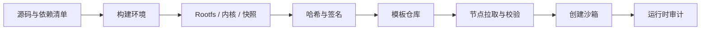

# 第三十三章　模板供应链与可复现环境：沙箱出生时就要可信

<!-- chapter-nav -->

[章节目录](../../README.md) · [第三十四章：身份、授权与 Artifact 边界](第三十四章-身份授权与Artifact边界.md)
<!-- /chapter-nav -->

> 本章是专家篇的补充章。前置：第九章（快照与克隆）、第十章（凭据安全）、第二十一章（生产化）。

前面的章节讨论了怎样把一个沙箱隔离起来，但还有一个更早的问题：**沙箱出生时带进来的模板、内核、依赖和初始化脚本是否可信？** 如果模板已经被污染，隔离只能限制它的影响范围，不能证明它本身值得运行。

## 一、模板不是文件，而是一条供应链



模板至少包含 rootfs、guest 内核、VMM/设备配置、初始化脚本、网络策略版本和工具依赖。只对 rootfs 做哈希还不够：内核和 VMM 版本改变，也可能改变系统调用、设备或启动行为。模板的身份应由一个不可变 manifest 表示：

```text
template_id = hash(rootfs, kernel, vmm_config, init, policy_version)
```

节点创建前验证 manifest 和签名，运行时把它写入 `sandbox_id` 的审计事件。这样批量评测才能回答“这些任务是不是从同一个环境出生”，生产事故才能回答“这个沙箱到底使用了哪个模板版本”。

## 二、构建阶段与运行阶段要分开

构建模板时允许安装依赖、编译工具和生成缓存；运行沙箱时则应禁止模板构建器留下的凭据、SSH key、云平台元数据访问和调试端口。建议把模板构建放在独立的构建沙箱中，构建产物经过扫描、签名和审批后才能进入模板仓库。

| 阶段 | 允许的动作 | 必须留下的证据 |
|---|---|---|
| 构建 | 下载依赖、编译、生成 rootfs | 来源、版本、哈希、构建日志 |
| 扫描 | 漏洞扫描、密钥扫描、许可检查 | 工具版本、规则集、结果 |
| 签名 | 生成 manifest 和签名 | 签名者、时间、密钥版本 |
| 发布 | 推送到模板仓库 | 审批记录、可回滚版本 |
| 运行 | 校验后只读加载模板 | 模板哈希、策略版本、节点 |

## 三、可复现不等于永远不变

可复现环境的目标是让同一 manifest 在同一口径下得到相同结果，而不是永远冻结所有软件。升级时应创建新版本并保留旧版本的回滚窗口；不要在原地覆盖模板。对于评测，模板版本必须进入评分记录；对于生产任务，升级要区分安全补丁、依赖升级和行为变更。

## 四、检查清单

- 模板是否有不可变 ID、哈希和签名？
- 构建日志能否追溯到源码和依赖版本？
- 模板里是否残留构建凭据或调试端口？
- 节点拉取模板前是否验证签名和策略版本？
- 旧版本能否在不修改原模板的情况下回滚？
- 任务审计是否记录模板、内核、VMM 和网络策略的完整组合？

模板供应链解决“出生时是否可信”，下一章继续解决“出生后谁能使用哪些能力”。
