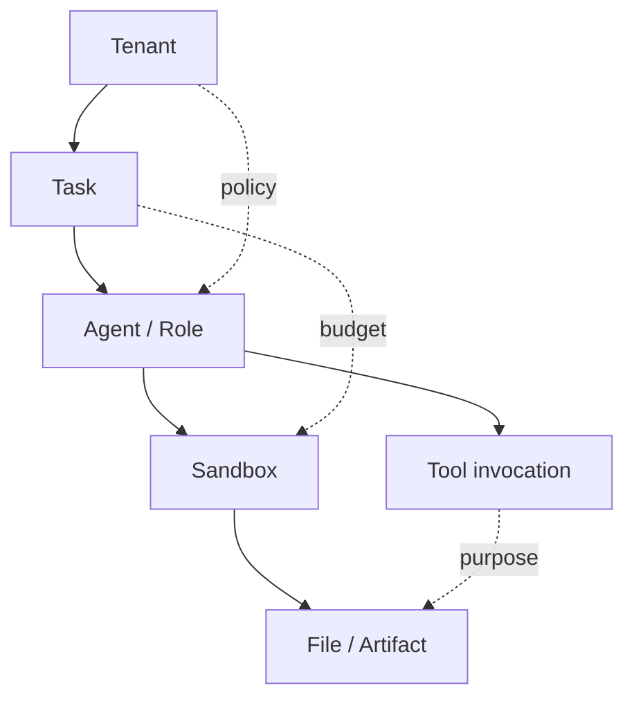
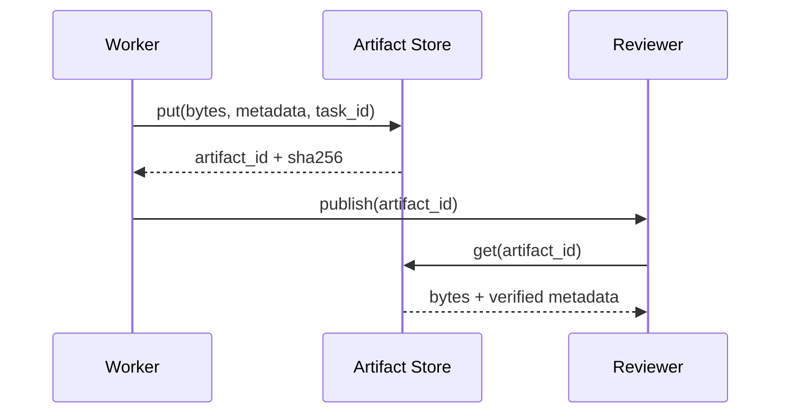

# 第三十四章　身份、授权与 Artifact 边界：沙箱里每个动作都要知道替谁做

<!-- chapter-nav -->

[第三十三章：模板供应链与可复现环境](第三十三章-模板供应链与可复现环境.md) · [章节目录](../../README.md) · [扩展研究](../扩展研究/第三十五章-研究笔记-关押型与监护型-沙箱的两种存在理由.md)
<!-- /chapter-nav -->

> 本章是专家篇的补充章。前置：第十章（凭据安全）、第十三章（执行审计）、第十五章（Agent 接口）、第二十章（多 Agent 拓扑）。

网络地址会变化，进程名会复用，沙箱也会被销毁重建。企业平台不能把 IP、容器名或 API key 当成完整身份。必须把租户、任务、Agent、沙箱、工具和 Artifact 绑定成一条可审计的授权链。

## 一、六层身份关系



每次动作至少携带 `tenant_id`、`task_id`、`agent_id`、`sandbox_id` 和 `purpose`。父 Agent 创建 worker 时，可以传递任务上下文，但不能默认传递所有凭据和文件权限；子 Agent 只能获得完成自己那一步所需的最小能力。

## 二、授权不是“有 key 就能做”

授权策略应同时判断主体、动作、对象、阶段和预算：

```text
allow(subject, action, resource, phase, budget, policy_version)
```

例如，worker 可以读取父任务指定的只读数据集，但不能读取兄弟任务的工作区；可以请求包仓库访问，但不能把同一凭据用于任意域名；可以写入自己的 artifact 命名空间，但不能覆盖已签名的父任务结果。

| 资源 | 允许 | 默认拒绝 |
|---|---|---|
| 工作区 | 当前任务路径、明确授权的只读输入 | 其他租户目录、宿主路径 |
| 网络 | 策略允许的域名和端口 | 内网扫描、元数据服务、任意 IP |
| 凭据 | 绑定用途和短时租约 | 读取原始密钥、跨任务复用 |
| Artifact | 读写自己的命名空间 | 覆盖他人结果、绕过签名 |
| 控制 API | 当前任务的状态和取消操作 | 集群级调度、租户配额修改 |

## 三、Artifact 是数据边界，不是普通文件

跨沙箱交接时不要只传一个路径。Artifact 至少需要内容哈希、创建者、所属任务、媒体类型、大小、保留期和访问策略。大文件通过对象存储引用传递，消息里只传 `artifact_id` 和版本；读取方校验哈希，避免共享目录里的半写文件或路径替换。



任务结束时，Artifact 的保留期和沙箱销毁时间可以不同，但两者必须有明确的引用关系。沙箱删除不应误删仍在审计保留期内的报告；保留期结束也应能证明删除的是哪个版本。

## 四、授权审计的最小字段

```text
event_id, tenant_id, task_id, agent_id, sandbox_id,
action, resource, decision, policy_version,
artifact_id, reason, timestamp, parent_event_id
```

有了这组字段，平台才能回答“哪个 Agent 以哪个身份读取了哪个结果、依据哪条策略、是否在预算内”。这也是第十三章的执行时间线和第二十章的任务树能够真正关联起来的前提。

下一步进入扩展研究：当 Agent 不只是执行，还要被系统持续监督时，沙箱的边界会从“关押”发展出“监护”的语义。
