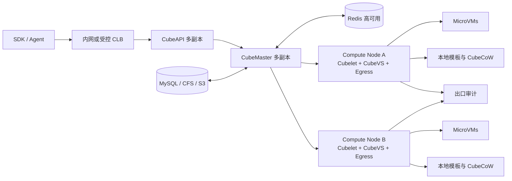

# 第二十一章　生产化：Terraform 集群部署、ARM64 与运维清单

<!-- chapter-nav -->

[← 上一章](../02-进阶篇/第二十章-多Agent拓扑-多沙箱协作与编排.md) · [章节目录](../../README.md) · [下一章 →](第二十二章-企业落地案例与场景矩阵.md)
<!-- /chapter-nav -->

> **本章基线**：CubeSandbox v0.7.2，仓库 checkout `f1aaa737fb3862202b1731e0e0d844c28779f930`，资料核对日期 2026-09-26。
>
> **本章要回答的问题**：一个能在单机上创建沙箱的 MicroVM 服务，怎样变成可升级、可审计、可扩容的生产系统？本章讨论边界、清单和运行手册，不把 Terraform 命令堆成部署教程。

## 引子：生产故障通常不是 VM 没启动

开发环境里，`POST /sandboxes` 返回 201，任务能执行，大家就会说“跑通了”。生产环境的第一个故障往往发生在更早或更晚的地方：模板已在一台节点上，调度却把请求送到了另一台节点；控制面滚动升级时 Redis 事件没有被消费；一个公共 CLB 暴露了默认没有鉴权的 WebUI；ARM64 节点启动了控制面镜像，却找不到对应 guest kernel；节点磁盘写满以后，所有“60ms”都变成排队。

生产化的关键不是把单机程序复制几份，而是把**控制面、数据面、状态、模板、出口、升级和审计**分别定义清楚。CubeSandbox v0.7.2 的架构正好提供了这个拆分：CubeAPI、CubeMaster、Redis 组成无本地状态的控制面；Cubelet、CubeShim、CubeHypervisor、CubeVS、CubeEgress 在计算节点组成数据面；CubeCoW 管理模板、根文件系统和内存快照；CubeProxy 和 lifecycle manager 处理沙箱入口与自动暂停恢复。

## 一、先画生产边界：控制面不等于计算面

官方架构文档把系统分成两层。控制面负责 API、调度和状态协调，数据面负责真正运行沙箱。这个分层决定了故障域：控制面短暂不可用时，已经运行的 VM 不应立即消失；某一计算节点故障时，控制面仍要能拒绝新请求、标记受影响沙箱并选择其他节点。

这里的“多副本”是架构目标，不是默认配置的保证。腾讯云 Terraform 指南明确说明默认配置偏向 POC：控制面许多组件为单副本，两个计算节点只是示例；要做生产容量和高可用，必须主动调整副本、节点规格和共享存储。CFS 只有在 CubeMaster 多副本时才有意义，因为多个实例需要共享 `/data/CubeMaster/storage`。Redis 是调度元数据、生命周期事件、CubeProxy 路由表和自动暂停协调锁的共享状态源，不能把它当作普通缓存随意清空。

## 二、Terraform 交付的正确心智模型

Terraform 的价值是把资源关系声明化，便于评审、复现和销毁；它不能替你决定容量、威胁模型和升级顺序。当前腾讯云集群交付文档的生产拓扑包括：TKE 控制面运行 `cube-master`、`cube-api`、`cube-ops`、`cube-proxy`、`cube-lifecycle-manager`、`cube-webui`；CVM PVM 计算节点运行 Cubelet；Cloud MySQL 与 Redis 保存控制面状态；可选 CFS 供多副本共享；可选 TCR 保存自建镜像；NAT 统一承担出网。

### 2.1 资源分组与故障域

| 资源组 | 生产职责 | 主要故障 | 设计要求 |
|---|---|---|---|
| 入口层 | CLB、API、Proxy、WebUI | 认证绕过、连接洪峰 | 默认内网；公网必须单独加鉴权、限流和来源控制 |
| 控制面 | CubeMaster、CubeAPI、Ops、Lifecycle、Redis/MySQL | 调度停顿、事件丢失 | 副本、反亲和、备份、版本一致 |
| 计算面 | 带 KVM 的裸金属/PVM 节点、Cubelet、CubeVS | 节点失联、磁盘满、模板缺失 | 按架构分池、健康上报、排空与替换 |
| 模板/快照 | 本地 XFS reflink、CFS/S3 | 新节点无法创建、恢复失败 | 模板版本与架构绑定，跨节点复制有校验 |
| 出口面 | CubeVS + CubeEgress + NAT | 凭据泄露、策略绕过 | 默认拒绝、审计、密钥轮换、失败关闭 |

把每个资源打上三类标签：环境（prod/staging）、架构（amd64/arm64）、数据等级（普通/敏感）。调度和发布都以标签为边界，避免将 ARM64 模板误分配给 x86 节点，也避免敏感租户与测试租户共享默认策略。

### 2.2 控制面副本不是“复制 Deployment”

CubeAPI 和 CubeMaster 的本地状态应保持最少，事件和元数据经 Redis 协调。副本扩展前要确认：Redis 连接池、MySQL 连接数、CubeProxy 的路由注册、lifecycle manager 对所有 Proxy 副本的发现机制都已测过。CubeProxy 多副本依赖 Redis 注册表，不能在负载均衡器后面静态写一份副本清单。

升级采用两个阶段：先扩控制面，观察 API 错误率、调度延迟和生命周期事件积压；再逐个排空计算节点。Cubelet/CubeShim/CubeHypervisor、guest kernel、模板 rootfs 必须视为一个兼容单元，不能只升级其中一个。模板中心保存模板版本和健康检查结果，旧模板在新组件稳定前保留回滚窗口。

## 三、ARM64：不是把镜像换成 arm64 就结束

v0.5 起，CubeSandbox 对 ARM64 做了从 Hypervisor、guest-init、Shim、BPF、构建和 CI/CD 到部署工具的全栈适配。仓库变更记录明确指出：x86 的 PIO 系统控制改为 ARM64 MMIO，guest 控制台从 `hvc0` 变为 PL011 的 `ttyAMA0`，seccomp 规则要处理系统调用号差异，BPF 对象按 `$GOARCH` 重新生成。这个事实带来四个生产检查点：

1. **硬件检查**：ARM64 机器必须暴露原生 KVM；PVM/nested KVM 当前仍是 x86_64 限制。ARM64 不能照抄云上 PVM 方案，应使用支持 `/dev/kvm` 的裸金属或原生虚拟化实例。
2. **内核检查**：guest kernel、宿主 kernel、CPU 特性和页面大小必须成套验证。v0.5.1 修复过 ARM64 64KB page 的 dirty bitmap 粒度问题，因此快照恢复不能只做“能启动”测试，还要做大页、增量快照和回滚校验。
3. **镜像检查**：控制面和数据面镜像是否有 multi-arch manifest 要逐一确认；官方文档注明并非所有镜像同时覆盖两种架构。模板也必须按架构构建，不能把 amd64 的预热快照当作通用模板。
4. **性能检查**：不要把 x86 的 60ms、5MB 直接迁移为 ARM64 SLO。分别测冷启动、快照恢复、文件 IO、网络代理和并发 P99，记录 CPU 型号、页面大小、磁盘和内核版本。

混合集群的推荐做法是按架构建立独立节点池和模板命名空间，调度时硬约束架构，成本报表按架构拆分。只有在两个池的功能和回滚链路都通过后，才让业务层把架构当作透明细节。

## 四、生产 checklist：从“可部署”到“可负责”

### 4.1 上线前检查

- [ ] 明确租户威胁模型：模型生成代码、用户代码、内部可信代码是否分池。
- [ ] 入口默认内网；若启用公网，WebUI、CubeAPI、CubeProxy 分别完成鉴权、来源限制、TLS 和限流。
- [ ] Redis/MySQL 有高可用、备份、恢复演练；Redis 数据丢失的影响已被记录。
- [ ] 控制面副本、反亲和、PDB 和升级顺序已评审；CFS/S3 的共享路径已做读写和故障测试。
- [ ] 每种架构有匹配的 guest kernel、模板、镜像和节点标签；模板健康检查通过。
- [ ] 计算节点 `/dev/kvm`、XFS reflink、磁盘水位、CPU/内存配额和时钟同步通过。
- [ ] CubeVS 默认拒绝内网/链路本地敏感网段，CubeEgress 域名/方法/路径策略和审计落盘通过。
- [ ] 凭据只在出口注入，模板和快照不含 API key、用户数据或临时令牌。
- [ ] 运行指标、审计日志、生命周期事件都有租户、沙箱、节点、模板版本维度。
- [ ] 已演练节点排空、控制面滚动升级、模板回滚、Redis 故障、S3 不可用和磁盘满。

### 4.2 发布闸门

发布一个组件前，先问它是否改变协议、状态格式、快照布局或安全策略。只改 WebUI 的发布可以走普通灰度；改 CubeShim、Hypervisor、guest kernel 或 CubeCoW 的发布，必须创建新模板版本并保留旧版本。跨节点 pause/resume 使用 S3 时，还要验证快照元数据、内存卷和 rootfs 卷的版本兼容。

## 五、运维 SOP：异常发生时先保护状态

**事件 0：发现异常。** 记录开始时间、受影响租户、沙箱 ID、节点、模板版本、请求 ID 和最近一次生命周期状态。先冻结高风险变更，避免边排查边升级。

**事件 1：判断范围。** 如果只有一个沙箱，查 CubeShim、guest-vsock、CubeVS 和该沙箱的审计；如果同一节点多个沙箱失败，优先查节点 KVM、磁盘、内存水位和 BPF 状态；如果跨节点失败，查 CubeMaster、Redis、模板分发和入口层。

**事件 2：保护数据。** 对仍可访问的沙箱先 pause 或 snapshot；对怀疑被入侵的沙箱保留审计和快照后隔离网络，不要直接销毁。凭据按租户或策略版本吊销，而不是只重启一个进程。

**事件 3：降级服务。** 调度器停止向异常节点派发新沙箱；入口层返回可重试错误并带 Retry-After；评测平台降低并发；对普通租户可启用 AutoPause，对实时任务保留容量。降级目标是把故障半径限制在节点或租户，而不是保证所有请求继续成功。

**事件 4：恢复与验证。** 替换节点前导出节点状态、模板命中率和审计；新节点加入后先跑 smoke、创建/执行/暂停/恢复/销毁闭环，再放少量租户。恢复跨节点快照时校验架构、CPU 特性、模板版本和数据校验和。

**事件 5：复盘。** 把“检测时间、隔离时间、恢复时间、丢失状态、错误租户数、策略是否生效”写入事件报告。若根因是容量，补充排队和水位阈值；若根因是版本，补充兼容矩阵；若根因是审计缺口，先补可见性再关闭事件。

## 六、横向参照：Terraform 与 Kubernetes 工具链

Terraform 适合描述云资源、网络、数据库、TKE 和计算节点之间的关系；Helm 适合把 CubeSandbox 组件放进已有 Kubernetes；ArgoCD 适合声明 Git 中的期望状态并做持续同步。三者不是替代关系：Terraform 管“云上有什么”，Helm 管“集群里装什么”，ArgoCD 管“目标版本和漂移如何持续纠正”。

Kubernetes Agent Sandbox 的思路则更靠近上层编排：把 sandbox 生命周期作为工作负载语义，由控制器处理模板、TTL、暂停和调度。CubeSandbox 的 CubeMaster/Cubelet 仍然拥有自己的 MicroVM 数据面；将其嵌入 K8s 时，要明确谁是权威调度器、谁负责节点排空、谁保存沙箱状态。双重控制器最容易出现“Pod 已 Ready、VM 尚未 Ready”或“Service 已删除、沙箱仍占资源”的状态漂移。

## 七、企业视角：把平台能力写成责任矩阵

生产团队需要把“平台提供什么”和“业务仍要负责什么”写在同一张表里。CubeSandbox 可以提供 MicroVM、调度、快照、出口代理和 E2B 兼容接口；业务团队仍要负责租户授权、数据分级、模板内容、结果留存和异常重试。责任不清时，最常见的误区是把“硬件隔离”误解为“数据合规已经完成”。

| 能力 | 平台侧 | 业务/安全侧 |
|---|---|---|
| 隔离 | KVM、seccomp、CubeVS 基础策略 | 威胁模型、租户分池、例外审批 |
| 凭据 | 出口注入、审计接口 | 密钥生命周期、最小权限、撤销 |
| 生命周期 | pause/resume、节点排空 | 会话 TTL、删除证明、重试语义 |
| 成本 | 节点水位、创建/运行指标 | 配额、计费、预算告警 |
| 合规 | 日志字段与留存能力 | 数据分类、访问审批、审计解释 |
## 本章小结

生产化的单位是一条可回滚的交付链：控制面状态、计算节点、模板、内核、网络策略、凭据和审计必须一起版本化。Terraform 可以复现资源，不能替你完成威胁模型；ARM64 可以原生运行，不能据此假定 x86 的性能和快照语义；运维 SOP 的第一动作是保存证据和限制故障扩散。

## 决策要点

- 只有单机验证：先用单节点和最小模板，不要把 POC 拓扑称为 HA。
- 需要私有化与多节点：控制面、计算面、模板分发和 Redis/MySQL 先做故障演练，再扩大并发。
- 需要 ARM64：采用独立节点池，先验证原生 KVM、内核/镜像/模板链路，再做混合集群。
- 已有 K8s：优先明确 CubeMaster 与 K8s 控制器的职责边界，再选 Helm/ArgoCD 交付方式。

## 下章预告

下一章不再从组件出发，而从四个企业场景反推容量、风险和成本：多租户代码执行 SaaS、内部数据分析 Agent、团队 Coding 平台和批量评测平台。同一家公司给四个团队采购沙箱，答案为什么会不同？

> **近就来源**：CubeSandbox v0.7.2 `docs/architecture/overview.md`、`docs/guide/tencentcloud-terraform-deploy.md`、`docs/guide/multi-node-deploy.md`、`docs/changelog/v0.5.0.md` 与 `v0.5.1.md`；仓库版本 `f1aaa73`，核对日期 2026-09-26。

