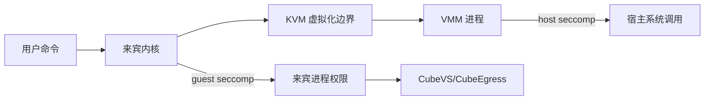

# 第二十七章　源码深潜：系统调用拦截篇，两套 seccomp 如何协作又为何不能互相替代

<!-- chapter-nav -->

[← 上一章](第二十六章-源码深潜-资源管控篇-Host-cgroup与KVM-memslot.md) · [章节目录](../../README.md) · [下一章 →](第二十八章-源码深潜-性能开销篇-60ms与5MB如何测量.md)
<!-- /chapter-nav -->


> **版本与边界**：本章基于 CubeSandbox v0.7.2、commit `f1aaa737fb3862202b1731e0e0d844c28779f930`。文中“宿主过滤器”指 VMM 进程所在宿主机的 seccomp，“来宾过滤器”指 rustjail 对 VM 内命令进程加载的过滤器。

## 引子：同一个词，保护的是两类进程

seccomp 都是在系统调用边界上做决策，但调用者不同，威胁模型也不同。宿主 VMM 的过滤器防止一个被利用的 VMM 进程继续调用不必要的宿主接口；来宾过滤器限制用户命令的 Linux 能力，减少提权、调试和设备访问。两者叠加后仍然需要 KVM、namespace、capability、网络出口和补丁管理。



## 一、宿主层：按 VMM 线程授予 syscall

### 1. 为什么按线程分组

`hypervisor/vmm/src/seccomp_filters.rs` 不只是列出一张系统调用黑名单，它还按工作职责定义线程过滤策略。`Api` 线程处理控制请求，`Vmm` 线程处理设备和内存，`Vcpu` 线程执行 `KVM_RUN`，`SignalHandler` 处理信号，`PtyForeground` 处理终端前台进程。线程划分让规则可以更接近最小权限：VCPU 不需要拥有 API 线程的全部文件和网络调用，API 线程也不应因为兼容性方便而拿到所有 KVM ioctl。

`hypervisor/vmm/src/lib.rs` 的初始化路径安装 VMM 过滤器，`cpu.rs` 的 VCPU 路径则需要允许 `KVM_RUN`。这也是源码审查的重点：新增线程、异步执行器或设备后端时，默认继承的过滤策略是否仍然足够窄，是否会因为一个 `EPERM` 导致隐蔽的启动失败。

### 2. ioctl 不是普通 syscall

KVM 大量能力通过 `ioctl` 暴露。仅允许 `ioctl` 这个系统调用还不够，因为真正的权限由 request number 和参数决定。CubeSandbox 的过滤规则因此把 KVM ioctl 常量纳入白名单或参数检查。审计时不能只 grep `seccomp`，还要核对 VMM 实际发起的 ioctl 与过滤器允许集合。


### 3. 规则表怎样变成 BPF

宿主层的编译链可以用四步理解：规则表先按线程和 hypervisor 类型构造 `SeccompRule`；`seccompiler` 将它们编译成 `BpfProgram`；线程在启动点调用 `apply_filter`；内核通过 `PR_SET_SECCOMP`/seccomp 机制让过滤器生效。`BpfProgram` 是编译产物，不是运行时策略数据库，因此规则更新通常需要重启或重新创建 VMM，而不是在线改一行配置。

过滤器具有线程局部性和继承语义：在一个线程上安装并不会自动替另一个已经存在的线程安装同一份规则，新线程则会继承创建者的 seccomp 状态。CubeSandbox 先对 `All` 做初始化约束，再在线程创建点使用 VMM/VCPU 等更窄规则，正是为了同时满足初始化与最小权限。新增异步任务或把工作移到新线程时，必须重新审查继承链。
## 二、来宾层：rustjail 的执行顺序

### 1. no_new_privs、能力与 seccomp

`agent/rustjail/src/container.rs` 将 no_new_privs、guest seccomp、capability drop 等动作编排在容器进程启动前，`agent/rustjail/src/seccomp.rs` 通过 libseccomp 加载规则。其核心目标是：即使命令能够执行一个新的二进制文件，也不能通过 setuid、文件能力或高风险系统调用恢复到更高权限。

一个可解释的执行顺序是：

```text
创建进程上下文
  → 建立 namespace / 工作目录 / 设备视图
  → 设置 no_new_privs
  → 丢弃不需要的 capabilities
  → 加载 guest seccomp
  → 设置 uid/gid 与环境
  → execve 用户命令
```

实际代码可能为兼容性采用不同的局部顺序，因此应以目标版本的调用链和测试为准。这里最重要的不是背诵顺序，而是确保任何可能执行用户代码的路径都不会绕过同一套约束，例如 PTY、后台任务和恢复后的进程。

### 2. 规则不是“安全清单”

seccomp 可以返回 `ERRNO`、`KILL`、`TRAP` 等动作。对编译器和浏览器来说，过窄的规则会误杀正常工作；对不可信代码来说，过宽的规则会增加攻击面。建议把规则按工作负载分 profile，并记录命中 syscall、sandbox、镜像和版本，避免只保留一条“进程被杀”的日志。


### 3. 白名单数字与版本边界

某次 x86_64 构建中，VCPU 过滤规则大约包含数十个 syscall，常被概括成“约 38 个”；它会随着 KVM、virtio 设备、调试特性和架构变化。规则中没有给 VCPU 线程开放常规网络监听的 `accept`、`bind`、`listen` 组合，这不是说宿主永远不能打开 socket，而是把网络职责留在受控的设备/代理路径。阅读源码时应比较规则生成函数与实际 workload 的 syscall trace，不能把文章中的数量复制成安全证明。
## 三、两层叠加后的真实路径

一次来宾命令调用宿主资源时，大致经过：用户进程发起 syscall → 来宾内核执行或拒绝 → 若涉及虚拟设备则触发 VM exit → VMM 进行设备处理 → VMM 发起宿主 syscall/ioctl → 宿主 seccomp 决定是否允许。绝大多数普通用户态 syscall不会直接到宿主 VMM；因此“来宾 syscall 白名单”等价于“宿主 syscall 白名单”是错误的。

两个过滤器还可能出现误判：

- guest 规则允许网络连接，但 CubeVS/CubeEgress 的域名策略拒绝；
- guest 规则允许文件访问，但工作区/挂载路径没有该文件；
- VMM 规则拒绝一个设备后端所需 ioctl，表现为 sandbox 启动或恢复失败；
- 宿主过滤器通过了调用，但 KVM、文件系统或 cgroup 在更低层拒绝。

诊断必须记录层级：`guest_seccomp_denied`、`vmm_seccomp_denied`、`kvm_error`、`egress_policy_denied` 不应共用一个错误码。

## 四、为什么 seccomp 不能单独完成隔离

1. **它不检查所有数据流**：共享文件、复制进程、网络代理和凭据注入仍需单独策略。
2. **它不修复内核漏洞**：允许的 syscall 可能在内核中存在漏洞，过滤器只能缩小调用面。
3. **它不等于身份隔离**：uid、capability、namespace 和 LSM 的语义仍要配置。
4. **它不理解业务意图**：`connect` 是否允许访问生产数据库，需要域名/IP/租户策略，而不是单纯允许或拒绝 syscall。
5. **它不覆盖已有连接状态**：恢复快照后，连接、token、DNS 解析和策略版本都可能变化。

因此，安全评审应把 seccomp 作为“系统调用层控制”，并在 threat model 中明确其上下界。


### 3. seccomp 的固有限制

即使一条规则正确编译安装，seccomp 仍有边界：它可以检查有限的 syscall 参数，却不能理解一段参数指向的复杂对象；不能自动防止 TOCTOU（检查后对象被替换）；不能阻止允许的 syscall 组合形成逻辑漏洞；也不能判断一个合法 `connect` 是否违反租户数据策略。因此，syscall trace、capability、namespace、LSM、文件权限、网络出口和应用审计要一起验证。
## 五、变更与回归测试

### 1. 新增工具的测试矩阵

给一个新工具开放能力时，至少验证：正常命令、失败命令、PTY、后台子进程、fork/exec、网络访问、文件访问、快照恢复、容器删除后的残留。为每项记录允许 syscall、命中策略、退出码和审计事件。

### 2. 过滤器变更的回滚

宿主 VMM 过滤器若误杀，可能导致所有新 sandbox 无法启动；来宾过滤器若误杀，则某一类 Agent 工具失败。二者都要有版本化 profile、节点灰度、启动探针和快速回滚。过滤器更新不能只依赖镜像标签，因为 VMM 二进制、guest agent 和模板内核可能不同步。

### 3. 从拒绝事件反推最小扩展

不要看到 `EPERM` 就把规则改成 allow-all。先确认调用来自哪一层、哪个线程、哪个二进制，再判断是否需要替代实现、条件允许、只对特定 profile 放开，或由代理完成同等能力。每个新增 allow 都应带上理由、测试和过期复审日期。

## 六、与 gVisor、Kata 和 E2B 的对照

gVisor 的系统调用兼容层把很多调用放进用户态 Sentry，降低应用直接触碰宿主内核的机会，但应用兼容性和性能需按 workload 验证；Kata 通过 VM 边界隔离容器，来宾内还可能叠加 OCI 约束；E2B 面向用户暴露更高层的执行接口，底层过滤器和节点运营由其实现或部署方负责。CubeSandbox 的公开源码优势是可以审查 VMM 线程规则、来宾 rustjail 和出口策略，但这也把维护责任交给私有部署团队。

## 小结

两套 seccomp 的关系是“分层协作”，不是“重复配置”：宿主保护 VMM，来宾约束用户命令。真正的最小权限来自线程职责、no_new_privs、capability、namespace、网络和文件策略共同收敛。下一章会把性能数字拆开，说明 60ms 和 5MB 应该如何解读、测量与复现。

### 本章练习

1. 为什么宿主 VMM 过滤器必须关注 KVM ioctl 的 request，而不能只允许 `ioctl`？
2. 设计一份编译器 profile 和浏览器 profile，列出各自的允许/拒绝理由。
3. 给出一个日志字段，使平台能区分 guest seccomp 拒绝和 CubeEgress 拒绝。
4. 当一条规则导致启动失败时，如何在不全局放开的情况下定位最小扩展？

### 参考源码

- `hypervisor/vmm/src/seccomp_filters.rs:21-90,126-270,905-945`：VMM 线程与 KVM ioctl 过滤。
- `hypervisor/vmm/src/lib.rs:340-390`、`hypervisor/vmm/src/cpu.rs`（VCPU `KVM_RUN` 入口）：过滤器安装与 VCPU 入口。
- `agent/rustjail/src/container.rs:608-731`、`agent/rustjail/src/seccomp.rs:69-110`：来宾进程限制。
- `docs/zh/guide/security-proxy.md`：L7 出口与凭据策略的边界。


