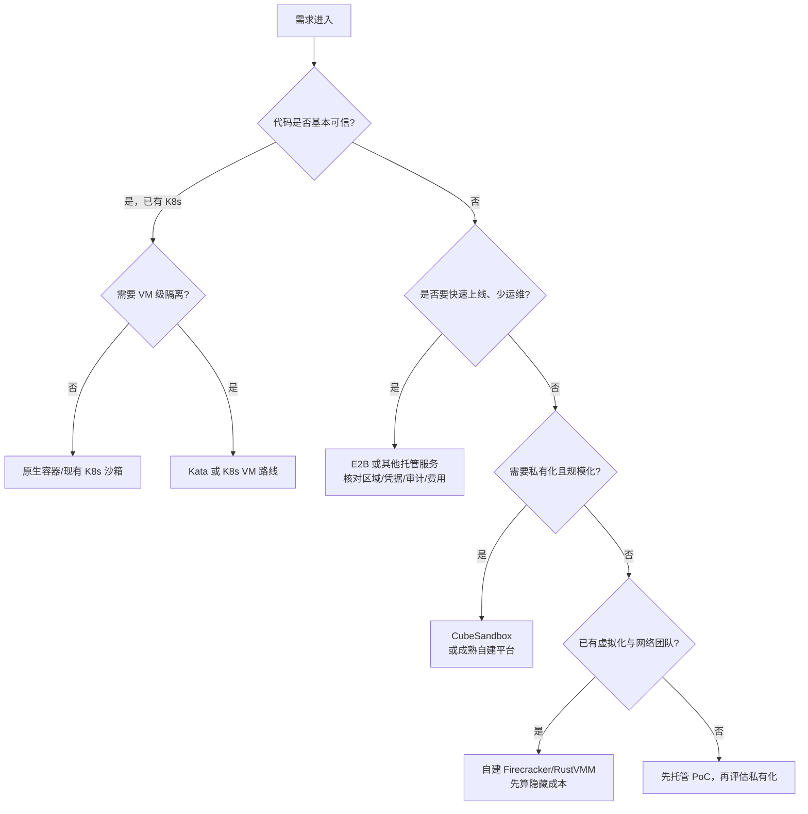

# 第二十三章　横评与选型：CubeSandbox vs E2B vs Kata vs gVisor vs 自建（决策篇中）

<!-- chapter-nav -->

[← 上一章](第二十二章-企业落地案例与场景矩阵.md) · [章节目录](../../README.md) · [下一章 →](第二十四章-边界与未来-MicroVM与WASM融合-沙箱会成为Agent操作系统吗.md)
<!-- /chapter-nav -->

> **统一口径声明**：本章不是跑分榜。对五条路线的可比事实来自截至 2026-09-26 的公开文档、仓库和部署资料；没有在同一机器、同一模板、同一负载下复测的数字，统一写“未实测”或“依实现而异”。CubeSandbox 版本基线为 v0.7.2，commit `f1aaa737fb3862202b1731e0e0d844c28779f930`。

## 引子：选型会把“最快”问成唯一答案

采购评审常问：“哪个沙箱启动最快？”但企业真正要的是：代码被攻破后会影响什么，谁负责升级，凭据放在哪里，故障能否重试，账单是否可预测。一个托管服务的启动数字和一个自建 VMM 的本地数字不在同一个测量边界内；一个已有 K8s 的团队，也不能把“能运行容器”当作“已经拥有 VM 沙箱平台”。

因此本章使用五类维度：隔离级别、启动延迟、内存开销、生态兼容、运维成本，以及多租户/凭据/审计等企业能力。每一维都先声明测量边界，再给适用条件，最后用决策树收敛。

## 一、五路路线的边界

### 1. CubeSandbox：私有化的 Agent 沙箱平台

v0.7.2 的公开架构是 RustVMM + KVM MicroVM，控制面由 CubeAPI、CubeMaster、Redis 等组成，数据面由 Cubelet、CubeShim、CubeHypervisor、CubeVS、CubeEgress、CubeProxy 组成。官方 README 宣称可在 60ms 内创建、单沙箱额外内存低于 5MB；仓库同时提供性能报告链接，但这些数字依赖模板、硬件、并发和统计口径，不应直接替代企业压测。

它的优势是把“强隔离、模板、网络、凭据、快照、AutoPause、集群调度”放在一个可私有化系统里；代价是用户要负责 KVM 节点、内核和模板供应链、Redis/MySQL、网络策略、监控和升级。它对 E2B SDK/协议提供兼容入口，减少应用迁移，却不代表所有 E2B 功能在任何版本都零差异。

### 2. E2B：托管 Agent 沙箱与公开 SDK 生态

E2B 是面向 Agent 的托管沙箱服务，同时维护公开 SDK、模板和开发者生态。选型时应把“E2B 的 API/SDK 兼容性”和“E2B Cloud 的托管责任”分开：前者是接口与开发体验，后者是运行节点、容量、网络和服务级别由供应商承担。其底层实现、地域、隔离配置和计费边界以当前服务文档和合同为准，本章不把它简单描述为“闭源全托管”或推断其所有底层组件。

E2B 适合希望快速上线、没有 KVM/网络/快照运维团队、可以接受云端数据边界的团队。需要私有网络、数据驻留、定制内核、特殊合规或大规模长期闲置会话时，应核对专属部署、区域、保留策略、出口控制和支持等级，而不是只看 SDK 是否兼容。

### 3. Kata Containers：Kubernetes 中的轻量 VM 运行时

Kata 通过 Kubernetes RuntimeClass 把 Pod 放进轻量虚拟机，保留较多容器工作流和 K8s 调度体验。它适合已经拥有成熟 K8s、希望用现有 namespace、Service、NetworkPolicy 和运维体系承载隔离工作负载的团队。Agent 场景仍需自行补齐会话 API、模板快照、凭据保险库、审计、租户配额和快速创建路径；Kata 本身不是完整 Agent 平台。

Kata 的隔离和启动取决于 kata-runtime、VMM、guest kernel、设备和 K8s 配置。没有统一实测就不能把它与 CubeSandbox 的“60ms”横向排序。它的主要价值是生态整合，主要成本是 K8s 控制面、节点内核、RuntimeClass 和升级矩阵的复杂性。

### 4. gVisor：用户态内核沙箱

gVisor 通过 Sentry/Gofer 重新实现和拦截一部分 Linux 语义，减少直接暴露给 guest 的宿主内核面。它能以容器形态接入现有编排，适合希望降低共享内核风险、又不想引入完整 VM 的场景。系统调用兼容性、文件和网络 IO 性能、特定 workload 行为必须按版本和负载测试；本章不采用“约 200 个 syscall”或“性能固定下降 N 倍”作为跨产品分数。

对 Agent 平台而言，gVisor 的边界是：它解决进程级隔离的一部分问题，但不会自动提供 E2B 风格的 session API、快照克隆、凭据注入和多租户计费。

### 5. 自建 Firecracker/RustVMM：自己拥有底座，也自己拥有账单

自建路线可以直接使用 Firecracker、Cloud Hypervisor 或 RustVMM 组件，再自行实现控制面和数据面。它适合已经有虚拟化、网络、SRE、存储和安全团队，并且需要深度定制的组织。Firecracker/RustVMM 不是“装上二进制就有 Agent 平台”：需要模板构建、rootfs 与内存快照、调度、节点代理、代理路由、凭据、审计、升级、故障恢复和 SDK 接口。

自建最容易低估的是非代码成本：夜间升级、内核 CVE、磁盘和模板分发、网络规则回收、跨节点恢复、容量预测和事故响应都要有人负责。

## 二、统一比较总表

| 维度 | CubeSandbox v0.7.2 | E2B Cloud/服务形态 | Kata Containers | gVisor | 自建 Firecracker/RustVMM |
|---|---|---|---|---|---|
| 隔离边界 | KVM MicroVM，独立 guest kernel；另有 CubeVS、Egress、seccomp | 以供应商当前公开架构、合同和区域配置为准；不要从 SDK 推断底层 | 轻量 VM + K8s RuntimeClass，细节依 VMM/配置 | 用户态内核拦截，仍依宿主内核与 Sentry 正确性 | 可做 KVM MicroVM；隔离质量由实现和运维决定 |
| 启动延迟 | 官方资料给出亚百毫秒/60ms 级宣传与报告入口；本文未复测 | 供应商 SLA/公开 benchmark；本文未复测 | 未统一实测，依 runtime、镜像、节点 | 未统一实测，依 Sentry、IO、镜像 | 未统一实测，依模板和自建恢复路径 |
| 单实例开销 | 官方宣传 <5MB 额外开销；口径需与 guest 内存分开 | 计费/资源口径以服务文档为准 | 未统一实测；需拆 Pod、guest 和 VMM 开销 | 未统一实测；Sentry/Gofer 与负载相关 | 由 VMM、guest、模板共享与实现决定 |
| Agent 生态 | E2B 兼容 API/SDK、模板、快照、AutoPause、Egress/凭据 | SDK、模板和托管产品生态 | K8s 生态强，Agent 语义需自建或接控制器 | 容器生态强，Agent 生命周期需自建 | 生态自由，工程工作量最大 |
| 多租户 | 平台提供调度、配额和网络/凭据组件，但需正确配置 | 供应商负责底座，租户/策略能力看套餐和 API | 需结合 K8s 配额、节点池和网络策略 | 需自行组合租户和策略 | 全部自建 |
| 凭据/审计 | CubeEgress 可做域名策略、注入和 JSONL 审计；需接企业 SIEM | 看服务能力、区域和合同；不能默认等同私有审计 | 通常需外接 Vault、代理和审计 | 通常需外接 | 全部自建 |
| 私有化 | 支持自建/云上集群；负责节点和控制面 | 取决于产品与合同，需单独确认 | 运行在企业 K8s | 运行在企业 K8s | 完全可控，也完全负责 |
| 运营成本 | 中高：平台已有组件，节点/数据库/模板仍由用户承担 | 低到中：按用量、保底、区域和数据流量付费 | 中高：既有 K8s 可复用，否则成本陡增 | 中：运行时集成和兼容性测试不可省 | 高：底座和平台均由团队维护 |

表中“未实测”是信息质量，而不是负面结论。跨产品 benchmark 至少要固定：CPU 型号、内核、磁盘、guest 镜像 digest、预热状态、创建 API 路径、并发阶梯、P50/P95/P99、成功率、网络和日志开销。没有这些条件，两个毫秒数字不能放在同一列相减。

## 三、生态兼容：E2B 和 Kubernetes 是两条不同的锁定线

E2B 兼容解决的是客户端、沙箱生命周期和 `envd` 风格的数据面接口。CubeSandbox 的 Go、Python、Node 教程和 trpc-agent-go 集成说明了“替换 API URL/配置即可迁移”的价值；生产迁移仍应逐项验证 PTY、文件、快照、Volume、超时、错误码、域名和认证回调。

Kubernetes 兼容解决的是部署与编排生态。Kata 直接沿 RuntimeClass；CubeSandbox v0.7.2 仓库提供 Kubernetes Helm/部署资料，控制面、计算 DaemonSet、DNS、Proxy 和 Egress 仍有自己的生命周期。社区所谓“Kubernetes Agent Sandbox”可能指控制器、CRD、运行时适配或一组约定，不应把一个尚在演进的生态名称当成单一产品。评审时应问三个问题：谁创建 VM，谁是状态权威，谁负责节点排空和回滚。

## 四、选型决策树

决策树只是第一轮过滤。最终方案要通过一张“退出条件”表：上线前若不能证明模板可复现、凭据不进 guest、节点故障可排空、审计可检索、费用有上限，就不能因为 SDK 能跑通而进入生产。

## 五、自建的真实成本清单

下面按一个拥有 3～5 个基础设施工程师、需要支持生产多租户的团队做**人力级别假设**。数字不是报价，只用于防止漏项：

| 工作包 | 交付物 | 假设投入 |
|---|---|---:|
| KVM/VMM 集成 | vCPU、内存、virtio、启动、pause/restore、seccomp | 1～2 人月 |
| guest 与模板 | 内核、rootfs、OCI 转换、版本/签名/回滚 | 1～2 人月 |
| 节点代理 | 资源上报、排空、垃圾回收、磁盘水位 | 1～2 人月 |
| 调度与控制面 | API、租户配额、队列、幂等、状态机 | 2～4 人月 |
| 网络与出口 | TAP/eBPF 或代理、SNAT、策略、凭据注入 | 2～4 人月 |
| 存储与快照 | CoW、快照、增量、跨节点传输、校验 | 2～4 人月 |
| 观测与审计 | 指标、日志、轨迹、SIEM、告警 | 1～2 人月 |
| 安全与合规 | 威胁建模、CVE 响应、渗透、密钥轮换 | 持续投入 |
| 生产运维 | 升级、容量、值班、事故演练 | 持续投入 |

这些包可以并行，但依赖关系不能消失；“两个人两周做个 demo”不等于拥有可承诺 SLA 的服务。若采用 CubeSandbox，部分工作包已有实现和文档，投入转为版本评估、部署适配、策略配置和上游跟进，仍不能省掉运维能力。

## 六、何时不该用 CubeSandbox

这是中立选型必须单列的一节：

- 代码完全可信、只有构建隔离需求，团队已有成熟 K8s，使用容器或现有 RuntimeClass 可能更简单。
- 任务极轻、可编译为 WASM，且不需要完整 Linux 用户态时，WASM 可能更省资源。
- 只做一次短期 PoC、没有私有化和数据驻留要求时，托管 E2B 可能减少前期运维。
- 团队没有可用 KVM、节点内核和网络值班能力时，直接自建 MicroVM 风险很高。
- 业务需要供应商已经承诺的地域、合规认证或支持等级，而当前 CubeSandbox 部署无法满足时，应选择能签署这些承诺的服务。
- 需要强 GUI/桌面兼容、GPU 或特殊设备直通时，先验证 CubeSandbox 的设备模型；不要从“能跑 shell”推断“能跑全部桌面工作负载”。

反过来，若威胁模型是模型/用户生成代码、需要私有化、需要高密度快照和 Egress 凭据隔离，CubeSandbox 的平台完整度可能比从 Firecracker 零开始更有价值。这里的“可能”取决于版本验证和企业运维能力。

## 七、企业视角：先分配责任，再比较产品

企业采购表至少要有四列责任人：平台工程负责节点和升级，安全团队负责威胁模型与凭据策略，数据团队负责驻留和留存，业务团队负责容量、重试和预算。把这四列填完后，产品差异会更清楚：托管 E2B 减少底座责任，CubeSandbox 减少部分平台开发但保留集群责任，Kata/gVisor 复用 K8s 或容器能力而把 Agent 语义留给企业，自建则把所有责任集中到自己的值班体系。
## 本章小结

横评的结论不是名次，而是责任边界：E2B 把底座运营交给供应商，Kata 把隔离嵌入 K8s，gVisor 用用户态内核缩小直接攻击面，CubeSandbox 把 Agent 生命周期和 MicroVM 平台打包，自建路线把一切控制权和一切故障责任交给自己。选型时先确定数据和运维边界，再比较数字。

## 决策要点

1. 没有同负载实测，就不要发布跨产品延迟/内存排名。
2. E2B SDK 兼容与 E2B Cloud 托管是两个问题；Kubernetes 兼容与 Agent 生命周期也是两个问题。
3. 用“谁负责升级、谁保存状态、谁审计出口、谁承担故障”四问识别隐藏成本。
4. 任何方案都要保留退出路径：可导出数据、可重建模板、可替换 SDK 适配层。

## 下章预告

最后一章回到未收敛的问题：WASM 与 MicroVM 会不会形成分级隔离，E2B 接口会不会成为生态事实标准，沙箱是否可能成为 Agent 的操作系统。下一章的判断全部标为趋势推测，不把路线图写成事实。

> **近就来源**：CubeSandbox v0.7.2 `docs/architecture/overview.md`、`README.md`、`docs/guide/usecases/trpc-agent-go.md`、`deploy/kubernetes/chart/README.md`；E2B 公开 SDK/API 文档（以 2026-09-26 服务状态为准）；Kata Containers、gVisor、Firecracker/RustVMM 官方项目文档。未统一复测的数据均明确标注为未实测。

