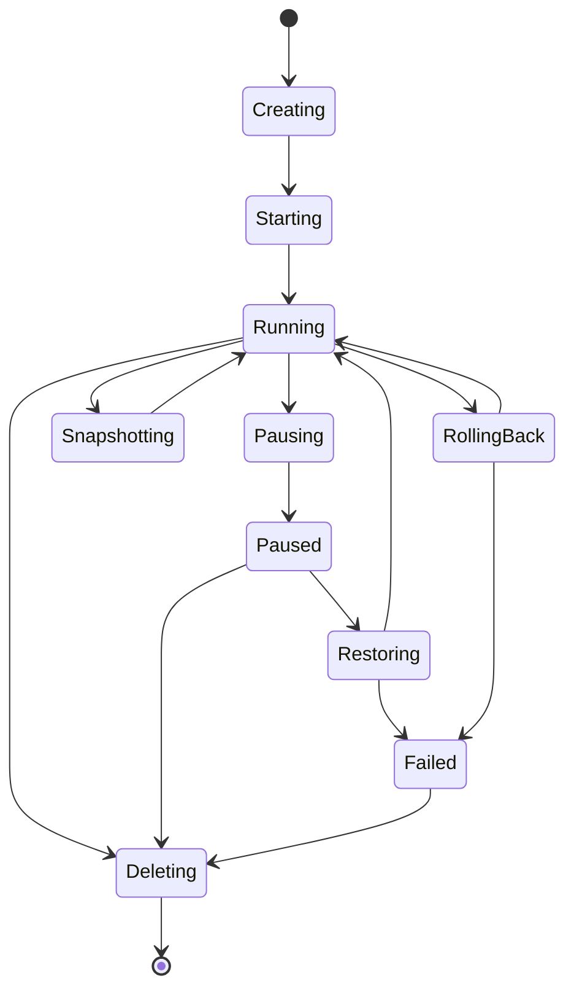

# 第二十九章　源码深潜：快照与状态机篇，CubeShim 如何让沙箱可暂停、可恢复、可回滚

<!-- chapter-nav -->

[← 上一章](第二十八章-源码深潜-性能开销篇-60ms与5MB如何测量.md) · [章节目录](../../README.md)
<!-- /chapter-nav -->

> **版本与边界**：本章基于 CubeSandbox v0.7.2、commit `f1aaa737fb3862202b1731e0e0d844c28779f930`。代码中的方法名是实现入口，不等同于所有 API 的稳定协议；生产集群应以当前版本的接口契约和兼容测试为准。

## 引子：状态比进程更长寿

Agent 沙箱不只是一个进程。它有创建、启动、执行、暂停、快照、恢复、克隆、回滚和销毁；状态还可能跨节点、跨控制面重启和跨对象存储保存。真正困难的不是写一个 `pause()` 函数，而是让控制面、CubeShim、VMM、来宾 agent、文件系统和网络策略对“现在到底处于什么状态”有一致理解。

上图是便于沟通的状态模型，具体项目的状态字段、事件名和恢复机制要以版本源码为准。任何异步操作都应有 operation id、幂等键、超时和可观测事件。

## 一、CubeShim 在状态机中的位置

`CubeShim/shim/src/sandbox/sb.rs` 维护 sandbox 侧的生命周期对象，服务层接收 containerd/上层请求，`cube_hypervisor.rs` 把快照、恢复、暂停等操作交给 VMM。Shim 是连接控制面与实际 VM 的协调点：它既要回报状态，又要等待 guest/VMM 的事实确认，不能仅因为 API 请求已接受就把对象标成 Running。

一个可靠的状态转换应满足：

- **幂等**：重复 Start、Pause 或 Delete 不会创建第二个 VM 或破坏已有快照；
- **单向失败**：不可恢复的恢复失败进入 Failed，并保留原因与清理动作；
- **可重试**：对象存储暂时不可用、节点短暂离线时，恢复可以重试而不重复写入；
- **可观察**：每个转换记录前后状态、operation id、sandbox、节点、模板 hash 和版本。

## 二、SnapshotType：三种内存语义不是三个按钮

`hypervisor/vm-migration/src/lib.rs` 定义 `SnapshotType::{Full, Incremental, SoftDirty}`。它们描述的是内存状态如何被捕获或增量化，不等于文件系统快照、网络连接或业务数据库事务。

### 1. Full

Full 快照捕获完整的 VM 内存状态，恢复时语义最直接、依赖链最短，但对象更大、传输和存储成本更高。适合建立基线、跨较长时间保留或增量链需要重新压实的场景。

### 2. Incremental

Incremental 只保存相对某个基线发生变化的页或状态。它降低每次快照的成本，却引入父快照依赖：删除、损坏或版本不兼容都会影响后续恢复。生产系统要记录 base id、链长、校验和、创建节点、内核/模板版本，并在链过长时自动生成新基线。

### 3. SoftDirty

Soft-dirty 依赖页表标记与写入跟踪来识别变化页。`memory_manager.rs` 中有 pagemap/soft-dirty 相关路径，能帮助实现增量迁移或快速检查。但标记的清除、进程写入、映射类型、内核版本和共享页语义都可能影响结果；“看到 dirty 页”不等于完整捕获了所有业务状态。

## 三、文件系统、内存和网络必须一起定义一致性

CubeCoW 文档将 snapshot 描述为 memory + filesystem，FICLONE 用于文件系统 CoW，内存路径由 Full/Incremental/SoftDirty 等类型决定。要得到可用恢复点，还需要明确：

1. 正在写入的文件是否 flush、fsync 或由应用自己保证一致性；
2. 工作区、临时目录、日志和挂载卷哪些进入快照；
3. DNS 缓存、TCP 连接、代理凭据和短期 token 恢复后是否仍有效；
4. 网络策略与凭据是否按快照创建时保存，还是恢复前重新计算；
5. 回滚后事件、审计和计费如何保持单调，不因时间回退而覆盖历史。

这就是为什么“快照成功”不能简单翻译成“业务可恢复”。快照是运行时状态的一致性点，业务一致性仍可能需要应用层 checkpoint。

### 1. `pause_vm_to_snapshot` 的数据布局

在 `sb.rs` 中，`pause_vm_to_snapshot` 接收 destination path、可选 `memory_vol_url` 和 `SnapshotType`，内部将它们组成 hypervisor 的 `SnapshotConfig`，再调用 `pause_vm_cube_with_config`。destination 保存 VM/设备状态与文件系统元数据，memory volume 则可以指向 CubeCoW 或其他 backing；两者必须在 manifest 中绑定同一个 sandbox、模板和 snapshot id。只上传其中一个对象，恢复时会得到“文件系统存在但内存不可用”或相反的半状态。

`update_ext.rs` 的解析函数对空值和未知值默认到 `Full`，这是兼容旧调用方的安全降级；生产客户端仍应先做 capability discovery，避免把用户以为的 SoftDirty 语义静默变成 Full，并在事件中记录实际生效的类型。
## 四、Pause/Resume 与跨节点恢复

暂停可以有多个语义：停止 guest CPU 但保留节点映射，释放 CPU 但保留内存，或把 VM/文件系统/网络状态序列化后完全释放节点。CubeSandbox v0.7 系列公开资料已经涉及跨节点 pause/resume 和 S3 后端，因而恢复流程至少包含：生成或确认快照、上传/校验对象、记录 source node、释放本地资源、目标节点准入、下载/映射、恢复 VMM、重建网络与凭据、等待 agent ready。

跨节点恢复的失败补偿要提前设计：

- 上传成功、控制面写入失败：通过对象前缀和幂等键清理孤儿对象；
- 目标节点准入失败：保留源快照，不把 sandbox 标为已迁移；
- VMM 恢复成功、网络重建失败：进入 Restoring/Degraded，而不是假装 Running；
- agent ready 但策略版本过旧：重新评估策略，必要时拒绝对外服务。

### 4. Rollback 的 delete + resume 技巧

当前实现的 rollback 不是在原 VM 内把几页覆盖回去，而是先停止/删除旧 VM，再用调用方提供的 `RestoreConfig` 从目标 snapshot 恢复新的 VM。`sb.rs` 对源 URL、磁盘、memory volume 和 sandbox 运行状态做前置校验；Cubelet 侧会派生新的 rootfs/内存卷，等待 Shim 的 delete/resume 结果，再刷新网络 generation 和 guest metrics epoch。这样可以避免旧 VMM 仍持有旧 memslot、进程和 CoW 引用，但也带来短暂不可用窗口与旧任务事件延迟，需要 operation id 和并发互斥。

### 5. 与上游 Cloud Hypervisor 的定制点

CubeSandbox 的差异集中在 Agent 场景：增加 `SnapshotType` 的 Full/Incremental/SoftDirty 分派、CubeCoW 文件/内存卷 URL、`--sandbox-id` 等租户识别与跨节点恢复字段，并在 Shim/ Cubelet 层维护 pause、rollback、网络 generation 和凭据重建。上游 Cloud Hypervisor 的通用 snapshot API 不自动提供这些租户语义；反过来，CubeSandbox 对上游设备和 VMM 的升级也必须重新验证自定义 restore、soft-dirty 和 Shim 状态机。
## 五、Rollback 与 Clone 的区别

### 1. Rollback

Rollback 在同一 sandbox 身份下把内存、文件系统和可选配置恢复到某个 snapshot。它适合测试回到已知状态，但会造成时间回退：进程内时间、日志序号、数据库连接和外部任务可能已经向前走过。API 应返回 rollback operation id，并在恢复前停止可写进程或明确丢弃未提交工作。

### 2. Clone

Clone 从一个 snapshot 创建新的 sandbox 身份，工作区和内存初始状态相似，但端口、租户、凭据、审计流和网络策略必须重新分配。Clone 的并发清理比 rollback 更复杂：多个实例共享 CoW 父层，任何一个实例的写放大都可能影响存储；父快照不能在子实例仍引用时随意删除。

### 3. 事件与计费

rollback 不应覆盖原有审计记录，clone 不应继承原租户的可用凭据。建议事件流使用单调 sequence/事件时间，快照只携带执行状态，控制面重新生成身份、配额、端口和凭据。这样恢复后仍能回答“谁在什么时候从哪个快照创建了哪个实例”。

## 六、源码审查与故障演练清单

1. **调用入口**：在 `update_ext.rs` 核对 snapshot type、默认值和参数解析；确认未知类型不会静默降级到 Full 或空操作。
2. **hypervisor 交接**：在 `cube_hypervisor.rs` 核对 pause/resume/snapshot 调用是否等待状态确认、是否处理超时和取消。
3. **sandbox 状态**：在 `sb.rs` 核对运行中、暂停中、恢复中和删除中的并发请求如何互斥。
4. **对象存储**：验证上传、下载、校验、清理和 GC 的幂等键；模拟中途断网与节点宕机。
5. **安全重评估**：恢复后重新加载租户网络策略、凭据版本和镜像信任信息。
6. **链路压实**：构造长 Incremental/SoftDirty 链，测量恢复时间、失败率和基线重建成本。
7. **业务一致性**：对编译、数据库迁移和浏览器会话分别做 checkpoint/rollback 演练，记录哪些状态不能恢复。

## 七、和 SWE-bench、评测平台的关系

代码评测希望每个样本从相同依赖、相同工作区和相同初始状态开始。Clone 能快速复制模板，rollback 能在失败后重放步骤，snapshot 能把昂贵的依赖安装阶段复用给多个样本。但如果快照里混入临时凭据、时间敏感的远端连接或非确定性缓存，评测结果会产生隐性偏差。

可复现评测需要把 snapshot manifest 一起保存：代码提交、镜像 digest、内核/运行时版本、环境变量白名单、网络策略、依赖锁文件、快照类型、父快照 id 和测量时间。这样“恢复得很快”不会以牺牲样本可解释性为代价。

## 小结

CubeShim 状态机的核心不是状态名，而是状态转换的事实确认、幂等、补偿和审计。Full、Incremental、SoftDirty 只是内存捕获策略，文件系统、网络、凭据和业务 checkpoint 仍需单独定义。把这些边界写进 API 和演练脚本，沙箱才会从“能启动的 VM”变成可迁移、可复现、可运营的 Agent 执行环境。

### 本章练习

1. 设计一个恢复 operation 的状态表，列出每个阶段的超时和补偿动作。
2. 为什么 clone 后必须重新生成端口和凭据，即使文件系统与内存完全相同？
3. 用一个数据库迁移例子说明 runtime snapshot 和业务 checkpoint 的差别。
4. 如何检测 Incremental 链过长，并在不影响运行实例的情况下生成新 Full 基线？

### 参考源码与资料

- `hypervisor/vm-migration/src/lib.rs:110-180`：`SnapshotType` 与迁移配置。
- `CubeShim/shim/src/service/update_ext.rs:110-171,194-281`：快照类型与参数解析。
- `CubeShim/shim/src/hypervisor/cube_hypervisor.rs:138-153,301-351`：快照/恢复调用。
- `CubeShim/shim/src/sandbox/sb.rs:1352-1410,1497-1604,1649-1705`：sandbox 生命周期方法。
- `docs/zh/guide/snapshot-rollback-clone.md`：快照、克隆、回滚语义。
- `cubecow/src/engine/reflink.rs:80-87,654-718,1079-1093`：文件系统 CoW/FICLONE 实现。

