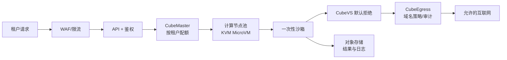
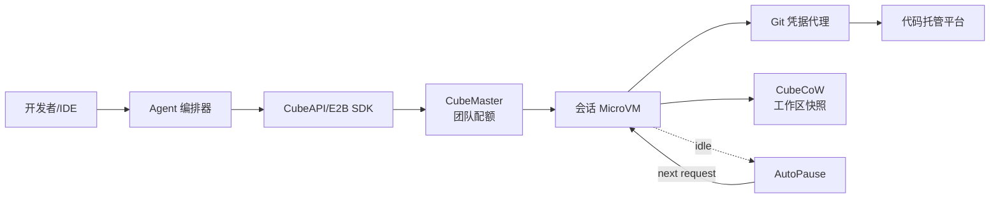
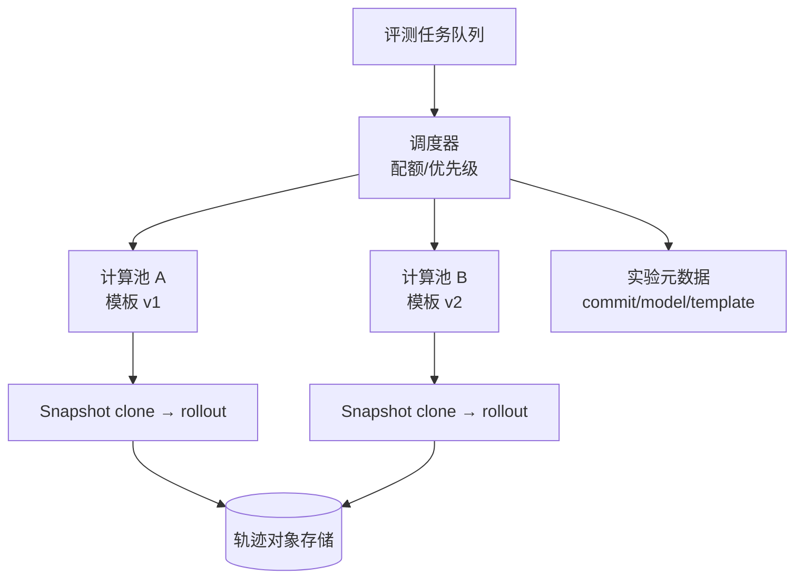

# 第二十二章　企业落地案例与场景矩阵（决策篇上）

<!-- chapter-nav -->

[← 上一章](第二十一章-生产化-Terraform集群部署-ARM64与运维清单.md) · [章节目录](../../README.md) · [下一章 →](第二十三章-横评与选型-CubeSandbox-E2B-Kata-gVisor与自建.md)
<!-- /chapter-nav -->


> **基线与口径**：本文以 CubeSandbox v0.7.2（commit `f1aaa737fb3862202b1731e0e0d844c28779f930`，核对日期 2026-09-26）为主案例。以下容量和费用均为**假设算例**，不是 CubeSandbox 的实测承诺；正式上线必须用本企业负载压测和云厂商报价替换。

## 引子：同一家公司为什么要四套沙箱策略

一家拥有电商、数据、研发和模型团队的公司，可能同时提出四个需求：电商团队要让外部用户执行代码；数据团队要读取内部数据并调用模型；研发团队要让 Coding Agent 修改仓库；模型团队要每天跑几十万条评测 rollout。四个需求都说“要一个沙箱”，但风险边界、状态时长、流量形态和失败代价完全不同。

如果把四个请求都交给同一个默认模板，结果通常是：SaaS 用户之间隔离过强或过弱，数据凭据进入 guest，研发会话因 AutoPause 失去状态，评测吞吐被入口层和模板分发卡住。选型应先回答四件事：**谁写代码、数据属于谁、一次任务多久、失败是否允许重试**。

## 一、统一算账尺子

本文四个场景都使用同一组符号：

- `Q_peak`：峰值同时活跃任务数；
- `t_run`：单任务平均占用沙箱的时间；
- `r_create`：每秒创建请求数；
- `m_vm`：单沙箱 guest 内存；`m_overhead`：VMM、网络、缓存等宿主额外开销；
- `C_node`：可用于沙箱的节点 CPU/内存容量；
- `u`：目标安全利用率，算例取 0.65，给系统线程、突发和碎片留余量。

并发容量先用保守公式估算：

```text
并发上限 ≈ floor(C_node × u / (m_vm + m_overhead))
节点数 ≈ ceil(Q_peak / 并发上限)
创建吞吐还要同时满足 r_create ≤ 每节点实际 restore/IO 能力 × 节点数
```

这不是调度器的真实算法。CubeMaster 还会考虑节点报告、配额、模板是否在本地、调度评分和网络端口；公式的作用是暴露数量级和瓶颈。

## 二、场景一：多租户代码执行 SaaS

### 2.1 业务触发与边界

用户上传一段 Python、JavaScript 或 shell，系统执行后返回 stdout、文件和图表。代码可能来自陌生用户，也可能被提示词注入改写。租户之间不能读文件、探测内网或复用凭据；任务完成后多数沙箱可销毁，少数需要短时间复连。

### 2.2 架构图



入口要把租户身份、沙箱 ID、模板版本和请求 ID贯穿到日志。CubeAPI 的 E2B 兼容接口减少 SDK 改造，但兼容协议只解决调用形状，不自动解决租户配额、计费和授权。

### 2.3 容量算例（假设）

假设峰值每分钟 12,000 个任务，每个任务平均运行 30 秒，得到平均并发 `12,000 × 30 / 60 = 6,000`。若峰值倍数为 1.5，`Q_peak = 9,000`。每个 guest 请求 256MiB，估计宿主额外开销 64MiB，单节点可用于沙箱的内存 240GiB，安全利用率 0.65：

```text
每节点并发 ≈ floor(240GiB × 0.65 / 320MiB) ≈ 499
节点数 ≈ ceil(9,000 / 499) = 19
```

这 19 台只是内存下限。若每个任务平均产生 0.8 次创建/秒的突发并且节点 restore 峰值按假设为 25 次/秒，则 `9,000/30 = 300` 次/秒的平均完成率可能需要至少 12 个节点承担创建恢复，再加故障和滚动升级余量，最终可能是 24～30 台。这个差异说明 SaaS 的瓶颈常常是创建吞吐和出口，而不是静态内存密度。

### 2.4 风险与成本结构

风险清单：

- 任务代码任意联网，必须通过 CubeVS 和 CubeEgress，默认拒绝云元数据、内网和管理端口。
- 同一租户恶意占满配额，调度需同时有租户级 CPU、内存、创建速率和存储配额。
- 结果文件可能含个人信息，日志与对象存储按租户隔离并设 TTL。
- “每次调用即焚”会增加创建洪峰；会话复用降低启动次数，却扩大状态和数据残留面。
- 公网 CubeProxy 的动态端口和域名必须有短期 token，不能把内部服务直接暴露。

成本拆成四项：计算节点按峰值保底；控制面和 Redis/MySQL 按请求量；对象存储按结果和审计留存；出口流量和代理 CPU 按网络调用量。一个假设月账单可写成：

```text
月成本 = 节点数 × 节点月价
      + (API请求量/1e6) × 网关单价
      + 结果GB × 对象存储单价
      + 出口GB × 流量单价
      + 审计GB × 留存与检索单价
```

不要用“单实例 5MB”直接乘任务数估算总价；SaaS 的模板本地缓存、出口代理、日志和峰值冗余会成为更大的项。

## 三、场景二：企业内部数据分析 Agent

### 3.1 业务触发与边界

Agent 读取销售、财务或实验数据，生成 SQL、Python 和图表，可能持续数分钟并跨多轮对话。数据合规和凭据控制优先于极限启动速度。模型上下文不应看到数据库长期密钥；guest 即使被提示词注入，也只能访问获批的数据接口。

### 3.2 架构图

```mermaid
flowchart TB
  A[对话 Agent] --> G[数据访问网关\n列/行级授权]
  G --> API[CubeAPI\n租户+会话身份]
  API --> M[CubeMaster]
  M --> VM[会话沙箱\n可 AutoPause]
  VM --> E[CubeEgress\n凭据注入]
  E --> D[(数据服务/查询代理)]
  VM --> O[(结果对象存储)]
  Audit[审计/血缘] <-- E
  Audit <-- G
```

凭据注入只能隐藏密钥，不能替代数据授权。数据网关应把“这个会话能读哪些表、哪些列、哪些时间范围”作为策略输入；Egress 负责把批准后的短期凭据放入出站请求，并将访问记录写入每主机 JSONL 审计。

### 3.3 容量算例（假设）

假设工作日峰值 600 个活跃分析会话，平均每个占用 8 分钟，峰值并发按 1.4 倍取 `Q_peak = 840`。每个 guest 512MiB，宿主额外 128MiB；每个节点可用 128GiB，安全利用率 0.60：

```text
每节点并发 ≈ floor(128GiB × 0.60 / 640MiB) ≈ 122
节点数 ≈ ceil(840 / 122) = 7
```

若每会话平均读 2GB 数据，600 个会话并不等于 1.2TB 的本地缓存需求，因为应通过查询网关和对象存储分层；假设 20% 数据落本地缓存、缓存命中率 60%，本地写入量约 `600 × 2GB × 20% × 40% = 96GB`/峰值窗口。这个数字应与 XFS、快照和审计盘容量一起设计。

### 3.4 风险与成本结构

风险集中在“状态和数据”：

- 模板快照不得包含真实数据、长期 token 或用户结果；预热进程恢复后要重建失效连接。
- AutoPause 保留内存状态，租户销毁和合规删除必须显式清理快照、rootfs CoW 分支和对象存储。
- 审计要记录数据查询意图、实际出站域名、凭据策略版本和结果导出者；只记录 shell 命令不足以证明合规。
- 网络策略应把数据网关视为允许的唯一出口，禁止 guest 直接访问数据库网段。

成本包括节点、数据查询服务、对象存储、审计检索和代理开销。假设每个会话每小时 6 次查询、每次 50MB 返回，840 并发持续一小时会产生约 252GB 返回数据；真正费用取决于查询下推、缓存和压缩，不能用沙箱内存大小代替数据传输成本。

## 四、场景三：团队 Coding 平台

### 4.1 业务触发与边界

Coding Agent 需要读取仓库、安装依赖、运行测试、反复修改文件。一次会话可能持续 20～60 分钟；用户期待“回来后环境还在”。这里最重要的不是每次创建的极限，而是会话状态、仓库凭据、并发高峰和可恢复性。

### 4.2 架构图



仓库 token 用短期凭据或出口注入。工作区快照和 Git commit 是两种不同的恢复点：前者恢复机器状态，后者恢复可审阅的代码状态，不能混为备份。

### 4.3 容量算例（假设）

假设 400 名开发者，上午高峰 35% 同时使用，峰值会话 `Q_peak = 140`；每会话 2GiB guest + 256MiB 宿主开销；每节点可用 256GiB，安全利用率 0.60：

```text
每节点并发 ≈ floor(256GiB × 0.60 / 2.25GiB) ≈ 68
节点数 ≈ ceil(140 / 68) = 3
```

考虑依赖安装带来的 CPU/磁盘突发、一个节点维护和 30% 增长，生产起步应取 5～6 个节点，而不是只买 3 台。假设每会话每天产生 3 个 300MB 的快照，140 个峰值会话每天写 `126GB` 逻辑快照；CubeCoW 的 reflink 可减少物理复制，但脏页和工作区变化仍需按最坏情况留盘。

### 4.4 风险与成本结构

- 依赖安装可能执行任意构建脚本；即使是内部开发，也要按不可信代码处理网络和宿主隔离。
- 会话复用时间越长，状态残留越多；用租户、仓库和会话绑定清理策略。
- 预热模板可以缩短启动，但模板中的进程、网络连接和临时凭据在恢复后可能失效。
- 远端 Git、包仓库、镜像仓库分别设出口规则；不能给整个互联网白名单。

成本主要由常驻会话内存、工作区快照、节点本地 SSD 和出口流量决定。AutoPause 的收益取决于闲置比例：若 140 个会话平均只有 35% 时间执行，理论上可释放约 `140 × 65% × 2.25GiB ≈ 205GiB`，但恢复延迟、磁盘读放大和用户体验要一并压测。

## 五、场景四：批量评测平台

### 5.1 业务触发与边界

评测平台从同一基线模板派生数千甚至数万 rollout，每个 rollout 执行固定测试并上传轨迹。它更像批处理系统：吞吐、复现性和失败重试优先，交互延迟次之。沙箱应尽量无状态、可重试，评测输入、模型版本、模板 digest 和网络策略必须写入实验清单。

### 5.2 架构图



批量评测不要把每个 rollout 都写成“用户会话”。通过快照克隆复用只读基线，把差异写入独立 CoW 分支；失败的 rollout 保留最小诊断快照和日志，成功的只保留轨迹，降低存储。

### 5.3 容量算例（假设）

假设一次实验 10,000 个 rollout，每个平均运行 90 秒，目标 20 分钟完成。所需平均完成率是 `10,000 / 1,200 ≈ 8.3 个/秒`。若单节点实测安全吞吐按假设为 20 个并发 rollout、每个 1GiB guest，安全利用率 0.65、节点可用 128GiB：

```text
内存并发 ≈ floor(128GiB × 0.65 / 1GiB) = 83
时间并发需求 = 8.3 × 90 ≈ 750
节点数（按内存）= ceil(750 / 83) = 10
```

但若单节点创建/恢复吞吐只有 12 次/秒，10 节点只能提供 120 次/秒，瓶颈会转到队列和模板 I/O；若模板未在本地，网络分发更慢。算例因此应预留两类容量：运行容量和创建容量。实验允许超时重试时，还需增加 10%～20% 的重试池；该比例只是规划假设，必须以历史失败率替换。

### 5.4 风险与成本结构

- 模板、评测代码、模型版本和依赖 lockfile 必须不可变，否则结果不可复现。
- 出口策略不能因批量吞吐而关闭；对外部 API 设置全局令牌桶，避免评测放大供应商费用。
- 评测数据可能含私有代码，轨迹存储按实验和租户隔离，设置自动过期。
- 节点故障要能重试 rollout；不要把单个节点上的运行状态当作唯一真相。

成本中计算占主导，随后是对象存储和外部 API 调用。假设一次实验每个 rollout 产出 2MB 轨迹，10,000 个 rollout 即 20GB；保留 30 次实验就是 600GB 原始轨迹，压缩和分层存储会比继续压缩 guest 内存更有效。

## 六、场景矩阵：按约束收敛方案

| 维度 | 多租户 SaaS | 内部数据分析 | Coding 平台 | 批量评测 |
|---|---|---|---|---|
| 代码来源 | 陌生用户/模型 | 模型生成 | Agent 修改仓库 | 固定实验代码 |
| 状态 | 短、可销毁 | 会话级 | 长会话、需恢复 | 可重建、可重试 |
| 首要 SLO | 启动与峰值吞吐 | 数据访问正确 | 复连与交互 | 完成时间与复现 |
| 主要隔离 | 租户、网络、凭据 | 数据网关、凭据 | 仓库与会话 | 实验与模板 |
| 主要成本 | 节点+出口+日志 | 查询+审计+存储 | 常驻内存+快照 | 计算+轨迹 |
| 适合策略 | MicroVM + 配额 | MicroVM + 网关 | MicroVM + AutoPause | 快照克隆 + 队列 |

矩阵不是产品排名。四种场景都可以使用 Docker、Kata、E2B 或自建 Firecracker，但前提不同：如果代码基本可信、已有成熟 K8s，Kata 或容器可能更经济；如果团队没有运行 KVM、网络和模板系统的能力，托管 E2B 可能比私有化更快；如果批量评测能容忍较长排队，普通 VM 也可能足够。


## 七、企业视角：用一张场景卡阻止“一套默认配置”

落地评审可以要求每个团队提交一张场景卡：代码来源、数据等级、会话时长、峰值并发、网络目的地、失败是否可重试、审计保存多久、月度预算上限。平台根据场景卡选择模板、节点池、出口策略和生命周期，而不是让四个团队共享一套“默认沙箱”。场景卡每季度复核一次，尤其在模型、数据源或外部 API 改变时重新压测。
## 本章小结

架构图只是起点，容量算式和失败代价才决定选型。SaaS 先算峰值和出口，数据 Agent 先算数据授权与审计，Coding 平台先算状态和闲置，评测平台先算创建吞吐与复现。所有数字都要标明假设、测量条件和安全余量。

## 决策要点

1. 先写场景卡：代码来源、数据等级、状态时长、峰值、失败是否可重试。
2. 再写容量卡：内存并发、CPU/IO、创建吞吐、模板分发、日志和对象存储。
3. 最后写成本卡：节点、控制面、出口、审计、存储、人工运维和供应商费用。
4. 用一条真实流量回放验证最小可行架构，再决定是否混合不同沙箱路线。

## 下章预告

下一章把 CubeSandbox、E2B、Kata、gVisor 与自建路线放入统一比较口径，明确哪些数字可以比较，哪些只能写“未实测”。

> **近就来源**：CubeSandbox v0.7.2 `docs/architecture/overview.md`、`docs/guide/tencentcloud-terraform-deploy.md`、`docs/guide/multi-node-deploy.md`、`docs/guide/usecases/trpc-agent-go.md`、`docs/guide/usecases/unisound-rl-rollout.md`；所有容量与费用为本文假设算例。


