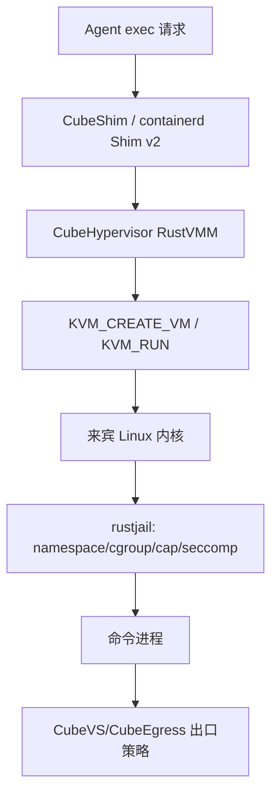

# 第二十五章　源码深潜：从 KVM_CREATE_VM 到 seccomp-BPF，CubeSandbox 的隔离链条

<!-- chapter-nav -->

[← 上一章](第二十四章-边界与未来-MicroVM与WASM融合-沙箱会成为Agent操作系统吗.md) · [章节目录](../../README.md) · [下一章 →](第二十六章-源码深潜-资源管控篇-Host-cgroup与KVM-memslot.md)
<!-- /chapter-nav -->

> **版本与边界**：本章按 CubeSandbox v0.7.2、commit `f1aaa737fb3862202b1731e0e0d844c28779f930` 编写。源码路径和结论以该版本为准；仓库后续改动可能改变函数名、默认值或调用顺序。源码事实、架构推断和运营建议分开叙述。

## 引子：隔离不是一行 `run` 命令

当用户说“给 Agent 一个安全沙箱”时，真正发生的事情至少跨越四层：宿主机的 KVM 硬件隔离，CubeHypervisor 的虚拟设备模型，CubeSandbox 自己的 VMM 与进程约束，以及来宾机内部 rustjail 对命令进程施加的 namespace、能力和 seccomp 限制。任何一层都不能单独代表“安全”。

可以把一次执行想成一条向下收敛的链：

上层决定“谁能执行什么”，底层决定“执行错误时能不能越过边界”。本章不把这些控制混为一谈。

## 一、KVM 的边界：VCPU 不是宿主线程的别名

### 1. 从用户态 VMM 到硬件虚拟化

CubeHypervisor 通过 KVM API 创建 VM、分配内存区域并启动 VCPU。`KVM_CREATE_VM` 得到的是一个内核对象，VMM 再通过 `KVM_CREATE_VCPU` 建立 VCPU fd，最后以 `KVM_RUN` 进入客户机执行。客户机运行在非 root mode；遇到需要 VMM 处理的事件时，KVM 返回用户态，VMM 根据 exit reason 处理设备访问、中断、I/O 或异常，再重新进入 `KVM_RUN`。

这里有一个常见误解：客户机每执行一条指令都会退出到 VMM。现代 x86 的 EPT、AMD NPT 和硬件中断虚拟化让普通内存访问与大部分用户态指令直接在硬件上运行；频繁退出通常来自虚拟设备、缺页、I/O、特权状态变化或异常。性能讨论必须先问“哪一种 exit 在增加”，而不是把所有 VM 开销归成一个百分比。

### 2. 内存区域与设备模型

VMM 要把来宾看到的物理地址映射到宿主进程的内存区域，并将 virtio block、网络、串口、vsock 等设备暴露给来宾。`hypervisor/vmm/src/vm.rs` 负责 VM 生命周期和启动路径，`memory_manager.rs` 负责 guest memory、映射和快照相关能力，设备模型则决定 I/O 是否落入 VMM 热路径。

PVH 启动路径的价值是缩短传统固件初始化，让内核能够更直接地从预先准备的入口启动。它没有消除内核启动、设备初始化和用户态 agent 恢复成本，只是减少一段不必要的固件工作；因此“PVH 等于 0 毫秒启动”是错误的。

### 3. 精简设备模型不是“没有设备”

Cloud Hypervisor 衍生的设备目录仍保留少量 legacy 路径，例如 i8042（关机/重启信号）、RTC/CMOS、固件调试设备 FwDebug 和 DebugPort；串口、ACPI、virtio-blk、virtio-console、virtio-net、virtio-vsock 等则按启动和通信需要选择。源码文档将这些设备标成 build configurable、默认启用或运行时可配置，不能笼统地说“MicroVM 没有 legacy 设备”。准确的说法是：它避免了 QEMU PC 机型的大量兼容设备，把仍需支持的设备做成小实现并通过 VMM 线程与 seccomp 约束。

设备越少，VMM 的 I/O exit、代码路径和可达 syscall 面越少；但 virtio-net、block、vsock 仍是高价值攻击面，需要各自的 fuzz、版本更新和异常输入测试。PVH 直接启动减少固件路径，但 ACPI/RTC 等设备仍可能参与 guest 的关机、时钟和早期启动语义。
## 二、CubeShim：把 containerd 语义送进 VM

### 1. Shim v2 解决什么

`CubeShim/shim/src/service` 使用 containerd Shim v2 的服务语义承接 `Create`、`Start`、`Exec`、`Kill`、`Delete` 等操作，再通过 ttrpc/vsock 把请求交给来宾机中的 cube-agent。Shim 负责宿主侧进程生命周期和事件回报，cube-agent 负责来宾侧进程执行。两者之间不是普通的宿主 Unix socket，因此应用看到的是熟悉的 containerd 生命周期，真正的命令却运行在 VM 内。

这种设计的好处是把上层编排器和隔离底座解耦：Kubernetes、containerd 或兼容 E2B 的 API 不需要直接理解 KVM；反过来，底座可以替换 VM 启动、快照恢复和出口策略，而不重写每个客户端。

### 2. 生命周期中的失败点

一个 `Exec` 请求至少可能在以下位置失败：Shim 找不到 sandbox、vsock 通道未建立、cube-agent 拒绝命令、guest 进程被 seccomp 拦截、出口策略拒绝网络、或者 VMM 在恢复快照时仍未进入可执行状态。错误码如果只返回“执行失败”，上层无法决定重试、回滚还是销毁，因此企业 API 应把启动中、已暂停、恢复失败、策略拒绝和命令退出区分开。

## 三、两套 seccomp：宿主 VMM 与来宾命令各自收紧

### 1. VMM 进程的线程分层

`hypervisor/vmm/src/seccomp_filters.rs` 定义了 KVM ioctl 常量和线程过滤规则，并将线程区分为 `Api`、`SignalHandler`、`Vcpu`、`Vmm`、`PtyForeground` 等类别。VCPU 线程需要 `KVM_RUN`，VMM 线程需要设备和内存管理相关调用，API 线程则承担控制接口。把所有线程套同一份宽权限过滤器会扩大攻击面，把所有线程套同一份最小过滤器又会误杀正常启动。

VMM 初始化路径在 `hypervisor/vmm/src/lib.rs` 安装对应过滤器，VCPU 线程的规则重点允许 `KVM_RUN`。这是一种“按职责给系统调用”的最小权限方法，但它只约束系统调用接口，并不替代 KVM 内核、Rust 内存安全、设备模型审计或来宾边界。

### 2. 来宾内的 rustjail

命令进程进入来宾机后，还会经过 rustjail 的进程约束。`agent/rustjail/src/container.rs` 依次处理 no_new_privs、guest seccomp、能力丢弃等设置，`seccomp.rs` 使用 libseccomp 建立系统调用过滤。这里的目标与宿主 VMM 不同：宿主过滤器保护 VMM 进程，来宾过滤器约束用户提交的命令和工具。

顺序很重要。若先保留高权限再执行可能触发能力检查的动作，后续丢弃能力可能过晚；若没有 no_new_privs，某些可执行文件可能通过 setuid 或文件能力恢复权限。实际策略应把“禁用提权、丢弃能力、建立 namespace、加载 seccomp、执行命令”作为可审计的固定步骤。

### 3. 安装时序与“先 All、后细化”

当前 VMM 启动路径先为 `Thread::All` 编译并安装一份能覆盖初始化阶段的过滤器，再为 VMM 线程取得更窄的 `Thread::Vmm` 过滤器；VCPU、API、信号与 PTY 线程在各自创建点使用对应规则。这个时序避免线程刚启动时因缺少初始化 syscall 而失败，但也意味着审查者必须同时检查“全局起步规则”和“线程最终规则”。

seccomp 过滤器不是只按 syscall 名称匹配。KVM ioctl 的 request number（例如 `KVM_CREATE_VM`、`KVM_SET_USER_MEMORY_REGION`、`KVM_RUN`、`KVM_GET_DIRTY_LOG`）作为参数被二次比较；只允许 `ioctl` 而不约束 request，会把保护面扩大到所有设备。VMM 的白名单还刻意不提供普通网络监听所需的 `accept`、`bind`、`listen` 组合；控制面与出口流量由已有的 socket/代理路径承担。规则数量会随版本和编译特性变化，不能把某一次构建的“约 38 个 syscall”当成永远不变的接口。
## 四、威胁模型：每层负责什么

| 层 | 主要保护对象 | 主要控制 | 失效时的后果 | 不能单独解决的问题 |
|---|---|---|---|---|
| KVM/EPT/NPT | 宿主内核与其他 VM | 硬件二级地址转换、VM exit | 来宾可能影响更大边界 | 不判断命令是否应该访问网络 |
| CubeHypervisor | VMM 与 guest 设备 | 设备模型、内存映射、快照 | 设备漏洞扩大宿主风险 | 不负责业务数据脱敏 |
| VMM seccomp | 宿主 VMM 进程 | 按线程限制 syscall/ioctl | VMM 被利用后的动作受限 | 不隔离来宾命令 |
| rustjail | 来宾用户态进程 | namespace、cap、seccomp | 命令权限降低 | 不保证宿主网络出口合规 |
| CubeVS/CubeEgress | 网络与凭据 | L3/L4/L7 policy、注入、审计 | 数据可能外传 | 不修复内核或 VM 漏洞 |

企业评审时应要求每条控制都有“验证信号”：例如 VMM 启动日志记录过滤器安装结果，来宾执行记录最终 UID、capabilities 和策略命中，网络审计记录域名与会话，而不是只在架构图上写一个“安全模块”。

来宾侧不只是一张 seccomp 表。rustjail 还会组合七类 namespace 视图（mount、UTS、IPC、PID、network、user、cgroup，具体启用项随配置变化）、no_new_privs、capability drop、rlimit 和设备/文件系统视图。namespace 让“看到什么”与“能调用什么”分开收敛：seccomp 拒绝 `mount` 并不等于进程看不到宿主路径，反之只设置新的 mount namespace 也不等于禁止危险 syscall。
## 五、一个源码审查清单

1. **VM 创建**：确认 KVM fd、guest memory、VCPU 和设备初始化失败会回收资源，不留下半启动 sandbox。
2. **线程过滤**：确认新增 VMM 线程会显式选择过滤器；不要因为线程名称变化而落入默认宽策略。
3. **来宾执行**：确认 no_new_privs、能力丢弃和 seccomp 顺序稳定；为需要额外 syscall 的工具建立 capability profile，而不是全局放宽。
4. **控制面**：确认 Shim 的幂等键和状态回报能区分 `creating`、`running`、`paused`、`restoring`、`failed`。
5. **出口**：确认允许域名、凭据和审计绑定到租户与 sandbox，而不是只绑定节点。
6. **快照**：确认内存快照中的 token、环境变量和终端历史有清理或加密策略。

## 六、与 gVisor、Kata、E2B 的边界差异

gVisor 以用户态内核减少直接使用宿主内核的系统调用面，兼容性和 syscall 代价取决于工作负载；Kata 也通过轻量 VM 提供容器语义，但具体设备、快照和编排集成要看运行时版本。E2B 更像面向 Agent 的产品接口与托管体验，其 SDK 不规定底层一定用哪种隔离技术。CubeSandbox 的特色在于把 Shim、RustVMM、eBPF、快照和 E2B 兼容接口组合成一套可私有部署的运行时。

因此选型问题不是“哪个名字最安全”，而是：需要的 Linux 兼容性、启动时间、快照语义、网络出口和运维团队分别由哪一层负责。对于高风险不可信代码，企业仍需保留独立节点、最小网络出口、补丁节奏和逃逸演练。

## 小结

CubeSandbox 的隔离链条不是一个模块，而是 KVM 硬件、RustVMM、Shim、来宾内核、rustjail、CubeVS/CubeEgress 共同组成的系统。源码深潜的价值在于把“安全”拆成可定位的控制点：哪个线程能调用哪个 ioctl，哪个进程先丢弃能力，哪个网络请求被哪张策略表拒绝。下一章将把同样的方法用于资源：CPU、内存、I/O 和端口额度如何从 API 变成内核实际执行的上限。

### 本章练习

1. 画出一次 `Exec` 从 API 到来宾进程的时序图，标出每个可能返回错误的边界。
2. 为编译器、浏览器和数据处理工具分别设计一份 guest syscall/capability profile。
3. 说明为什么“VMM 安装了 seccomp”仍不能推出“用户代码不能访问网络”。
4. 在一次故障演练中，如何证明策略拒绝来自 CubeEgress，而不是 DNS、TCP 或命令自身报错？

### 参考源码

- `CubeShim/shim/src/service/`（重点 `service.rs`/`update_ext.rs`，约 1–320 行）：containerd Shim v2 服务入口。
- `hypervisor/vmm/src/seccomp_filters.rs:21,126-158,211-270,905-945`：KVM ioctl 与线程过滤规则。
- `hypervisor/vmm/src/lib.rs:340-390`：VMM seccomp 安装路径。
- `agent/rustjail/src/container.rs:395-460,608-731`、`agent/rustjail/src/seccomp.rs:69-110`：来宾命令约束。
- `hypervisor/vmm/src/vm.rs:1000-1060`、`hypervisor/vmm/src/memory_manager.rs:1340-1556`：VM、内存与启动路径。

