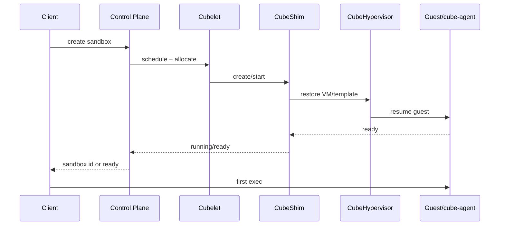

# 第二十八章　源码深潜：性能开销篇，60 毫秒与 5 MB 应该怎样被拆解

<!-- chapter-nav -->

[← 上一章](第二十七章-源码深潜-系统调用拦截篇-两套seccomp如何协作.md) · [章节目录](../../README.md) · [下一章 →](第二十九章-源码深潜-快照与状态机篇-CubeShim生命周期.md)
<!-- /chapter-nav -->


> **读者先记住**：CubeSandbox README 中的“约 60ms 创建”和“约 5MB 额外内存”是项目公开的体验目标/宣传指标，不能直接当成任意节点、任意模板、任意并发下的保证。本章用源码和测量方法解释这些数字可能由什么组成，不把推断写成实测。

## 引子：一个数字不能代表一次请求

“创建一个沙箱用了多少毫秒”至少有四种口径：控制面收到请求到返回 ID，返回 ID 到 API 可执行，模板恢复完成到首次命令，还是首次命令输出到客户端。冷启动、快照恢复、跨节点恢复、镜像拉取和高并发排队也不能混成同一条 P99。

同样，“每个沙箱增加 5MB”也有不同口径：进程 RSS 增量、宿主 cgroup memory.current、独占页增量、快照对象大小，或者在共享模板后的 steady-state 平均值。若不先写清公式，两个团队可以同时说自己测到了 5MB，却在测完全不同的东西。

## 一、60ms：从请求到可执行的时间线



一个很短的 happy path 可能包含：节点已热、模板和内核在本地、快照索引命中、FICLONE 只做元数据操作、VMM 和 guest agent 已优化、没有排队和网络重试。任何一个条件改变，数字就会变化。

### 1. 冷启动与恢复启动

冷启动通常包括 rootfs 准备、VM 创建、内存映射、设备初始化、内核/PVH 引导、guest agent 启动和服务就绪。恢复启动则可能从已准备的内存快照和根文件系统 clone 开始，省掉大量引导步骤，但仍有 restore、页缺失、网络策略、凭据和 agent 握手成本。

CubeShim 的 `Create/Start` 与 hypervisor snapshot/restore 调用之间有明确边界。性能仪表应分别记录：排队、rootfs/CoW、VMM、guest ready、API ready、首次 exec。只看总时长不能知道优化应该落在哪里。

### 2. FICLONE 的真实含义

CubeCoW 使用 XFS reflink/FICLONE 让多个根文件系统共享物理 extent。创建 clone 的主要工作是元数据操作，因此在本地文件系统和小元数据树上很快；后续写入会触发 copy-on-write，文件热点、碎片、snapshot 链长度和后台 flatten 会影响尾延迟。把“FICLONE 是 O(1)”理解为“所有读写成本都不变”会造成容量和性能误判。

## 二、5MB：内存增量的账本

一个可审计的公式可以写成：

```text
增量 = VMM 私有结构
      + guest/agent 首次写入的独占页
      + 设备与队列缓冲
      + 页表与内核记账
      + 日志/代理连接缓存
      + 并发恢复期间的临时页
```

模板内共享的只读页、文件 page cache 和 snapshot backing 不一定按实例完全计入；cgroup 统计、RSS、PSS、USS 和 KSM/共享页的结果也不同。想验证“5MB”，至少要固定：节点内核、文件系统、模板 hash、guest RAM、VCPU、日志级别、并发度、测量时间点和统计口径。

### 1. 为什么首个实例和后续实例不同

第一个实例可能承担模板 page cache、内核和 VMM 初始化成本，后续实例复用热 cache；但多个实例并发恢复又会产生额外的页表、队列和工作集。稳态平均值不能代替冷启动首样本，P99 也不能由平均增量推导。

### 2. 快照内存不是免费共享

内存快照的 backing 可以在对象存储或本地文件中共享，恢复时页面可能按需加载。页面首次触碰产生的延迟和驻留增长应该单独观测。跨节点恢复还要计入传输、校验、解密、映射和策略重建，不能直接套用本地 clone 的数字。


### 3. 5MB 账本的源码对应

要把“约 5MB”拆到代码级，至少要把三个共享/按需机制分开：

1. **共享内核与页表**：模板恢复让只读页可以共享；匿名内存按首次写入产生独占页，THP/KSM 提示（`MADV_HUGEPAGE`、`MADV_MERGEABLE`）会改变页粒度与合并概率。
2. **文件系统 CoW**：`FICLONE`/XFS reflink 让 rootfs clone 共享 extent；它增加的是元数据和后续写时复制，而不是创建时把整盘复制一遍。
3. **内存 backing**：memfd、稀疏文件和 `MAP_SHARED` 映射让快照恢复可以直指共享 backing；页面是否驻留要由 first-touch 和内核回收决定。

这三项能解释“增量很小”的工程方向，却不能证明任何 workload 固定增加 5MB。测量还需加上 VMM 私有结构、设备队列、VCPU 页表、guest agent、日志与 cgroup 记账。

### 4. 增量页追踪的三种证据

- **pagemap_anon**：通过 `/proc/self/pagemap` 的匿名页标志（实现中关注 bit 61）筛出 CoW 匿名页，适合区分共享文件页与已私有化页。
- **soft-dirty**：向 `/proc/self/clear_refs` 写入 `4` 后，以 pagemap bit 55 标出自上次清除以来被写过的页；它表达“这一个窗口里的 delta”，不是累计集合。
- **KVM dirty log**：用 `KVM_GET_DIRTY_LOG` 等 ioctl 获取 guest 写脏位，适合迁移/快照协作，但需要把 bitmap 与 VMM memory range 对齐。

对于“只保存本轮真正写过的匿名页”，实现可能取 `anonymous ∩ soft-dirty` 的交集；pagemap_anon 与 soft-dirty 的 fallback 语义不同，基线、clear 时刻和快照链必须写进 manifest。跨内核版本或 seccomp 规则变更时，应把检测失败视为能力降级，而不是静默丢页。
## 三、源码里能确认什么，不能确认什么

| 问题 | 源码可确认的事实 | 需要基准测试的部分 |
|---|---|---|
| 是否支持快照类型 | `SnapshotType::{Full, Incremental, SoftDirty}` 存在 | 每种类型的实际耗时和对象大小 |
| 是否有快速恢复检查 | `memory_manager.rs` 存在 `support_fast_restore_check`、映射路径 | 不同模板下的命中率与收益 |
| 是否使用 CoW clone | `cubecow` 有 FICLONE/reflink 路径 | 写热点、链长度、碎片与长期成本 |
| 是否按需触碰页面 | 映射/恢复代码提供机制 | first-touch 延迟和 steady-state RSS |
| README 的公开数字 | 文档给出约 60ms、约 5MB 的项目指标 | 当前版本、硬件、并发与 workload 是否复现 |

这张表是源码深潜的边界：看到了 `mmap`、`FICLONE` 或 `SoftDirty`，只能说明实现路径存在，不能自动推出一条通用的 P99 曲线。


### 4. eBPF datapath 的微观代价

网络路径的另一类“低延迟”来自策略在 eBPF datapath 中按包完成，而不是为每个 sandbox 生成一组 iptables 规则。每个包仍要做 map lookup、NAT/session 状态更新、可能的 LPM 命中和锁/并发控制；当策略条目、连接数和 SNAT 端口水位线逼近上限时，map contention、端口分配和代理转发会成为尾延迟来源。iptables 规则爆炸被消除，不代表网络成本为零。

### 5. 50 并发的 P99 诊断案例（示例，不是仓库 benchmark）

大纲中的“50 并发 P99 137ms”应当作为待复现实验，而不是当前源码的实测事实。若一次测试确实得到约 137ms，先按时间线拆分：模板克隆是否串行、VMM 启动是否抢同一把锁、调度队列是否排队、guest restore 是否发生集中缺页、网络策略/端口 map 是否出现 contention。只有把每一段的 P95/P99 采出来，才能判断是锁竞争、调度延迟还是模板 I/O；单一总 P99 不能证明某个模块是瓶颈。
## 四、建立可复现的基准

### 1. 固定变量

记录 commit、内核、CPU 型号、NUMA、文件系统、磁盘介质、镜像/template hash、guest RAM/VCPU、网络策略、快照类型、并发度和控制面版本。每次测试输出 manifest，避免“同名模板已被重建”造成不可比。

### 2. 分层计时

建议使用 monotonic clock，在以下点打时间戳：request accepted、scheduled、node allocated、shim create、VM created、memory restored、guest booted、agent ready、API ready、first exec submitted、first output。对每个点计算平均、P50、P95、P99，并保留失败与超时。

### 3. 分层内存

并行采集 cgroup `memory.current/events`、VMM RSS/PSS/USS、guest 内存统计、page fault、文件 cache、CoW 新增 extent、快照大小和节点 PSI。至少比较：一个冷实例、10 个串行、50 个并发、恢复后写入 100MB 工作区、恢复后执行浏览器/编译器。

## 五、优化优先级

1. **先消除排队和重复初始化**：预热模板、节点本地缓存、合理并发窗口。
2. **再优化状态路径**：FICLONE、快照索引、增量/SoftDirty 选择和后台 flatten。
3. **再优化 VMM/guest**：PVH、设备初始化、agent 握手与日志输出。
4. **最后优化微观 syscall**：只有在火焰图证明它是热路径时，才为一个 syscall 省纳秒。

性能优化要和安全策略绑定。为了降 10ms 而跳过策略重建、复用带敏感 token 的内存快照，通常会把尾部风险转化为安全事故；正确做法是测量策略重建的成本并把它放进预算。

## 六、与 E2B、Kubernetes Agent Sandbox 的测量对齐

E2B 的托管产品会把节点准备和容量运营隐藏起来，用户可以从 API 观察创建、exec、暂停和销毁的端到端延迟，但难以得到宿主层分解。Kubernetes Agent Sandbox 的部署路径会增加调度、Pod/CRD 状态同步和节点 runtime 的阶段，指标应把 K8s admission/scheduling 与底层 VM restore 分开。自建 CubeSandbox 则必须自己定义公开 SLO：是“创建成功”还是“首次 exec 可用”，是单租户冷启动还是多租户峰值。

## 小结

60ms 和 5MB 是需要被解释、复现、分层的工程指标。源码能告诉我们有哪些加速机制：Shim v2、PVH、FICLONE、内存快照、快速恢复和按需映射；基准测试才能告诉我们在特定硬件、模板和并发下的代价。下一章回到状态机，分析 CubeShim 如何把 create、pause、restore、snapshot、rollback 和 delete 组织成可恢复的语义。

### 本章练习

1. 设计一个“首次 exec 可用”的 P99 指标，写清起止点和排除项。
2. 为什么 FICLONE 创建很快，却不能推出写入工作区也没有额外成本？
3. 为“5MB 增量”写一份实验 manifest，至少包含十个变量。
4. 一个恢复请求总时长变长，如何用分层时间戳判断是排队、对象存储、缺页还是 guest agent？

### 参考源码与资料

- `README.md`：公开性能指标与版本说明。
- `CubeShim/shim/src/service/update_ext.rs:166-281`、`CubeShim/shim/src/hypervisor/cube_hypervisor.rs:138-153,301-319`：生命周期与快照调用。
- `hypervisor/vmm/src/memory_manager.rs:1340-1383,1518-1556,1855-1860`：映射、快速恢复检查。
- `cubecow/src/engine/reflink.rs:80-87,654-718,1079-1093`、`cubecow/README.md`：FICLONE/CoW。
- `hypervisor/vm-migration/src/lib.rs:110-180`：SnapshotType 定义。


