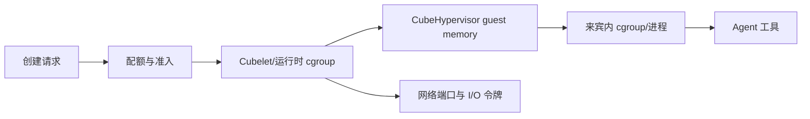

# 第二十六章　源码深潜：资源管控篇，Host cgroup 与 KVM memslot 不是一张账

<!-- chapter-nav -->

[← 上一章](第二十五章-源码深潜-隔离篇-从KVM_CREATE_VM到seccomp-BPF.md) · [章节目录](../../README.md) · [下一章 →](第二十七章-源码深潜-系统调用拦截篇-两套seccomp如何协作.md)
<!-- /chapter-nav -->


> **版本与边界**：本章基于 CubeSandbox v0.7.2、commit `f1aaa737fb3862202b1731e0e0d844c28779f930` 的公开代码与架构文档。示例数字是容量规划模型，不是该项目的基准测试结果。

## 引子：为什么“给 512 MB”仍可能超卖

沙箱资源常被压缩成一个配置项：CPU=1、内存=512 MiB、磁盘=1 GiB。真正运行时至少存在四本账：宿主进程和 Cubelet 的开销，cgroup v2 的 CPU/内存限制，KVM 为 guest 建立的内存映射，以及来宾内部进程看到的资源。它们的单位、统计口径和失效方式都不同。



容量规划必须回答两个问题：一个 sandbox 需要占用多少节点资源，多个 sandbox 同时活跃时哪个限额先触发。只看 guest 内存会漏掉 VMM、page table、文件缓存、日志和 cgroup accounting；只看宿主 RSS 又无法解释 guest 内为什么 OOM。

## 一、从 API 到 cgroup v2

### 1. Cubelet 是资源控制的落点

CubeSandbox 的 Cubelet 负责节点侧沙箱生命周期、端口和资源管理。`Cubelet/plugins/cube/internals/cgroup/handle/v2/manager.go` 提供 cgroup v2 管理入口，设计上会把 CPU、内存、I/O 等限制写入节点的 cgroup 层级，再由进程树继承。这样控制面给出的“每个 sandbox 配额”才能变成 Linux 内核可执行的约束。

cgroup v2 常见的三类指标含义不同：

- `cpu.max` 是配额/周期，限制可用 CPU 时间；它不是“虚拟机里只有一颗固定频率的 CPU”。
- `memory.max` 是 cgroup 可用内存上限，达到上限后可能触发回收或 OOM；它包括哪些 page，需要结合层级和统计方式核对。
- `io.max` 或设备级限制影响块设备请求速率/带宽，不能用来推断网络带宽。

### 2. CPU 配额与 VCPU 数量

VCPU 数量决定 guest 可见的并行度，cgroup CPU quota 决定宿主调度时最多消耗多少时间。给 2 个 VCPU 但只配 0.5 CPU 的 quota，通常意味着短时间可以并行抢占，长期平均只能使用半核；反过来给 1 个 VCPU 和 4 个 CPU 配额也不会自动产生 4 路并行。

批量评测时，`N × vCPU` 不是节点 CPU 需求的可靠公式。更合理的第一阶模型是：

```text
平均宿主 CPU ≈ 活跃 sandbox 数 × 任务平均 CPU 利用率
峰值宿主 CPU ≈ 同时 runnable 的 guest/vmm 线程数 × 调度余量
```

对于编译、浏览器和数据处理，峰值与平均值差距很大；应该按 runnable 比例和排队延迟做压测，而不是按“每个配置 1 核”静态相加。

## 二、guest memory、VMM RSS 与 memslot

### 1. 三个不能混用的数字

1. **guest 配置内存**：来宾内核认为可用的 RAM，例如 512 MiB。
2. **VMM 映射空间**：CubeHypervisor 为 guest memory 建立的 mmap、memslot 和页表。
3. **节点实际驻留**：真正触碰过的页、VMM 私有数据、设备缓冲、文件缓存和内核开销。

guest 配置为 512 MiB 不意味着创建瞬间就消耗 512 MiB 物理页，但也不意味着节点可以无限超卖。任务写满内存、页表增长、快照恢复或多个 VCPU 产生并发 fault 时，驻留会接近上限。

### 2. KVM memslot 的意义

KVM 需要把一段 guest physical address 映射到用户态地址，VMM 通过 memslot 告诉内核这段映射的起止、权限和 backing memory。memslot 是地址映射的管理单位，不是内存配额本身；它的数量和变化会影响热插拔、设备内存和快照实现，但不能拿来替代 cgroup memory.max。

快照恢复时还要考虑页是否已实际加载。CubeSandbox 的 memory manager 中存在快速恢复检查、MAP_SHARED 映射等路径，这说明“恢复完成”可能先代表映射与状态准备完毕，后续页面在访问时再发生缺页或从对象存储取回。监控应区分 restore control-plane latency 和 first-touch latency。

## 三、I/O、端口与临时文件也是资源

### 1. 文件系统层

CubeCoW 使用 XFS reflink/FICLONE 复制文件系统状态时，新增 clone 的元数据成本很低，但写时复制会在后续产生新 extent。若工作负载反复写大文件，磁盘空间和写放大仍会增加；“快照 O(1)”只描述创建操作的元数据路径，不代表长期存储成本为零。

临时目录、构建缓存、浏览器 profile、日志和 core dump 必须纳入每个租户的配额，否则一个任务可以通过写文件把节点磁盘打满，最终影响所有 sandbox。快照保留数量也应有 TTL、总大小与单租户上限。

### 2. 网络端口与连接数

CubeVS 维护端口映射、NAT、DNS 与会话状态。端口范围是离散资源：同一节点上 sandbox 数量增加后，可能先耗尽 host port、conntrack、策略 map 容量或代理连接池，而不是 CPU。企业配额应记录“端口分配数、并发连接数、策略条目数、每秒新连接数”，不能只记录带宽。

### 3. I/O 令牌

若采用 token bucket，令牌速率控制长期平均值，桶容量允许短突发。容量规划应同时给出 `rate` 和 `burst`；只有 rate 没有 burst 时，短时编译或下载容易产生排队。读写、日志和镜像拉取最好使用不同的优先级，防止诊断日志因为业务 I/O 被饿死。


### 4. 双令牌桶和端口空间

I/O 限速常把 bytes 与 operations 分成两个 token bucket：前者防止大块读写占满带宽，后者防止小 I/O 请求造成 IOPS/CPU 队列爆炸。网络还需要分别看 RX/TX；一个方向的限速不会自动限制另一个方向。端口也是一套离散账本：节点可以把内核临时端口（例如 10000–19999）、代理/暴露端口和 CubeVS SNAT 起始范围（源码默认 `MAX_PORT_START=30000`）分开，具体保留段以当前配置为准。端口范围、连接跟踪和策略 map 必须一起纳入准入。
## 四、一个可复算的节点账本

假设一台节点物理内存 64 GiB，系统与 kubelet 预留 8 GiB，Cubelet/VMM/日志等固定开销预留 6 GiB，安全余量 10%，则可用于 sandbox 的目标上限约为：

```text
可用目标 = (64 - 8 - 6) × (1 - 10%) = 45 GiB
```

若某类活跃 sandbox 的 guest 配置为 512 MiB，观测到每个实例的额外 VMM/设备/页表/日志驻留预算为 80 MiB，快照恢复阶段的并发加载余量按 20% 预留，则一实例容量模型可先写成：

```text
每实例预算 = 512 × 1.2 + 80 ≈ 694 MiB
并发上限 ≈ 45 GiB / 694 MiB ≈ 66 个
```

这只是准入上限，不是性能承诺。若任务同时编译、下载并写入工作区，CPU、磁盘或端口可能更早成为瓶颈。上线前应以压力测试中的 P95/P99、OOM、iowait、run queue 和恢复失败率修正模型。

## 五、资源失控时的诊断顺序

1. **先看租户和 sandbox 配额**：确认请求值、默认值、上限和继承关系。
2. **看 cgroup 事件**：`memory.events`、CPU throttling、I/O 延迟和层级路径。
3. **看 VMM 与 guest**：VMM RSS、guest balloon/内存统计、page fault、VCPU exit 与设备队列。
4. **看节点资源**：run queue、pressure stall information、磁盘空间、conntrack、端口 map。
5. **最后看应用**：命令是否内存泄漏、是否生成巨量缓存、是否重试风暴。

不要把“容器里 free 显示还有内存”当作没有内存压力，也不要把宿主 OOM 的一个进程堆栈直接归因给 guest。资源诊断必须沿账本逐层核对。

## 六、与 E2B、Kubernetes Agent Sandbox 的资源差异

E2B 托管平台通常把节点容量和弹性隐藏在产品后面，用户更关心 sandbox 的套餐、超时、磁盘和并发限制；私有部署需要自己建立上述四本账。Kubernetes Agent Sandbox 把对象、队列、节点和 RuntimeClass 纳入 K8s 生态，但真正的 cgroup、VM 内存与快照成本仍由底层运行时承担。CubeSandbox 的优势是可以直接观察并调节 Cubelet、VMM 和快照层，代价是平台团队要负责准入、监控和故障演练。

## 小结

资源管控的关键不是把配置项写满，而是把 API 的意图映射到内核的可执行约束，再把 guest、VMM、节点和租户指标放在同一张账本里。CPU quota、guest memory、memslot、FICLONE、端口 map 和日志磁盘各自解决不同问题。下一章会继续深挖两套 seccomp，解释为什么“限制系统调用”仍然需要能力、namespace、网络和补丁一起工作。

### 本章练习

1. 为 64 GiB 节点分别计算 256 MiB、512 MiB 和 1 GiB sandbox 的准入上限，并说明哪些假设需要实测。
2. 设计一个指标面板，同时展示 cgroup throttling、VMM RSS、guest page fault、端口使用和磁盘 CoW 增长。
3. 为什么增加 VCPU 数量不等于增加宿主 CPU 配额？
4. 一个 sandbox 被 OOM kill 时，如何判断是 guest 内 OOM、cgroup OOM 还是节点内核 OOM？

### 参考源码

- `Cubelet/plugins/cube/internals/cgroup/handle/v2/manager.go:281-376`：cgroup v2 管理。
- `hypervisor/vmm/src/memory_manager.rs:1340-1556,1855-1860`：guest memory、映射与快速恢复检查。
- `cubecow/README.md`、`cubecow/src/engine/reflink.rs:80-87,654-718,1079-1093`：FICLONE/CoW 路径。
- `docs/architecture/network.md`、`CubeNet/src/cubevs.h:30-45`：端口、NAT、DNS 与网络 map。


