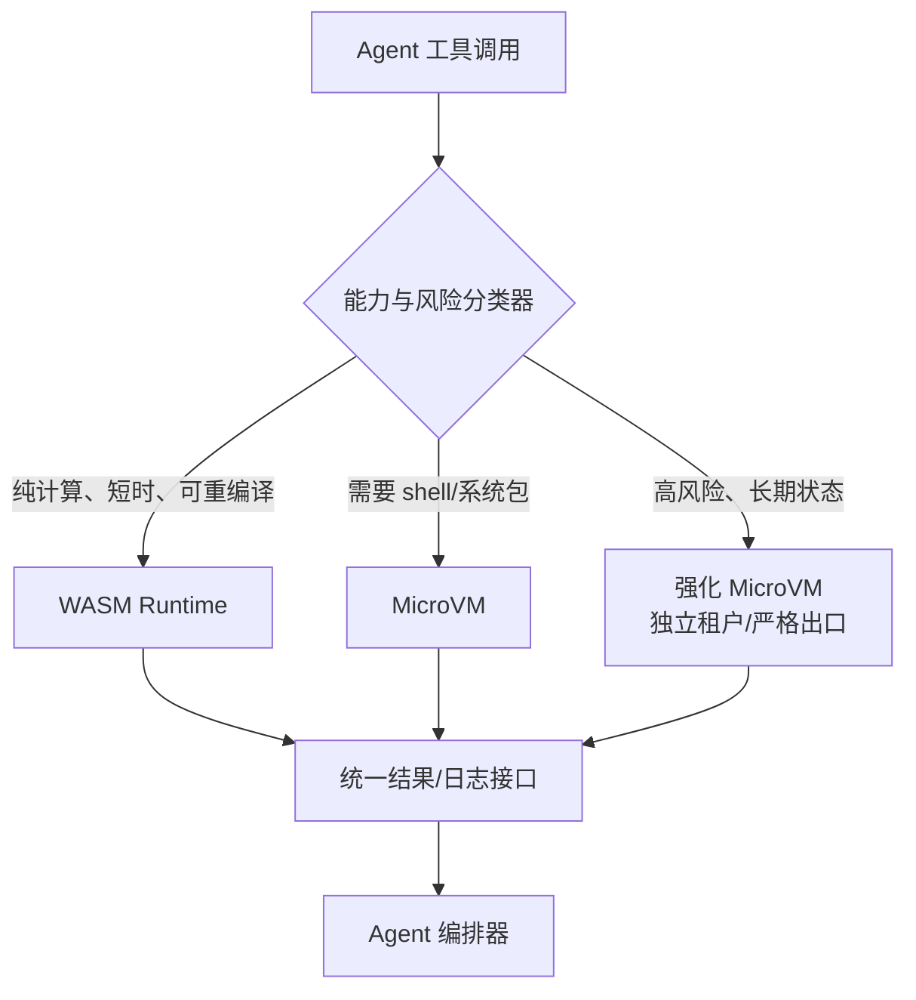
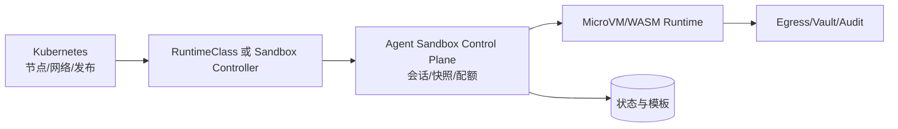

# 第二十四章　边界与未来：MicroVM 与 WASM 融合、沙箱会成为 Agent 操作系统吗

<!-- chapter-nav -->

[← 上一章](第二十三章-横评与选型-CubeSandbox-E2B-Kata-gVisor与自建.md) · [章节目录](../../README.md) · [下一章 →](第二十五章-源码深潜-隔离篇-从KVM_CREATE_VM到seccomp-BPF.md)
<!-- /chapter-nav -->


> **阅读提示**：本章把"已观察到的工程方向"和"基于方向的推测"分开。推测不是项目承诺，也不是 CubeSandbox、E2B、Kubernetes 或 WASM 社区的路线图。版本基线仍为 CubeSandbox v0.7.2、commit `f1aaa737fb3862202b1731e0e0d844c28779f930`，核对日期 2026-09-26。

## 引子：沙箱正在从边界变成运行时

第一章的问题是"模型生成的代码跑在哪里"。第二章回答了隔离光谱，第三章以后又把快照、凭据、内存、生命周期、协议和并发接起来。走到这里，沙箱已经不只是一个阻挡逃逸的盒子：它保存 Agent 的工作空间，提供工具出口，承载多步状态，决定任务能否复现，也决定一个平台能否在峰值时创建数千个环境。

因此，最后的问题不是"MicroVM 会不会取代容器"，而是：**Agent 的执行、记忆、工具、权限和升级，是否会围绕沙箱形成一层新的操作系统式运行时？** 答案目前还不能确定，但可以从已经出现的工程信号推演边界。

## 一、已发生的方向：分层而不是单一替代

### 1. WASM 负责轻任务，MicroVM 负责完整 Linux

WASM 的能力模型适合小函数、纯计算和显式授予的文件/网络能力；MicroVM 适合需要任意 shell、系统包、编译器、浏览器或完整 Linux 用户态的任务。两者的差异不是简单的"谁更安全"，而是"程序是否能被编译到受限能力模型"和"任务是否依赖内核语义"。

CubeSandbox 自身的路线也没有假设所有任务都一样：模板快照、AutoPause、快照克隆让完整 Linux 的启动和状态成本下降；WASM 则可能把极轻任务的成本进一步压低。混合调度的基本形态可以画成：



**推测 A（中等把握）**：未来平台会把"隔离等级"作为每个工具调用的策略字段，而不是让应用在 Docker、VM、WASM 三套 SDK 中做静态选择。调度器先检查输入大小、所需系统调用、网络域名、数据等级和预计运行时长，再决定运行时。

这个推测的难点是分类器本身：模型可能低估工具需求，WASM 任务也可能因为依赖一个原生库而升级到 MicroVM。安全默认值应是升级到更强边界，而不是因为分类失败而放宽能力。

### 2. 快照从"加速启动"变成"状态层"

CubeSandbox v0.7.2 已有本地快照、克隆、回滚以及跨节点 pause/resume（S3 后端、预览能力）的公开资料。它们把沙箱状态从单机进程提升为可以迁移、复制和恢复的对象。未来的 Agent 编排器可能把状态拆成三类：

```text
可重建状态：模板、依赖锁文件、代码 commit
可迁移状态：工作区、进程内存、会话上下文
不可复制状态：短期凭据、外部连接、租户授权
```

**推测 B（高把握）**：生产系统会更加明确地区分这三类状态。快照不会再被当作"万能备份"：数据库连接、临时 token、GPU 会话和外部锁在恢复后可能失效，必须由 Agent runtime 重新握手。

这也带来安全问题：一个快照是内存取证材料，可能包含模型上下文、用户数据或意外的密钥。未来的快照 API 需要支持敏感页排除、租户密钥加密、生命周期 TTL、跨区域删除证明和恢复前策略再评估。

## 二、E2B 接口：事实标准还是迁移适配层

E2B SDK 的价值在于它把"创建沙箱、执行命令、文件和 PTY、连接服务、暂停/销毁"等动作变成应用可调用的接口。CubeSandbox 的 API、Go/Python/Node 教程和 trpc-agent-go 集成说明了兼容层如何降低迁移摩擦：应用可以把 API URL 和认证配置指向私有集群。

但一个接口成为事实标准，至少要满足三件事：

1. 多个实现对生命周期、错误码、超时和状态语义有可验证的共同解释；
2. SDK 能表达凭据、网络、快照、Volume 和审计等企业能力，而不只覆盖 `exec`；
3. 版本演进有兼容测试、能力发现和降级机制。

**推测 C（中等把握）**：E2B 兼容会继续成为 Agent 沙箱的迁移层，类似"HTTP 兼容"而不是所有实现都相同的操作系统 ABI。平台会在基础接口之外暴露 capability discovery：客户端先询问是否支持快照、跨节点恢复、Volume、网络策略、GUI 或 GPU，再选择路径。

接口兼容的风险是"兼容幻觉"：创建成功不表示 PTY、流式输出、暂停恢复和凭据注入的边界相同。企业迁移应保留适配层和契约测试，不要把一个环境变量替换当成完整灾备方案。

## 三、Kubernetes 与 Agent 沙箱：谁拥有调度权

Kubernetes 解决声明式部署、节点管理、服务发现和滚动升级；Agent 沙箱还需要会话状态、短时创建、快照恢复、出口凭据和租户配额。两者结合时，最关键的不是把每个沙箱包装成一个 Pod，而是定义控制权：



**推测 D（中等把握）**：Kubernetes 生态会出现更明确的 Agent Sandbox 抽象（CRD、RuntimeClass、作业控制器或组合），但不会很快抹平所有实现差异。已有 K8s 团队会优先复用节点、RBAC、监控和发布能力；高密度 MicroVM 平台仍会保留自己的 CubeMaster/Cubelet 类调度与数据面，因为 Pod 调度的时间和状态语义未必适合毫秒级沙箱。

工程上应避免"双重真相"：K8s 认为对象 Running，而 MicroVM 仍在 restoring；K8s 删除 Pod，而沙箱状态和快照仍被引用。未来的接口需要明确 owner、finalizer、幂等和恢复语义。

## 四、沙箱会成为 Agent 的操作系统吗

把"操作系统"拆成能力，而不是品牌，可以看到沙箱已经占据了几块位置：

| OS 式能力 | Agent 沙箱中的对应物 | 尚未解决的部分 |
|---|---|---|
| 进程与内存 | MicroVM、WASM 实例、配额 | 跨沙箱共享状态和调度公平 |
| 文件系统 | rootfs、Workspace、Volume、CoW | 大规模索引、版本和删除证明 |
| 网络栈 | CubeVS、Egress、服务入口 | 跨租户身份、端到端策略和可解释审计 |
| 权限 | 模板、租户配额、凭据注入 | 模型意图与工具权限的动态绑定 |
| 进程间通信 | vsock、HTTP、SDK、事件流 | 多 Agent 拓扑中的信任和失败传播 |
| 启动与恢复 | 模板、快照、Pause/Resume | 外部连接、GPU、时钟和随机性恢复 |
| 观测 | stdout、审计、指标、轨迹 | 把模型决策与系统证据关联 |

**推测 E（低到中等把握）**：未来会出现"Agent runtime OS"这一类产品形态，但它更可能是一组协议、调度器和安全服务，而不是一个替代 Linux 的新内核。MicroVM、WASM、Kubernetes、托管沙箱和企业数据网关会作为不同层组合。谁能把权限、状态、工具和证据统一起来，谁就更接近"操作系统"位置。

这个判断也解释了为什么单纯追逐冷启动数字会失焦。一个 30ms 的环境如果无法恢复状态、隔离凭据、解释网络访问或在节点故障后重试，对企业 Agent 仍然不是完整运行时。

## 五、行业验证：个人 Agent 已经把"常驻运行时"推上生产线

前四节的推测不必等未来检验。2026 年 9 月，两类面向消费者的个人 Agent 产品公开了架构，它们恰好把本章的核心论题——沙箱从一次性隔离工具变成 Agent 的常驻运行时——做成了产品事实。

### 5.1 一人一台持久云电脑：产品形态已经出现

**Muse（Meta）**：上线约十天登顶美国 App Store 免费榜的个人 Agent，产品定义的第一条规矩是"关掉 App，它还在替你干活"——7×24 后台执行，具备完整浏览器、文件系统和命令行，用户可随时接管 Agent 正在使用的同一环境。其公开安全架构为每个用户分配一台独立的云端 VM（Secure VM），内部再做两层细分：Agent 运行时跑在 systemd-nspawn 容器内（seccomp 系统调用过滤 + capabilities 削减），安全关键服务部署在同一 VM 但位于容器之外——Agent 权限被削到最低，碰不到安全服务。

**Grok Bot（xAI）**：每用户一台持久运行的 Firecracker microVM（独立 guest 内核），带浏览器、文件系统与终端；同一用户的多个 Bot 共享该计算环境。已知限制同样有教育意义：Firecracker 快照不能保证网络连接状态被无损保存。

这两个架构与本章前几节的对应关系几乎是逐条兑现：**"关掉 App 还在干活"就是"沙箱从边界变成运行时"**；Muse 环境里跨会话延续的浏览器登录态和已安装依赖是"可迁移状态"，Grok 保存不住的网络连接是"不可复制状态"——推测 B 的状态三分类在消费级产品上有了现成的实例。个人 Agent 的本质变化在于计算环境的语义：传统 Web 集群执行预先定义的业务逻辑、服务无状态化；而 Agent 的执行路径运行时动态变化，环境是被 Agent 改造过的"个人计算机"——安装过依赖、改过配置、有登录态。这种跨会话连续性正是专属持久环境的技术根源。

### 5.2 治理语义的新高度：执行与授权在内核层分离

Muse 架构中最值得本系列读者注意的是 Sentinel 机制：一个与主 Agent 相互独立的监督 Agent 跑在同一 VM 上，**每一个发往网络的动作全量审批（不抽样）**，且审批由内核强制执行——主 Agent 即使被提示注入操控也无法绕过。审批分两层：L4 管能不能连出去，L7 管发出去的内容是什么。浏览器子 Agent 只能看到可访问性树而非原始 DOM，且禁止执行 JavaScript——直接砍掉基于脚本的注入路径。

凭据保护与第十章的注入式方案同构：Agent 上下文中永远只有占位 token，真实密钥由监督层在网络边界注入——提示注入即使成功诱导 Agent 吐出"密钥"，得到的也是无权限占位符。评估标准从"会不会被攻破"变成"被攻破后攻击者能拿到什么"。此外还有内核级污点追踪按"请求是否接触过个人数据"动态分级审批门槛。这些设计把本系列"治理语义"的边界从出口网关（CubeEgress 层）推进到了**内核强制 + 独立 Agent 审批**——对应本章第四节权限一行"尚未解决的部分"（模型意图与工具权限的动态绑定），行业已经交出了第一版答案。

### 5.3 成本悬念与混合架构的行业共识

一人一台云电脑的账单尚未收敛。按公开口径估算：8000 个活跃环境 × 单环境 200MB～1GB 常驻内存 ≈ 1.6～8TB，不含宿主机、存储与冗余；空闲环境几乎不耗 CPU，但常驻进程内存、浏览器实例、磁盘与快照备份仍在计费，且 VM 休眠无法控制 Token 推理成本。缓解手段——休眠、快照、共享只读镜像、按需唤醒——恰好是本系列第十一章（内存账本）与第十二章（AutoPause）讨论的工具箱；个人 Agent 把这套账本挑战推到了消费级规模：**每个用户都是一个长驻沙箱，闲置成本的治理决定这个产品形态能否盈利**。

行业分析对"每人一台云电脑是进步还是倒退"的收敛答案不是二选一，而是任务分级：API/LLM 调用走共享 Worker，短期浏览器/代码任务走按需创建的即焚沙箱，只有需要环境连续性的任务才支付专属持久 VM 的成本——这与本章原则 1（按能力选择隔离层）和第二十三章决策树完全一致。个人 Agent 验证了常驻运行时的需求真实存在，但"全 VM"与"全共享"之间的答案仍是混合架构：**仅在任务确实需要时，才为它支付完整计算环境的成本**。

## 六、尚未收敛的开放问题

### 6.1 跨会话持久记忆

Agent 需要长期记忆，但把所有记忆放进可恢复的 guest 文件系统会带来泄露和版本问题。可能的方向是把记忆放在外部受控服务，沙箱只拿短期授权；这会增加网络延迟，也要求恢复时重新验证租户和会话身份。

### 6.2 GUI 与桌面工具

浏览器自动化和 Computer-use 任务需要图形显示、输入事件、下载文件和可审计屏幕。把完整桌面塞进 MicroVM 会增加设备和攻击面；WASM 对这类任务不适用。未来可能是专用远程渲染服务加最小化 guest，而不是把物理 GPU 和窗口系统直接交给每个 Agent。

### 6.3 万级沙箱网格调度

万级并发不只是把节点数乘大：模板分布、创建队列、端口空间、出口代理、Redis 事件、审计写入和租户公平都可能成为瓶颈。跨节点快照能改善恢复，但 S3 带宽和一致性会成为新的约束。调度器需要把"创建能力、运行能力、恢复能力"分成三个资源池。

### 6.4 随机性、时间与可复现

评测要求可复现，真实 Agent 又依赖随机数、时钟、网络响应和外部模型。快照恢复会复制部分随机状态，暂停时间也可能改变超时语义。未来的实验清单可能必须记录虚拟时钟、随机种子、模板 digest、网络策略和外部 API 版本。

### 6.5 安全证据能否自动生成

硬件隔离、seccomp、eBPF、Egress 和审计分别提供局部证据，但企业最终要回答"这个输出使用了哪些数据、访问了哪些域名、由哪一版模板产生"。把系统调用、网络决策、文件变更和模型轨迹绑定为一条可验证链，是比再增加一条隔离墙更难也更有价值的问题。

## 七、给未来架构的五条原则

1. **按能力选择隔离层**：能用 WASM 的轻任务不要承担完整 Linux 的成本；需要 Linux 的任务不要为了省钱绕过硬件边界。
2. **把状态分类**：可重建、可迁移、不可复制三类状态分别设计，快照默认不含长期凭据。
3. **把兼容性写成契约测试**：E2B 或 Kubernetes 的接口兼容必须覆盖错误、超时、恢复和安全策略。
4. **把创建、运行、恢复分开计量**：一个"并发数"不足以描述 Agent 平台容量。
5. **把证据当作产品能力**：审计、轨迹和策略版本要能被租户、SRE 和合规人员按同一沙箱关联查询。


## 八、横向参照：三条路线都在争夺"运行时层"

WASM 社区从能力模型、组件模型和可移植运行时推进轻任务隔离；MicroVM 项目从 KVM、快照和最小设备模型推进完整 Linux 的密度；Kubernetes 生态从 CRD、RuntimeClass、作业控制器和节点治理推进编排一致性。三者解决的问题不同，未来更可能通过接口组合，而不是由某一条路线独占全部能力。E2B 风格 API 位于应用迁移层，能把差异隐藏一部分，却不能消除底层状态和安全语义的差异。

## 九、企业视角：把趋势写成可验证的投资闸门

企业不需要现在押注"Agent OS"这个名字。可以把趋势拆成四个可验证闸门：轻任务是否已经占到足够比例，才值得引入 WASM；快照和跨节点恢复是否减少了可观测的成本，才值得扩大状态化会话；E2B/Kubernetes 契约是否有兼容测试，才值得把适配层下沉为平台标准；审计证据是否能被合规人员独立复核，才值得把平台扩到更高数据等级。

## 十、最后一笔账：统一运行时的收益与代价

假设平台把 70% 的短任务迁移到 WASM，单任务资源账面下降 80%，但为分类器、双运行时、能力适配和故障回退新增 25% 的平台工程与观测成本。只有当短任务占用的节点、出口和日志成本超过新增复杂度时，混合运行时才有正收益。这个比例只是决策假设，必须用真实任务分布、迁移成功率和回退率替换；不能把"WASM 更轻"直接等同于"总成本更低"。

## 十一、决策要点：今天能做的准备

1. 先把 E2B/Kubernetes 适配层做成可替换接口，避免业务代码绑定某个底层实现。
2. 给模板、快照、凭据、网络策略和审计事件建立版本与能力发现字段。
3. 用真实任务分布统计可 WASM 化比例、需要完整 Linux 的比例和恢复失败率。
4. 将跨节点恢复、敏感快照删除、外部连接重建纳入灾备演练，而不是等未来标准出现。
## 本章小结：沙箱会成为 Agent 的操作系统吗

现在还不能把答案写成"会"。更可靠的说法是：Agent 正在把沙箱从一次性隔离工具推向一个包含状态、权限、工具出口、调度、恢复和证据的运行时层。MicroVM 解决完整 Linux 的安全与密度，WASM 提供能力受限的轻量路径，Kubernetes 提供基础设施编排，E2B 风格接口提供应用迁移层。它们会不会收敛为一个统一的 Agent OS，取决于状态语义、权限模型和跨实现契约能否先收敛。

如果未来仍然需要一句工程判断，可以用这三问：

- 这个任务真的需要完整 Linux 吗？
- 这个状态真的应该留在沙箱里吗？
- 这个权限和结果能被第三方审计复现吗？

能清楚回答三问的平台，才有资格把"操作系统"写进自己的路线图。而第五节的个人 Agent 产品说明，这三问已经从思想实验变成了消费级产品的每日工程实践。

> **近就来源**：CubeSandbox v0.7.2 `docs/architecture/overview.md`、`docs/guide/cross-node-snapshot.md`、`docs/guide/security-proxy.md`、`docs/guide/kubernetes/architecture.md`、`README.md`；WASI/wasmtime、Kata Containers、gVisor、Firecracker/RustVMM 与 E2B 公开资料；第五节个人 Agent 架构事实来自 Meta Muse 官方发布博客与安全技术博客《How We Built Muse》（2026-09）、Grok Bot 公开架构描述与社区分析（2026-09，含"从 Web 集群到每人一台云电脑"的架构对比讨论），引用处仅取公开可查证的架构事实，解读为本系列判断。凡标注"推测"的段落均为作者判断，不代表项目承诺。


