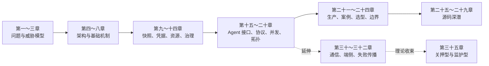

# 附录 B　章节路线与证据索引

<!-- appendix-nav -->

[章节目录](../../README.md) · [附录 A：术语与指标口径](附录A-术语与指标口径.md)
<!-- /appendix-nav -->

## 一、主线为什么这样排

这条路线先建立“为什么需要边界”，再解释“边界怎样实现”，然后回答“怎样供给、治理和扩展”，最后才进入生产决策与源码。扩展研究不是主线漏掉的编号，而是读者在主线问题上继续追问后形成的支路。

## 二、章节之间的关键接缝

| 接缝 | 前一章留下的问题 | 后一章接住的答案 |
|---|---|---|
| 3 → 4 | Agent 沙箱有哪些业务原型，平台需要哪些能力 | CubeSandbox 用哪些组件把能力装成一张架构图 |
| 4 → 5 → 6 → 7 | 组件各自叫什么 | 创建请求怎样流动、虚拟化怎样提供隔离、网络怎样执行治理 |
| 8 → 9 | 基础篇架构能否组装成方案 | 快照和 CoW 怎样把复现、克隆、回滚变成机制 |
| 9 → 10 → 11 → 12 → 13 → 14 | 状态、资源、凭据和生命周期互相牵制 | 如何分别建立账本、治理、审计和状态机 |
| 15 → 16 → 17 → 18 → 19 → 20 | 单个 Agent 如何调用沙箱 | 接口兼容、批量评测、万级供给、多租户和多 Agent 拓扑 |
| 20 → 21 → 22 → 23 → 24 | 拓扑复杂后基础设施会遇到什么现实约束 | 生产部署、业务场景、选型决策和未来边界 |
| 24 → 25～29 | 架构判断如何落到实现 | KVM、seccomp、资源账本、性能和 CubeShim 状态机的源码证据 |

## 三、扩展研究应该插在哪里

- 读完第二十章后读第三十章：把通信通道和共享状态单独拆开；
- 读完第三十章后读第三十二章：把“怎么协作”推进到“失败时怎样停一棵树”；
- 读完第二、二十三、二十四章后读第三十一章：把隔离路线放进端侧与云端的现实分工；
- 读完第三十一、三十二章后读第三十五章：把“关押型/监护型”作为理论收束；
- 读第四、六、七、九、二十八章时可插读四层平面专题：用一张图回看继承、供给、治理和控制四层。

## 四、第三十三、三十四章的定位

第三十三章和第三十四章补的是主线里最重要的两个工程缺口：模板出生是否可信，以及动作授权是否可审计。它们放在专家篇补充区，接在源码深潜之后阅读，不改变第一至第二十九章的核心学习曲线；第三十五章继续保留为基于第三十一、三十二章的理论研究扩写。
